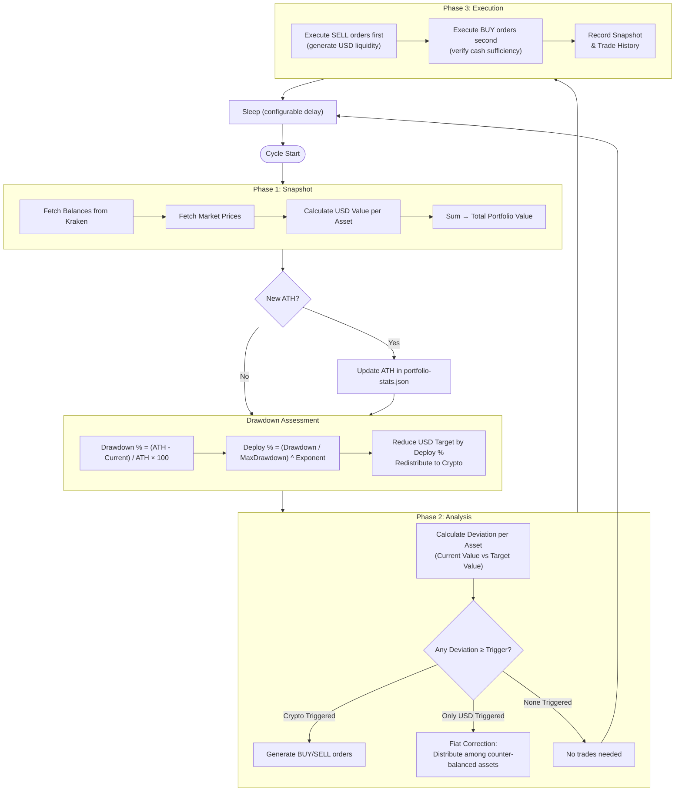

# Rebalancing Algorithm

This document details the operational logic of the Kraken Rebalancer. The system is designed to autonomously maintain a specific portfolio allocation across a set of assets (cryptocurrencies & fiat).

## Overview

## Core Concepts

### 1. Portfolio Definition
The portfolio is defined by a set of target allocations summing to 100%.
**Example:**
- **BTC**: 50%
- **ETH**: 45%
- **USD**: 5%

### 2. Operational Loop
The application runs a continuous "Rebalance Cycle" with a configurable delay (e.g., every 60 seconds). Each cycle consists of three phases: **Snapshot**, **Analysis**, and **Execution**.

---

## Phase 1: Snapshot

In this phase, the system builds a complete view of the current portfolio state.

1.  **Fetch Balances**: Retrieves the current balance of all configured assets from the Kraken API.
2.  **Fetch Prices**: Retrieves the current market price (in USD) for all non-USD assets.
3.  **Calculate Valuation**:
    *   Calculates the USD value of every asset (`Balance * Price`).
    *   Sums these values to determine the **Total Portfolio Value**.

---

## Phase 2: Analysis

The system determines what trades are necessary to restore the portfolio to its target state.

### 1. Target Calculation & Dynamic Adjustment
    Normally, the target value is `Total Portfolio Value * Target %`. However, the system implements a **Dynamic Fiat Deployment Strategy**:

    1.  **ATH Tracking**: The bot tracks the portfolio's All-Time High (ATH) value in `portfolio-stats.json`.
    2.  **Drawdown Calculation**:
        `Drawdown % = (ATH - Current Value) / ATH * 100`
    3.  **Fiat Deployment Percentage**:
        Based on the configured `fiatMaxDrawdown` (e.g., 30%) and `fiatDeploymentExponent` (e.g., 1.0):
        `Deployment % = (Drawdown % / Max Drawdown %) ^ Exponent` (Capped at 100%)

        **Examples (Max Drawdown = 30%)**:
        | Drawdown | Linear (1.0) | Aggressive (0.5) | Conservative (2.0) |
        | :--- | :--- | :--- | :--- |
        | **1.5%** (5% of Max) | 5% | 22% | 0.25% |
        | **7.5%** (25% of Max) | 25% | 50% | 6.25% |
        | **15%** (50% of Max) | 50% | 71% | 25% |
        | **22.5%** (75% of Max) | 75% | 87% | 56% |
        | **30%** (100% of Max) | 100% | 100% | 100% |

    4.  **Target Adjustment**:
        The target percentage for USD is reduced by the Deployment %:
        `Effective USD Target = Base USD Target * (1 - Deployment %)`
        The removed allocation is redistributed proportionally to the crypto assets, ensuring the total remains 100%.

    Using these effective targets, the **Ideal Value** for each asset is calculated.

2.  **Deviation Calculation**:
    The difference between current and target value is calculated:
    `Deviation (USD) = Current Value - Target Value`
    `Deviation (%) = |Deviation (USD)| / Target Value * 100`

3.  **Trigger Logic**:
    A rebalance is only attempted if an asset's `Deviation (%)` exceeds the configured `deviationTriggerPercent` (e.g., 5%).

    *   **Scenario A: Standard Rebalance**
        If a crypto asset (e.g., BTC) exceeds the threshold:
        *   **Overweight (> 0)**: A **SELL** order is generated for the excess USD amount.
        *   **Underweight (< 0)**: A **BUY** order is generated for the deficit USD amount.

    *   **Scenario B: Fiat Correction (Deposit/Withdrawal)**
        If *only* the USD asset triggers the threshold (e.g., due to a fresh deposit of cash), the system recognizes this as a "Fiat Correction" event.
        *   The surplus (or deficit) of USD is distributed intelligently among assets that counter-balance the deviation.
        *   **Surplus (Deposit)**: Buys are distributed among **Underweight** assets only, proportional to their current USD deficit.
        *   **Shortage (Withdrawal)**: Sells are distributed among **Overweight** assets only, proportional to their current USD surplus.
        *   *Note: This concentrates the rebalancing power into the assets that are furthest from their targets, effectively clearing dust thresholds.*

---

## Phase 3: Execution

The system executes the calculated orders in a specific sequence to ensure liquidity.

1.  **Sell Orders First**: All SELL orders are executed immediately to generate USD.
2.  **Buy Orders Second**:
    *   The system calculates the projected cash available (Current USD + Proceeds from Sells).
    *   It verifies that sufficient cash exists for the planned BUY orders.
    *   If cash is insufficient (rare, usually due to price slippage), buy orders may be reduced.
3.  **Order Placement**:
    *   Orders are placed as **Market Orders** for immediate execution.
    *   "Dust" orders (below the configured `dustThresholdUSD`) are skipped to avoid API errors.

---

## Configuration

The behavior is controlled by `rebalancer-config.json`:

| Parameter                 | Description                                                                                                                                                                |
|:--------------------------|:---------------------------------------------------------------------------------------------------------------------------------------------------------------------------|
| `loopDelaySeconds`        | Time to wait between cycles.                                                                                                                                               |
| `deviationTriggerPercent` | Sensitivity of the rebalancer. Lower values track targets closer but trade more frequently (higher fees).                                                                  |
| `dustThresholdUSD`        | Minimum order value in USD. Trades smaller than this amount are skipped to avoid API errors.                                                                               |
| `dryRun`                  | If set to `true`, the system performs all calculations and logs intended trades but **does not** send orders to Kraken.                                                    |
| `fiatMaxDrawdown`         | The portfolio drawdown percentage at which 100% of the USD allocation should be deployed into assets. Set to `0` to disable.                                               |
| `fiatDeploymentExponent`  | Controls the aggressiveness of deployment. `1.0` is linear. Values `< 1.0` deploy more cash earlier (aggressive). Values `> 1.0` save cash for deeper dips (conservative). |
