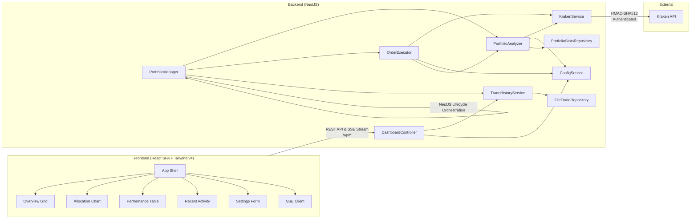
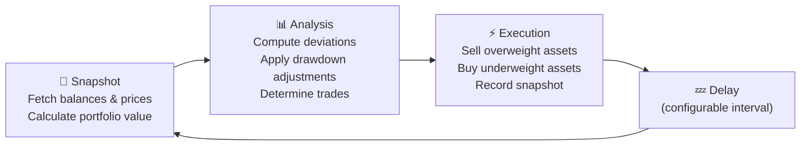

# Kraken Rebalancer

A production-grade, autonomous portfolio rebalancing engine for
the [Kraken](https://www.kraken.com/) cryptocurrency exchange. The system
continuously monitors your portfolio and automatically executes trades to
maintain target asset allocations — with intelligent strategies for handling
deposits, withdrawals, and market drawdowns.

**This application has been running in production managing a live portfolio for
several months.**


---

## Tech Stack

| Layer           | Technology                                                                                           |
|-----------------|------------------------------------------------------------------------------------------------------|
| **Language**    | TypeScript (both Backend and Frontend)                                                               |
| **Backend**     | Node.js, NestJS                                                                                      |
| **HTTP Client** | Node.js Native Fetch (with Kraken HMAC-SHA512 private API signing)                                   |
| **Concurrency** | NestJS Dependency Injection, Loop lifecycle managers                                                 |
| **Frontend**    | React SPA (Vite), Tailwind CSS v4, HTML5, CSS3, Server-Sent Events (SSE)                             |
| **API**         | Kraken REST API with HMAC-SHA512 authentication                                                      |
| **Testing**     | Vitest, Testing Library React (100% test coverage)                                                  |
| **Build/Repo**  | Yarn Workspaces (Monorepo)                                                                           |

---

## Features

### Autonomous Rebalancing

- Continuously monitors portfolio allocations against configurable targets
- Automatically generates and executes market orders when deviation thresholds
  are exceeded
- Sells overweight assets first to generate liquidity, then buys underweight
  assets

### Dynamic Fiat Deployment

- Tracks portfolio All-Time High (ATH) and calculates real-time drawdown
- Progressively deploys idle cash into the market as drawdowns deepen
- Configurable deployment curve via an exponent parameter (linear, aggressive,
  or conservative)

### Intelligent Fiat Correction

- Recognizes when only USD triggers a deviation threshold (e.g., after a deposit
  or withdrawal)
- Distributes surplus cash proportionally among the most underweight assets
- Handles withdrawals by selling from the most overweight assets

### Live Dashboard

- Real-time portfolio overview with push updates (via Express Server-Sent Events)
- Horizontal bar chart showing asset allocation by value
- Sortable asset performance table with deviation indicators
- Trade history log with BUY/SELL badges
- Live/Delayed status indicator with data age tracking

### Hot-Reload Configuration

- Modify all settings (allocations, thresholds, assets) via the web UI
- Add or remove assets without restarting the application
- Allocation validation ensures targets always sum to 100% and USD is always present

### Safety & Reliability

- **Dry Run Mode** — test your strategy without executing real trades
- **Structured Order Results** — each order returns success/failure status;
  failed orders don't corrupt cash projections
- **Atomic File Writes** — config, stats, and trade history use
  write-then-rename patterns to prevent corruption
- **Graceful Shutdown** — process shutdown hooks cleanly stop the loop and close the server
- Dust threshold filtering to avoid minimum order size errors
- Automatic error recovery — API failures don't crash the rebalancing loop
- Price validation — aborts cycle if any asset price is unavailable
- **Decimal Precision** — order volumes use high-precision decimals (`decimal.js`) to eliminate floating-point rounding errors

---

## Screenshots

### Dashboard

The main dashboard shows portfolio value, cash position with effective target (
adjusted for drawdown deployment), crypto asset values, an allocation chart, and
a sortable asset performance table.


### Asset Table & Trade History

The lower section shows detailed per-asset metrics (price, value, target %,
current %, deviation) and a chronological trade activity log.


### Settings

All configuration is managed through the web UI — loop interval, deviation
trigger, dust threshold, fiat deployment parameters, and per-asset allocation
targets.


---

## Architecture



### Rebalance Cycle

Each cycle executes three phases:



See **[ALGORITHM.md](ALGORITHM.md)** for a detailed breakdown of the rebalancing
logic, fiat correction strategy, and dynamic deployment math.

### Real-Time Event Streaming

To eliminate unnecessary network polling, the system uses a reactive, push-based
architecture to synchronize the dashboard with the backend rebalancing loop:

1. **Node EventEmitter**: `TradeHistoryServiceImpl` maintains an event emitter. Whenever a rebalance cycle records a new `PortfolioSnapshot`, the snapshot is emitted.
2. **Server-Sent Events (SSE)**: The `/api/status/stream` route in `DashboardController` implements a persistent NestJS SSE stream. When a client connects, the backend pushes the latest cached snapshot and registers an event listener to stream subsequent snapshots as they occur.
3. **React Client**: The React frontend opens an `EventSource` connection to `/api/status/stream` on mount, automatically updating its state and view dynamically whenever a new snapshot is broadcast.

---

## Project Structure

```
├── backend/
│   ├── src/
│   │   ├── main.ts                       # Entry point, bootstraps NestJS container
│   │   ├── app.module.ts                 # Main NestJS module topology
│   │   ├── controller/                   # NestJS Dashboard SSE controller
│   │   ├── config/                       # AppConfig and validation definition
│   │   │   └── config.ts                 
│   │   ├── model/                        # Type interfaces: snapshot, stats, assets
│   │   ├── repository/                   # File persistence implementation (trade, stats, atomicFile)
│   │   └── service/                      # Core rebalancer components (analyzer, executor, manager, kraken, history)
│   └── test/                             # Vitest unit and integration tests (100% coverage)
├── frontend/
│   ├── src/
│   │   ├── main.tsx                      # Vite entry point
│   │   ├── App.tsx                       # Client router and SSE state coordinator
│   │   ├── index.css                     # Styles entrypoint configuring Tailwind CSS v4 & custom @utility classes
│   │   └── components/                   # Modular React views (Grid, Chart, Table, Settings)
│   ├── test/                             # Vitest & Testing Library component test suites
│   ├── index.html                        # HTML shell
│   └── vite.config.ts                    # Vite compilation config
├── package.json                          # Yarn workspace root configurations & launch scripts
├── ALGORITHM.md                          # Detailed rebalancer math documentation
└── rebalancer-config-template.json        # Template settings file
```

---

## Getting Started

### Prerequisites

- Node.js (v18 or higher)
- Yarn (v1.x)
- A Kraken account with API Keys (Permissions: **Query Funds**, **Create & Modify Orders**)

### 1. Clone & Configure

```bash
git clone https://github.com/HyperVon/new-kraken-rebalancer.git
cd new-kraken-rebalancer
cp rebalancer-config-template.json rebalancer-config.json
```

Edit `rebalancer-config.json`:

- Add your Kraken API Key and Private Key
- Define your desired `allocations` (must sum to 100%, must include USD)
- Set `dryRun` to `true` for initial testing
- Optionally configure `fiatMaxDrawdown` and `fiatDeploymentExponent` for dynamic cash deployment

### 2. Install Dependencies

```bash
yarn install
```

### 3. Start the Application

To run the application in development mode with hot-reloading for both backend and frontend:

```bash
yarn dev
```

The frontend will run at **http://localhost:5173** and proxy backend API calls to port **8080**.

### 4. Build and Start in Production

To build the monorepo assets and launch the production environment:

```bash
yarn build
yarn start
```

The production application is served completely unified on **http://localhost:8080**.

---

## Configuration Reference

| Field                     | Type      | Default | Description                                                                           |
|---------------------------|-----------|---------|---------------------------------------------------------------------------------------|
| `loopDelaySeconds`        | `number`  | `60`    | Seconds between rebalance cycles                                                      |
| `deviationTriggerPercent` | `number`  | `5.0`   | Minimum deviation % to trigger a trade                                                |
| `dustThresholdUSD`        | `number`  | `5.0`   | Minimum trade value in USD (below this is skipped)                                    |
| `dryRun`                  | `boolean` | `true`  | If true, logs intended trades without executing them                                  |
| `fiatMaxDrawdown`         | `number`  | `0.0`   | Portfolio drawdown % at which 100% of USD is deployed (0 = disabled)                  |
| `fiatDeploymentExponent`  | `number`  | `1.0`   | Controls deployment curve: `1.0` = linear, `<1.0` = aggressive, `>1.0` = conservative |

---

## API Endpoints

| Method | Path                   | Description                                                              |
|--------|------------------------|--------------------------------------------------------------------------|
| `GET`  | `/api/config`          | Retrieve current application settings                                    |
| `POST` | `/api/config`          | Validate and update application settings                                 |
| `GET`  | `/api/history`         | Get last 50 historical portfolio snapshots                               |
| `GET`  | `/api/status/stream`   | Server-Sent Events (SSE) stream for real-time portfolio snapshot updates |

---

## Testing

The project enforces automated test coverage. All core services, managers, routes, and views are tested behaviorally.

To run both backend and frontend test suites concurrently:

```bash
yarn test
```

Totaling 96 tests across:
- E2E portfolio rebalancing flow validation.
- Drawdown dynamic deployment calculations.
- Fiat correction asset distribution.
- Mocked Kraken API client request signatures and nonce bump logic.
- React components, columns state-sorting, and layout rendering.

---

## License

This project is licensed under the MIT License — see the [LICENSE](LICENSE) file for details.