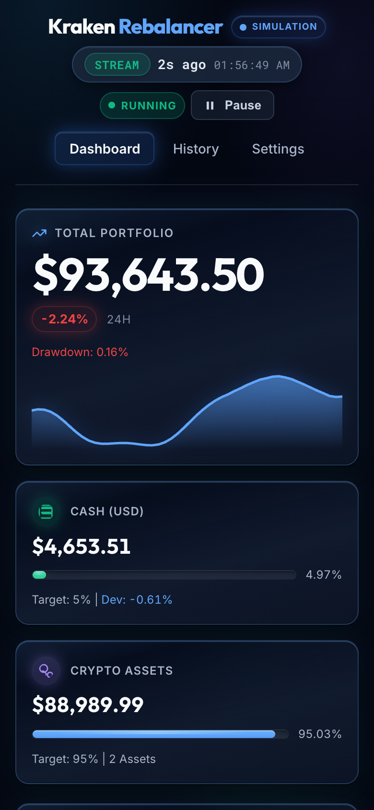
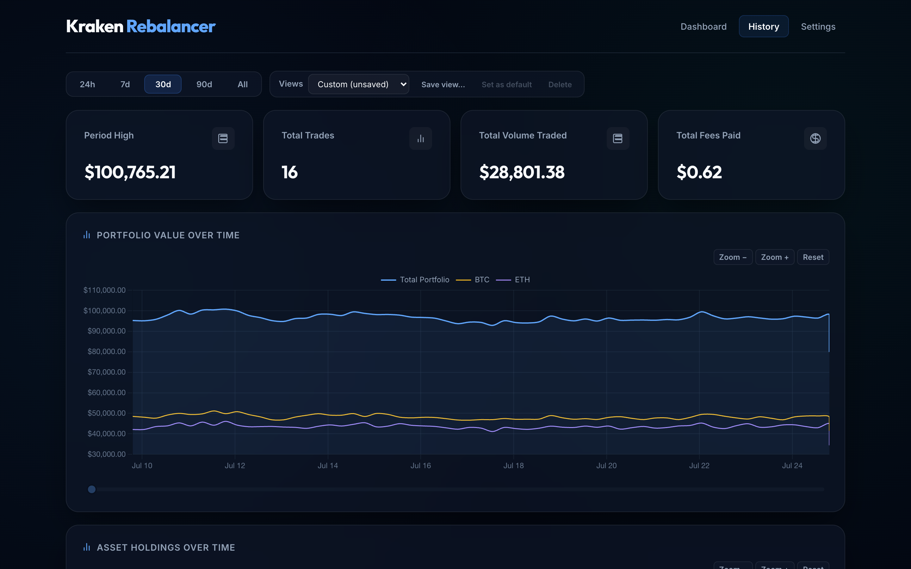
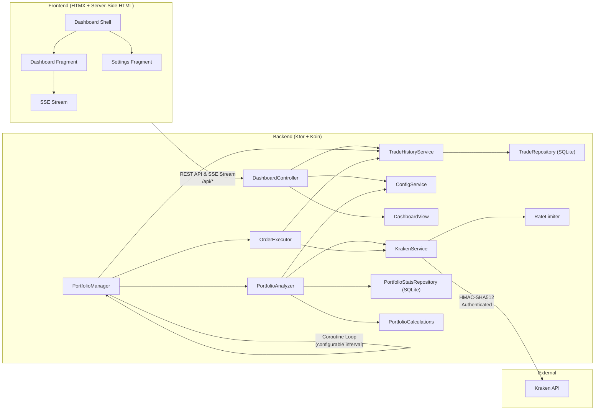
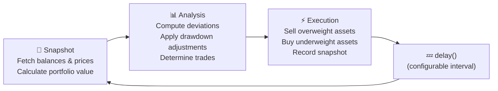

# Kraken Rebalancer

A production-grade, autonomous portfolio rebalancing engine for
the [Kraken](https://www.kraken.com/) cryptocurrency exchange. The system
continuously monitors your portfolio and automatically executes trades to
maintain target asset allocations — with intelligent strategies for handling
deposits, withdrawals, and market drawdowns.

**This application has been running in production managing a live portfolio for
several months.**

<p><a href="docs/images/dashboard.png"></a></p>

**New here?** Start with the [User Guide](docs/USER_GUIDE.md) — a visual
walkthrough of Dashboard, Settings, History, and safety modes
(simulation / dry run).

---

## Why Use Kraken Rebalancer?

- **Stay disciplined automatically** — define the mix you want and let the bot
  correct meaningful drift instead of reacting to headlines or price swings.
- **Optionally put cash to work gradually during drawdowns** — configure the bot
  to retain a target cash allocation, then progressively deploy it as the
  portfolio falls from its all-time high rather than making one all-or-nothing
  entry.
- **Absorb deposits and withdrawals cleanly** — rebalance new cash after a
  deposit, or respond to a cash withdrawal by selling overweight assets, without
  maintaining a spreadsheet and placing every order by hand.
- **Keep control and an audit trail** — inspect current allocations, intended or
  completed trades, fees, slippage, and portfolio history from a local dashboard.
- **Test before trusting it with funds** — learn with the offline simulator, then
  rehearse against live market data in dry-run mode before enabling real orders.

The project is best suited to a self-hosting Kraken user who already has a target
allocation and wants consistent execution, not trading signals. It does not
predict prices, choose the right allocation, guarantee better returns, or remove
the risks of cryptocurrency trading. Rebalancing can also incur fees and tax
consequences, so you remain responsible for the strategy and its operation.

---

## AI-Assisted Development

This project—including its application code, tests, documentation, and agent
playbook—was developed through human-directed AI coding sessions. Most of the
initial project and much of its earlier evolution were created with Google
Antigravity. Cursor, Codex, and OpenCode are also used in the workflow, while
portable repository guidance is also available to Claude Code, GitHub
Copilot, and other agents. Independent models are used for adversarial review,
while tests, coverage, simulation, browser QA, and human approval provide the
final safety boundaries.

See the [Agentic Development Guide](docs/AGENTIC_DEVELOPMENT.md) for the full
provenance, instruction architecture, cross-harness setup, skill catalog,
human–agent workflow, review loop, and maintenance guidance.

Cross-provider routing, when needed, is handled by the host's native launchers
and the same portable `.agents/` guidance. The repository is still fully usable
without KiloCode. Application code, tests,
Gradle tasks, documentation, Git workflows, and the portable `.agents/` skills
remain available to any capable development tool. KiloCode-only additions are
strictly optional and isolated to Kilo harness configuration.

### Cline MCP Quota Tool

If you use [Cline](https://github.com/cline/cline) for AI-assisted development,
the repo includes a local MCP server that exposes `quota_check` so you can
inspect remaining provider quota without leaving your session.

```bash
# Install the dependency once from the repo root
cd .cline/mcp/quota-server
npm install
```

Then add the server to Cline's global MCP settings
(`~/.cline/data/settings/cline_mcp_settings.json`):

```json
{
  "mcpServers": {
    "quota": {
      "command": "node",
      "args": ["/absolute/path/to/new-kraken-rebalancer/.cline/mcp/quota-server/index.js"]
    }
  }
}
```

Restart Cline after editing the settings file. The server depends on
`@slkiser/opencode-quota` being available in your environment; install it once
with `npm install -g @slkiser/opencode-quota` if needed.

---

## Tech Stack

| Layer           | Technology                                                                                                   |
| --------------- | ------------------------------------------------------------------------------------------------------------ |
| **Language**    | Kotlin 2.4.20-RC (Kotlin Multiplatform: JVM + JS; temporary security patch)                                  |
| **Backend**     | Ktor 3.5.2 (Netty engine), Koin 4.2.2 (DI), Jackson 2.22.2                                                   |
| **Database**    | SQLite (via JetBrains Exposed ORM 1.5.0)                                                                     |
| **HTTP Client** | Ktor CIO Client (async, coroutine-native)                                                                    |
| **Concurrency** | Kotlin Coroutines (`kotlinx.coroutines` 1.11.0)                                                              |
| **Frontend**    | Server-side HTML (kotlinx.html DSL + HTMX), kotlinx-css DSL, Ktor SSE + Client-side Kotlin/JS                |
| **API**         | Kraken REST API with HMAC-SHA512 authentication                                                              |
| **Testing**     | Kotest 6.2.4, MockK 1.14.11, JaCoCo 95/95/95/90, Karma/Istanbul 90/80/90/75                                  |
| **Build**       | Gradle 9.7.1 (Kotlin DSL), Spotless 8.10.1 + ktlint 1.8.0                                                    |
| **Engine**      | Pure Kotlin JVM domain calculation library with independent JaCoCo 95/90 coverage gates                      |
| **Codegen**     | JVM-only module with KSP processors for API mappers and YAML string catalogs                                 |
| **Agent tools** | Optional Kilo Context Mode plugin for bounded large-output analysis; standard workflows remain portable      |

---

## Technology Journey

This project has served as both a real production tool and a personal learning
lab. The full history of each migration is preserved in the
[CHANGELOG](CHANGELOG.md), the git history, and in dedicated branches — every
rewrite is a checkpoint you can browse on GitHub.

### Phase 1 — Java / Spring Boot / Maven *(Jan – May 2026)*

The application was originally written in **Java 25** with **Spring Boot 4**,
**Maven**, **Lombok**, **OkHttp**, and **JUnit 5 / Mockito** — the stack I am
most experienced with and the one I use professionally. The frontend started as
a **React/Vite** SPA with vanilla JavaScript and Chart.js, and was later
migrated to **TypeScript** with **Tailwind CSS v4** and a full **Vitest** suite.
This phase produced the core rebalancing algorithm, Kraken API integration with
HMAC-SHA512 authentication, and a full CI pipeline on GitHub Actions. By the
time the project was made public (May 2026), the Java backend had 89+ unit tests
enforcing 95%+ coverage, the TypeScript frontend had 97 Vitest tests, and the
application included production-hardened features like atomic file writes,
structured order results, and graceful shutdown.

Development during this phase used feature branches merged via pull requests:

- `fix/security-and-ci-hardening` (PR #9) — security hardening and CI
  enforcement
- `refactor/backend-code-quality` (PR #10) — service/repository layering and
  import cleanup
- `feature/engine-hardening` (PR #12) — rebalancer engine reliability
  improvements
- `large_refactor` (PR #13) — TypeScript migration, Tailwind CSS v4 integration,
  Lombok adoption, and 95%+ coverage enforcement across both frontend and backend

> The early commit history showcases idiomatic Java, Spring Boot dependency
> injection, service/repository layering, JUnit 5 testing patterns, and Maven
> build configuration.

### Phase 2 — Kotlin / Ktor / Koin / Gradle *(May 2026)*

The entire codebase was migrated from Java to **Kotlin 2.x**, **Ktor** (Netty
engine), **Koin** (DI), **Gradle** (Kotlin DSL), and **Kotest / MockK** for
testing. This migration was developed on the `kotlin-migration` branch and
merged via PR #15. Kotlin's coroutines replaced Java's
`ScheduledExecutorService` and `Thread.sleep`, making the rebalancing loop and
all API calls fully non-blocking.

The Kotlin phase continued with several focused branches:

- `cursor/rebalancer-reliability-and-safety-fixes` (PR #16) — `BigDecimal`
  order precision, `AtomicJsonFile` utility, `OrderResult` model, and 122
  backend + 110 frontend unit tests
- `htmx-html-dsl` (PR #17) — replaced the React/Vite frontend with
  **server-side HTML** using the **kotlinx.html** DSL and **HTMX**. Before
  landing on HTMX, I also explored **Angular** as a potential frontend
  framework, but the overhead of a full Angular project with its own build
  pipeline and module system felt disproportionate for a single-page dashboard
  — that exploration was done locally and never committed. HTMX turned out to
  be the ideal fit: it eliminated the separate frontend build pipeline entirely,
  added **Ktor SSE** for real-time dashboard updates, and achieved 100% test
  coverage across every metric
- `code_quality` (PR #18) — centralized CSS classes, HTML IDs, inline styles
  extraction, service layer SRP decomposition (`PortfolioAnalyzer` +
  `OrderExecutor`), and test symbol constants
- `refactor/kotlin-modernization` (PR #19) — Kotlin 2.4.10 named context
  parameters, `Asset` inline value class, pipeline typealiases, and Gradle
  configuration caching

### Phase 3 — Go *(Jun 2026, experimental)*

The application was rewritten in **Go 1.26** — goroutines, `net/http`,
`html/template`, `encoding/json`, `log/slog`, and `shopspring/decimal`. The Go
version achieved 98.2% test coverage with strict per-package gates. The complete
Go codebase is preserved on the [`go-rewrite`](../../tree/go-rewrite) branch
(10 commits).

### Phase 4 — TypeScript / Node.js / NestJS *(Jun 2026, experimental)*

The application was then rewritten in **TypeScript** with **Node.js**, starting
with a plain Express backend and React/Vite frontend, then migrating to
**NestJS** with **Tailwind CSS v4**, using Zod schema validation, the NestJS
module/controller/service pattern, and native `fetch` in Node.js. The complete
TypeScript/NestJS codebase is preserved on the
[`feature/typescript-rewrite`](../../tree/feature/typescript-rewrite) branch
(8 commits).

### Phase 5 — 100% Kotlin & Kotlin Multiplatform *(Jun 2026 – present)*

After building the same application three different ways, **Kotlin / Ktor**
became the permanent stack. To eliminate client-side JavaScript entirely, all
remaining frontend scripts were migrated to **Kotlin/JS** using **Kotlin
Multiplatform (KMP)**. The codebase is now **100% Kotlin**, offering the best balance of:

- **Kotlin Multiplatform** — compiling a `:frontend-js` subproject directly to JavaScript via the Kotlin JS IR backend, replacing legacy browser scripts with type-safe Kotlin code.
- **Conciseness** — data classes, extension functions, and coroutines dramatically reduce boilerplate compared to Java.
- **Type safety** — `kotlinx.html` gives compile-time-checked HTML rendering that Go's `html/template` and JSX cannot match, while Kotlin/JS handles all client-side actions and table sorting with strong compile-time types.
- **JVM ecosystem** — access to battle-tested libraries (Jackson, Netty, JaCoCo) without the weight of Spring Boot's classpath scanning.
- **Single-process simplicity** — HTMX and Kotlin/JS compile to a single bundled asset served dynamically, keeping the entire application within a single `./gradlew run` command.

The experimental branches (`go-rewrite` and `feature/typescript-rewrite`) remain in the repository as complete, working
reference implementations for anyone interested in comparing the same domain
logic across three languages and ecosystems.

Subsequent updates in Phase 5 integrated a reactive configuration loop (`watchConfigChanges().collectLatest`), a Kraken call-counter rate limiter, flow-based API retry policies, and flow-based trade history pagination directly into the `main` branch. Additionally, the remaining client-side Javascript logic was rewritten to Kotlin/JS under the `:frontend-js` subproject, achieving a 100% Kotlin codebase.

### Technologies Explored

| Category               | Technologies Used                                                                                                                     |
| ---------------------- | ------------------------------------------------------------------------------------------------------------------------------------- |
| **Languages**          | Kotlin 2.4 (current), Kotlin 2.x, Java 25, Go 1.26, TypeScript (all phases documented in CHANGELOG)                                   |
| **Backend Frameworks** | Ktor 3.5.2 (current), Spring Boot 4, Ktor 2.3, NestJS, Express, Go `net/http`                                                         |
| **DI / IoC**           | Koin 4.2.2 (current), Spring IoC (`@Autowired`), Koin 3.5, NestJS modules                                                             |
| **Build Systems**      | Gradle 9.7.1 Kotlin DSL (current), Maven, npm / yarn, Go modules                                                                      |
| **Frontend**           | Kotlin/JS + kotlinx.html + HTMX (current), React, Angular (explored), Tailwind CSS v4, Chart.js                                       |
| **HTTP Clients**       | Ktor CIO Client (current), OkHttp, Node.js native `fetch`, Go `net/http`                                                              |
| **Concurrency**        | Kotlin Coroutines (current), Java `ScheduledExecutorService`, Go goroutines, Node.js event loop                                       |
| **Testing**            | Kotest 6 + MockK + Karma/Istanbul (current), JUnit 5, Mockito, Vitest, Go `testing`                                                   |
| **Coverage**           | JaCoCo 95%+ (Kotlin JVM), Karma/Istanbul 90/80/90/75 (Kotlin/JS) (current); Vitest, Go per-package gates (historical)                 |
| **Serialization**      | Jackson 2.22.2, Go `encoding/json`, Zod schema validation                                                                             |
| **Real-Time**          | Ktor Server-Sent Events (SSE), Kotlin `SharedFlow` (config changes + snapshot broadcasts), HTMX SSE extension                         |
| **CI / Security**      | GitHub Actions, Dependabot, SHA-pinned actions, CVE patching (Netty, Logback, Jackson); CodeQL Java/Kotlin analysis enabled on `main` |
| **Code Quality**       | Lombok, ESLint, `go fmt`, Kotlin named context parameters, strict `BigDecimal` precision, atomic file I/O                             |

---

## Features

### Autonomous Rebalancing

- Continuously monitors portfolio allocations against configurable targets
- Automatically generates and executes market orders when absolute deviation
  thresholds (`>=`) are met
- Sells overweight assets first to generate liquidity, then buys underweight
  assets

### Dynamic Fiat Deployment

- Tracks portfolio All-Time High (ATH) and calculates real-time drawdown
- Progressively deploys idle cash into the market as drawdowns deepen
- Configurable deployment curve via an exponent parameter (linear, aggressive,
  or conservative)

### Intelligent Fiat Correction

- Recognizes when only USD triggers a deviation threshold (e.g., after a deposit
  or withdrawal)
- Distributes surplus cash proportionally among the most underweight assets
- Handles withdrawals by selling from the most overweight assets

### Live Dashboard

- Real-time portfolio overview with push updates (via Ktor Server-Sent Events)
- Horizontal bar chart showing asset allocation by value
- Sortable asset performance table with deviation indicators
- **Recent Activity** — per-cycle action feed (deviations, trades, dry-run intents) with BUY/SELL badges; not the full trade log on the `/history` page
- STREAM/STALE SSE stream-health indicator with relative age/time (separate from trading mode)
- Persistent mode plate (SIMULATION / DRY RUN / LIVE TRADING)
- Header loop control on Dashboard, History, and Settings showing RUNNING/PAUSED with neutral labeled **Pause** and **Resume** actions
- **Range-Filtered History Metrics** — Time frame selector controls all six top metric summary cards (All-Time High / Period High, Total Trades, Total Volume Traded, Total Fees Paid, Avg Fee Rate, Avg Slippage) dynamically alongside interactive Chart.js timelines and trade history logs with price, fee, and slippage columns.
- **Staking Rewards History** — displays cumulative staking and dividend rewards in USD, split
  by asset, from synchronized Kraken ledger entries. `dividend` entries for
  untracked assets (e.g. DOT outside the tracked universe) remain external inflows
  excluded from the chart, while dividends for tracked assets are treated like
  staking; Earn-migration asset suffixes (`.S`/`.M`/`.F`/`.B`) and legacy `X`/`Z`
  asset codes are normalized to the base symbol.
- **Hypermedia-powered** — uses HTMX for HTML swaps and form submissions, plus
  Kotlin/JS (`rebalancer.js`) for charts, History controls, and client behavior

### Hot-Reload Configuration

- Modify all settings (allocations, thresholds, assets) via the web UI
- Add or remove assets without restarting the application
- Allocation validation ensures targets always sum to 100%
- `ConfigService.watchConfigChanges()` exposes a `Flow<Settings>`, which
  `PortfolioManagerImpl` uses to restart its sleeping rebalancing loop with new
  settings without polling. Saves made during an active cycle persist
  immediately but defer runtime publication until that execution session ends.

### Offline Exchange Simulator & Pre-Seeding

- **Offline Simulation Mode** — Run the bot completely offline without a real Kraken API key. Enable `"simulation": true` (dynamic toggling supported via the Settings UI) to execute orders and check balances against a realistic random walk price generator.
- **Automated Database Seeding** — If started in simulation mode with an empty database, the system generates ~15 days of snapshots at 6-hour steps (~61 points), trade logs, and synthetic staking ledger entries, providing immediately interactive graphs including a populated rewards panel.

### Historical Trades Synchronization

- Automatically synchronizes executed trade history from Kraken API (`/0/private/TradesHistory`) on startup
- Persists historical trades to the SQLite database
- Deduplicates overlapping records within a ~5 minute window via pair-alias normalization (e.g. `XBTUSD` vs `XXBTZUSD`), local-estimate vs API fill reconciliation, and fee-difference tolerance
- Tracks synchronization state in `history_sync_metadata` to prevent redundant API queries

### Ledger & Staking Rewards Synchronization

- Synchronizes eight strategy-neutral entry types (`staking`, `dividend`, `deposit`,
  `withdrawal`, `transfer`, `adjustment`, `spend`, and `receive`) from Kraken's private
  `/0/private/Ledgers` endpoint, with a five-minute throttle and paginated cold Flow fetching.
  The live adapter queries the documented `sale` filter for consumer `spend`/`receive`
  rows, then filters the returned rows by their response type.
- Persists ledger entries in SQLite using the `(ledger id, timestamp, asset, type)`
  identity so overlapping pages and retries remain idempotent
- Stores durable seed progress and timestamps in `history_sync_metadata`, then
  uses a five-minute incremental overlap to avoid missing entries near a
  watermark
- Serves `/api/history/rewards` with cumulative staking rewards aligned to
  portfolio snapshots and valued using each snapshot's asset prices. Ledger
  assets are normalized to the tracked base symbol (Earn suffixes and legacy
  `X`/`Z` codes), and assets without a snapshot price in the range are excluded
  from the totals.
- In simulation mode with an empty database, synthetic staking ledger entries
  are seeded alongside snapshots and trades so the rewards panel shows a
  realistic cumulative history; `dividend` entries for tracked assets are now
  mirrored in the rewards chart, comparison math, and historical reconstruction
  (like staking), while dividends for untracked assets remain external inflows.
- Rebalancer vs Buy & Hold and historical reconstruction replay every supported
  external ledger type using `amount - fee`. Consumer Buy Crypto activity is
  represented by its ledger `spend`/`receive` legs; it is not inferred from
  `TradesHistory`. The reconstruction marker records the ledger-coverage version
  it replayed, so a coverage migration cannot be hidden by an older marker.

### Safety & Reliability

- **Dry Run Mode** — calculates intended orders on the active backend (live
  Kraken or the emulator) but never places them
- **Structured Order Results** — each order returns success/failure status;
  failed orders don't corrupt cash projections
- **Durable Live-Order Journal** — before a real AddOrder request, the bot
  persists a `PENDING` intent with its deterministic `cl_ord_id`. Ambiguous
  transport/response failures become `UNCERTAIN`, abort the remaining batch,
  and block later live orders until an operator verifies Kraken and resolves
  the SQLite row with `POST /api/order-intents/{id}/resolve` using explicit
  evidence and the optional Kraken `orderTxid` when known. `PENDING` rows cannot
  be manually resolved while an AddOrder may
  still be in flight; abandoned PENDING rows are recovered as UNCERTAIN on
  restart. Unresolved intents are not reconciled, deduplicated, or pruned
  automatically. Follow the [operator recovery runbook](SECURITY.md#operator-recovery-runbook)
  before resolving an intent
- **Atomic File Writes** — config updates use write-then-atomic-rename (NIO Files.move with StandardCopyOption.ATOMIC_MOVE) to prevent file system corruption
- **Graceful Shutdown** — JVM shutdown hook cleanly cancels the coroutine loop scope, closes Ktor HttpClient, and stops Koin DI
- **Redacted Secret Logging** — value class `toString()` implementations for API credentials return redacts to protect application logs
- **Rate-Limiting & Retries** — Private calls use Kraken's standard linearly
  decaying account counter (safe limit 20.0; decay 0.5/sec):
  `Ledgers`, `TradesHistory`, and `ClosedOrders` cost 4, other private calls
  cost 1, and `AddOrder`/`CancelOrder` use Kraken's separate trading limits.
  Public calls use a separate conservative limiter of at most about one call
  per second. `retryWithFlow` retries only network I/O, 429, temporary lockout,
  and relevant 5xx responses with capped backoff; AddOrder is attempted once
  because an ambiguous response may follow an accepted order. See Kraken's
  [current rate-limit guidance](https://support.kraken.com/articles/206548367-what-are-the-api-rate-limits-?mobile_site=false)
- **CORS Restrictions** — by default, limits browser origins to local machine addresses (`localhost`, `127.0.0.1`), Bonjour multicast DNS domains (`*.local`), and private local subnets (`192.168.x.x`, `10.x.x.x`, `172.16–31.x.x`, link-local `169.254.x.x`). `REBALANCER_ALLOWED_ORIGINS` can add exact origins; `REBALANCER_ALLOW_ALL_ORIGINS=true` is a lab-only break-glass override that disables origin checks and must never be used with live keys. CORS is not authentication.
- **No dashboard user auth** — trust model is local/private network; see [SECURITY.md](SECURITY.md)
- **Database Indexing & Versioned Migrations** — schemas index timestamp
  columns; on startup `DatabaseConfig` records applied schema versions, runs
  non-deprecated Exposed builders in one transaction, and creates a
  pre-migration backup for an existing file-backed database
- **Operational Readiness** — `/api/health` is a liveness/diagnostic endpoint;
  `/api/readiness` reports whether the loop, snapshot history, and live-order
  journal are safe for continued operation
- Dust threshold filtering to avoid minimum order size errors
- Automatic error recovery — API failures don't crash the rebalancing loop
- Price validation — aborts cycle if any asset price is unavailable
- **BigDecimal Precision** — all balances, prices, and volumes are tracked via `BigDecimal` to completely eliminate floating-point precision loss

---

## Screenshots

### Dashboard

The main dashboard leads with a hero portfolio KPI and 24h delta, plus cash and
crypto tiles (effective target adjusted for drawdown deployment), an allocation
chart, and a sortable asset performance table.

The canonical dashboard above is deliberately shown once at a constrained
display width. The full responsive capture matrix remains available through
the [User Guide](docs/USER_GUIDE.md); this README keeps only a few representative
views so high-DPI source PNGs do not dominate the page at 100% browser zoom.

### Phone preview

<p><a href="docs/images/dashboard-phone.png"></a></p>

### Settings

All configuration is managed through the web UI — loop interval, deviation
trigger, minimum order size, fiat deployment parameters, per-asset allocation
targets, and per-asset chart colors.

<p><a href="docs/images/settings.png"></a></p>

### History

The dedicated History view provides detailed analysis and charts tracking portfolio metrics over time. Users can select different time ranges (24h, 7d, 30d, 90d, All) to update the charts and trade log. It features:

- Six summary stat cards including avg fee rate and avg slippage
- Trade log columns for price, fee, slippage, and status
- Cumulative net cash flow chart with gross and fee-adjusted (dashed) series
- Staking Rewards chart with cumulative USD value and per-asset series from
  synchronized ledger entries

- **View presets** — **Overview**, **Day · Total only**, **Week · Allocation**, and **Month · Net Cash Flow**, plus **Save view…** / **Set as default** / **Delete** for browser-local custom views
- **Chart zoom** — **Zoom −** / **Zoom +** / **Reset**, plus wheel, pinch, and drag-to-zoom on the x-axis
- **Pan scrubber** — after zooming in, a horizontal scrubber below each chart pans the visible window across the full time range (chart drag zooms; it does not pan)
- **Rebalancer vs Buy & Hold** — compares actual portfolio value against fixed quantities from the first stored snapshot in the selected range, shows the latest USD/percentage difference; ranges with incomplete reconciliation remain visible with an **Estimated** confidence badge, while fully reconciled ranges are unbadged
- **Portfolio Value Over Time** (overall portfolio value in USD + individual asset values)
- **Asset Holdings Over Time** (% change in asset balance)
- **Allocation Deviation from Target** (signed relative drift around a 0% on-target baseline)
- **Cumulative Net Cash Flow** (gross signed cash flow plus dashed **Net After Fees** series)
- **Comprehensive Trade Log Table** (showing all executions, with a toggle to filter/show dry-run trades)

<p><a href="docs/images/history.png"></a></p>

For a full walkthrough of what each control and chart means, see the
[User Guide](docs/USER_GUIDE.md).

---

## Architecture



### Rebalance Cycle

Each cycle executes three phases:



See **[ALGORITHM.md](docs/ALGORITHM.md)** for a detailed breakdown of the rebalancing
logic, fiat correction strategy, and dynamic deployment math.

See **[FLOWS.md](docs/FLOWS.md)** for sequence diagrams and a comprehensive breakdown
of how Kotlin's hot `SharedFlow` and cold `Flow` streams orchestrate configuration updates,
real-time dashboard streaming, paginated transaction sync, and exponential backoff polling.

### Real-Time Event Streaming

The dashboard and monitoring hooks use a reactive, push-based architecture with
two complementary `SharedFlow` channels:

#### Portfolio Snapshot Stream (Dashboard SSE)

1. **Kotlin SharedFlow**: `TradeHistorySnapshotStore` owns a
   `MutableSharedFlow<PortfolioSnapshot>` as a hot event broadcaster (exposed
   through the `TradeHistoryServiceImpl` façade via `getHistoryFlow()` /
   `addSnapshot`). Whenever a rebalance cycle records a new snapshot, it is
   emitted via `tryEmit()`.
2. **Ktor Server-Sent Events (SSE)**: The `/api/status/stream` route installs
   Ktor 3's native `SSE` plugin. When a client connects, Ktor pushes the latest
   cached snapshot and then collects subsequent snapshots from the
   `SharedFlow`, streaming them over a single persistent HTTP connection.
3. **HTMX SSE Extension**: The dashboard shell uses `hx-ext="sse"` and
   `sse-connect="/api/status/stream"`. A div with `sse-swap="message"` and
   `hx-trigger="sse:message"` automatically fetches updated dashboard fragments
   from `/fragments/dashboard` whenever a new snapshot arrives.

#### Config Hot-Reload Loop Restart (not SSE)

This path is internal orchestration — not a second browser-facing SSE stream like
`TradeHistorySnapshotStore.snapshotFlow` above.

1. **Config `SharedFlow`**: `ConfigServiceImpl` maintains a hot
   `MutableSharedFlow<Settings>` (`replay=1`) that emits when settings are saved
   via the UI or reloaded from disk.
2. **Reactive loop restart**: `PortfolioManagerImpl` collects
   `ConfigService.watchConfigChanges()` with `collectLatest`, cancelling an
   in-flight `delay()` and restarting the rebalancing loop immediately when
   settings change. During an active rebalance, `ConfigServiceImpl` stages the
   validated runtime config until the execution session exits, preventing one
   cycle from mixing old and new settings.

---

## Project Structure

```text
├── .agents/                                # AI Agent rules, guidelines & domain skills
│   ├── AGENTS.md                          # Repository rules & technical guidelines
│   ├── OPERATING.md                       # Always-on norms (all agent frameworks)
│   └── skills/                            # Domain skills (see .agents/AGENTS.md skill index)
├── .kilo/                                  # Optional Kilo Code integration (Agent Manager hooks)
│   ├── kilo.json                           # Context Mode plugin + safe local-tool settings
│   ├── shell-strategy.md                   # Compatibility symlink to canonical shell guidance
│   ├── setup-script                        # Prepare Gradle classes for Agent Manager worktrees
│   ├── run-script                          # Build fat JAR and start an isolated local simulation
│   ├── agent-manager.json                  # Agent Manager worktree configuration
│   ├── command/                            # Project command definitions
│   └── agent/                              # Project agent definitions
├── .opencode/                              # Cross-harness companion configuration
│   └── shell-strategy.md                   # Canonical shell guidance
├── .cursor/rules/                          # Cursor projections of OPERATING.md (committed)
├── CLAUDE.md                               # Claude Code entrypoint → .agents/
├── .github/copilot-instructions.md         # GitHub Copilot entrypoint → .agents/
├── common/                                 # Kotlin Multiplatform shared module (JVM + JS)
│   ├── src/commonMain/kotlin/com/gemini/krakenbot/
│       ├── api/                           # Wire DTOs: PortfolioSnapshot, TradeRecord, HistoryStats, RebalancerComparison, RewardsOverTime, RewardsOverTimePoint, SyncProgressResponse
│       ├── codegen/                       # GenerateStringConstants and shared codegen sources
│       ├── config/                        # AppConfig, Settings, Allocation, KrakenCredentials, InvalidConfigurationException
│       ├── model/                         # Asset, OrderSide (OrderType defined alongside), RebalancerComparisonEnums, Result, TimeRange, TradeSource, StringConstantSchemas, generated SyncMetadataKeys
│       ├── util/                          # PrecisionConstants, FormatSpec (price/fee tier single-source), StreamStatus
│       ├── view/util/                     # Generated YAML string catalogs, Routes helpers, ViewText, CssClass, HtmlQueries, CssClassSchema, ChartProps, AllocationEditor
│   └── src/commonMain/resources/codegen/   # Explicit YAML inputs for generated common catalogs
├── codegen/                                # JVM-only module with KSP processors for API mappers and YAML string catalogs
├── engine/                                 # Pure Kotlin domain calculation library (:engine)
│   ├── src/main/kotlin/com/gemini/krakenbot/
│   │   ├── codegen/                        # GenerateApiMapper annotation processor target
│   │   ├── domain/                         # RebalancerEngine, PortfolioCalculations, TradeCalculator, RebalancePlan, OrderResult, formatters, helpers
│   │   └── model/                          # Domain models: PortfolioSnapshot (AssetSnapshot), TradeRecord
│   └── src/test/kotlin/                    # Pure engine domain calculation unit tests (JaCoCo 95/90 gates)
├── frontend-js/                            # Kotlin/JS client-side subproject compiling to rebalancer.js
│   ├── src/jsMain/kotlin/                 # Kotlin/JS frontend source files
│   │   ├── main.kt                        # Client-side routing entry point
│   │   ├── AssetColors.kt                 # Palette generation and chart color helpers
│   │   ├── Dashboard.kt                   # Stats card age calculation & table sorting
│   │   ├── Settings.kt                    # Targets validation & dynamic row actions
│   │   ├── History.kt                     # History page wiring (initHistory)
│   │   ├── HistoryChartConfig.kt          # Chart.js defaults and option builders
│   │   ├── HistoryChartState.kt           # Chart state, series visibility, and time range
│   │   ├── HistoryCharts.kt               # Snapshot, rewards, and net-cash-flow chart builders
│   │   ├── HistoryComparisonChart.kt      # Rebalancer comparison chart
│   │   ├── HistoryFormatting.kt           # Localized date, time, and currency formatters
│   │   ├── HistoryZoom.kt                 # Zoom buttons and pan scrubbers
│   │   ├── HistoryLoading.kt              # History API loading and sync progress
│   │   ├── HistorySessionState.kt         # History session cache and active filter state
│   │   ├── HistoryTradeRendering.kt       # Trade table and summary-card rendering
│   │   ├── HistoryJsonParsing.kt          # Typed History JSON parsing over :common api DTOs
│   │   ├── HistoryViewPrefs.kt            # Browser-local History view presets
│   │   └── DomExtensions.kt               # Shared DOM helpers for Kotlin/JS
│   └── build.gradle.kts                   # Kotlin Multiplatform JS compilation configuration
├── backend/                                 # Ktor JVM backend (:backend)
│   ├── src/main/kotlin/com/gemini/krakenbot/
│   │   ├── KrakenRebalancerApplication.kt    # Entry point, Ktor server & Koin DI bootstrap
│   │   ├── config/
│   │   │   ├── AppModule.kt                  # Koin dependency injection module
│   │   │   ├── DatabaseConfig.kt             # SQLite connect + Exposed schema migrate
│   │   │   ├── ErrorHandlingConfig.kt        # Ktor status pages
│   │   │   ├── IndexRepair.kt                # SQLite index validation and rebuild
│   │   │   ├── KtorConfig.kt                 # CORS, compression, content negotiation
│   │   │   ├── LegacyDataRepair.kt           # Legacy submission state and trade id repair
│   │   │   ├── MigrationBackup.kt            # Pre-migration database backup helper
│   │   │   ├── SchemaMigrations.kt           # Versioned schema DDL migrations
│   │   │   └── ServerConfig.kt               # Server port constant and JVM property key
│   │   ├── controller/
│   │   │   ├── DashboardController.kt        # HTTP handlers (pages, settings POST, SSE, history APIs)
│   │   │   ├── CsrfProtection.kt              # Double-submit protection for settings mutations
│   │   │   └── DashboardRoutes.kt            # Koin wiring → registerRoutes()
│   │   ├── api/                               # Generated history mappers + custom sync-progress response mapping
│   │   ├── model/                             # OrderIntent, LedgerEvent, RewardsOverTime, HistoryStats, RebalancerComparison, PortfolioStats
│   │   ├── repository/                        # TradeRepository, OrderIntentRepository, LedgerRepository, PortfolioStatsRepository
│   │   │   ├── impl/                          # Sqlite*Impl + RepositoryUtils (safeTransaction)
│   │   │   └── table/                         # Trade/OrderIntent tables, SchemaMigrationTable, snapshot/stat/history tables
│   │   ├── service/                           # Interfaces, OrderIntentService, and AssetColorAssigner
│   │   │   └── impl/                          # Service implementations (coroutine-aware)
│   │   │       ├── ConfigFilePermissionStrategy.kt # Cross-platform owner-only file permissions
│   │   │       ├── ConfigServiceImpl.kt      # Config persistence + watchConfigChanges flow
│   │   │       ├── DynamicKrakenService.kt   # Routes live vs SimulatedKrakenService by settings.simulation
│   │   │       ├── KrakenParsers.kt          # Response parsing and error mapping
│   │   │       ├── KrakenServiceImpl.kt      # Kraken API client + RateLimiter + retryWithFlow
│   │   │       ├── KrakenSigning.kt          # HMAC-SHA512 request signing
│   │   │       ├── KrakenTransport.kt        # HTTP execution, nonce handling, and private endpoint routing
│   │   │       ├── OrderExecutorImpl.kt      # Sell-first/buy-second + live submission journal
│   │   │       ├── OrderIntentServiceImpl.kt # Durable ambiguous-order lifecycle
│   │   │       ├── OrderSettleHelper.kt      # Settle proceeds polling, backoff, and pagination
│   │   │       ├── PortfolioAnalyzerImpl.kt  # Snapshot/analysis + ATH I/O
│   │   │       ├── PortfolioManagerImpl.kt   # Loop orchestrator
│   │   │       ├── PublicRateLimiter.kt      # Conservative public-call pacing
│   │   │       ├── RateLimiter.kt            # Kraken private call-counter limiter
│   │   │       ├── RebalanceSessionContext.kt# Immutable per-cycle session context
│   │   │       ├── SimulatedKrakenService.kt # Offline exchange emulator
│   │   │       ├── SimulationDefaults.kt     # Shared simulation default prices
│   │   │       └── history/                  # Trade history façade + collaborators
│   │   │           ├── TradeHistoryServiceImpl.kt # Thin façade (Sync / SnapshotStore / Query / Reconstruction)
│   │   │           ├── TradeHistorySyncService.kt
│   │   │           ├── LedgersSyncService.kt
│   │   │           ├── TradeHistorySnapshotStore.kt
│   │   │           ├── TradeHistoryQueryService.kt
│   │   │           ├── TradeHistoryReconstructionService.kt
│   │   │           ├── RebalancerComparisonCalculator.kt # Rebalancer vs Buy & Hold comparison
│   │   │           └── SnapshotHistoryCalculator.kt # History reconstruction helpers
│   │   ├── util/                              # Formatters, NetworkUtils, TradeDeduplicator
│   │   └── view/                              # HTML templates & components (kotlinx.html DSL)
│   │       ├── DashboardView.kt              # Facade class delegating to components
│   │       ├── component/                    # Shell, Grid, Form, History, charts, activity, performance
│   │       ├── css/                          # CssTheme, CssStyles, ComponentStyles, LayoutStyles, TableStyles, FormStyles, NavigationStyles, MediaQueries
│   │       └── util/                         # AllocationExtensions, Formatter, HtmlExtensions, HtmlHelpers, Icons, Layouts (shared IDs/Routes live in :common)
│   ├── src/test/kotlin/                       # JVM integration / E2E / evaluation tests (JaCoCo gates)
│   ├── src/main/resources/                    # Static resources
│   │   └── static/
│   │       ├── (style.css served dynamically) # Stylesheet compiled from view/css/ via kotlinx-css DSL
│   │       └── (rebalancer.js copy-bundled)   # Dynamic JS bundle compiled from frontend-js subproject
│   └── build.gradle.kts                       # Backend JVM build (JaCoCo, fatJar, copyJsBundle)
├── docs/                                  # Project documentation and architecture guides
│   ├── AGENTIC_DEVELOPMENT.md             # Human guide to the AI-assisted development system
│   ├── USER_GUIDE.md                      # End-user walkthrough (Dashboard, Settings, History)
│   ├── images/                            # README / User Guide screenshot PNGs
│   ├── FLOWS.md                           # Kotlin Flow architecture guide
│   ├── ALGORITHM.md                       # Detailed algorithm documentation
│   └── EVALUATION.md                      # Scenario evaluation suite documentation
├── rebalancer-config-template.json        # Configuration template
└── build.gradle.kts                       # Root aggregator (Spotless + :backend/:frontend-js delegation)
```

---

## Getting Started

### Prerequisites

- JDK 25 or higher
- Gradle (or use the included `./gradlew` wrapper — no installation required)
- For **live** or **dry-run-against-Kraken** modes: a Kraken account with API
  keys (Permissions: **Query Funds**, **Query Closed Orders & Trades**,
  **Query Ledgers**, **Create & Modify Orders**)
- For **`simulation: true`**: no real keys required — template placeholders are
  enough; the emulator never calls Kraken

### 1. Clone & Configure

```bash
git clone https://github.com/HyperVon/new-kraken-rebalancer.git
cd new-kraken-rebalancer
cp rebalancer-config-template.json rebalancer-config.json
```

> [!WARNING]
> `rebalancer-config.json` is **gitignored** and must **never** be committed. It
> holds your Kraken API key and private key — keep credentials local only.
> POSIX systems use owner-only file permissions; ACL-capable Windows and other
> non-POSIX filesystems use a current-owner ACL, while unsupported filesystems
> refuse to persist credentials.

Edit `rebalancer-config.json`:

- Add your Kraken API Key and Private Key
- Define your desired `allocations` (must sum to 100%, must include USD)
- Set `dryRun` to `true` for initial testing
- Optionally configure `fiatMaxDrawdown` and `fiatDeploymentExponent` for
  dynamic cash deployment

### 2. Start the Application

You can start the application using the convenient pre-configured startup scripts (which automatically compile the Fat JAR if it has not yet been built):

- **macOS / Linux**:

  ```bash
  ./start.sh
  ```

- **Windows**:

  ```cmd
  start.bat
  ```

#### Alternative Startup Methods

If you prefer to run using Gradle directly:

```bash
./gradlew run
```

Or if you wish to build and execute the Fat JAR manually:

```bash
# Build the Fat JAR containing all dependencies
./gradlew :backend:fatJar

# Run using the JVM (includes optimal JVM parameters for native SQLite memory access)
java -Xshare:off --sun-misc-unsafe-memory-access=allow --enable-native-access=ALL-UNNAMED -jar backend/build/libs/kraken-bot-0.0.1-SNAPSHOT-all.jar
```

For a local quality-gated release build, use `./gradlew build :backend:fatJar` without
`clean` so Gradle can reuse compilation, Kotlin/JS, Webpack, and test outputs.
Reserve `clean` for troubleshooting stale outputs. Gradle runs independent
projects in parallel and uses up to two JVM test forks by default; override on
smaller machines with `-PtestForks=1` or `-PtestMaxHeap=1g`.

The backend starts on port **8080** and begins the rebalancing loop immediately.
To bind a different port, pass the JVM property `-Dkraken.server.port=<port>`
(valid range `1`–`65535`) when starting the application.

### 3. Open Dashboard

Open your browser to **<http://localhost:8080>**. The dashboard is served directly
from the backend.

> [!NOTE]
> **Zero-Setup Kotlin/JS Build:** The client-side code is written in Kotlin and compiled to JavaScript (`rebalancer.js`) via the Gradle build pipeline. The build process automatically downloads and executes an isolated local copy of Node.js and Yarn inside the `.gradle/` directory. **You do not need to install Node, npm, or Yarn on your host machine.**

#### Frontend Development Tasks (Optional)

If you are modifying the client-side code in `frontend-js/` and want to compile or verify only the JS bundle:

```bash
# Compile and bundle the Kotlin/JS subproject via production Webpack
./gradlew :frontend-js:jsBrowserProductionWebpack

# Compile and copy the bundle directly into the Ktor JVM static resources folder
./gradlew :backend:copyJsBundle
```

---

## Configuration Reference

| Field                     | Type      | Default                 | Description                                                                           |
|---------------------------|-----------|-------------------------|---------------------------------------------------------------------------------------|
| `loopDelaySeconds`        | `Long`    | — (template `60`)       | Seconds between rebalance cycles; required in JSON                                    |
| `deviationTriggerPercent` | `Double`  | — (template `5.0`)      | Minimum absolute deviation % to trigger a trade; required in JSON                     |
| `minimumOrderSizeUSD`     | `Double`  | `5.0`                   | Min significant USD deviation (order generation) and min order notional (execution)   |
| `dryRun`                  | `Boolean` | — (template `true`)     | Required in JSON; suppresses order placement on the active backend (live or emulator) |
| `simulation`              | `Boolean` | `false`                 | If true, runs offline in exchange simulation mode (seeds history if DB is empty)      |
| `fiatMaxDrawdown`         | `Double`  | `0.0`                   | Portfolio drawdown % at which 100% of USD is deployed (0 = disabled)                  |
| `fiatDeploymentExponent`  | `Double`  | `1.0`                   | Controls deployment curve: `1.0` = linear, `<1.0` = aggressive, `>1.0` = conservative |

> **Note:** `minimumOrderSizeUSD` is enforced to a minimum of `2` in `ConfigService` and the Settings UI (`min="2"`).

---

## API Endpoints

| Method | Path | Description |
| --- | --- | --- |
| `GET` | `/` | Main dashboard shell (HTML) |
| `GET` | `/settings` | Settings page (HTML) |
| `POST` | `/settings` | Submit settings form (HTMX) |
| `GET` | `/history` | History page (HTML charts + trade log) |
| `GET` | `/fragments/dashboard` | Dashboard fragment (HTMX) |
| `GET` | `/api/status/stream` | Server-Sent Events (SSE) stream for real-time portfolio snapshot updates |
| `GET` | `/api/health` | Public health check endpoint returning app status and metrics (JSON) |
| `GET` | `/api/readiness` | Readiness status; returns `503` until safe to operate (JSON) |
| `GET` | `/api/order-intents` | Unresolved live-order intents for operator review (JSON) |
| `POST` | `/api/order-intents/{id}/resolve` | Resolve an intent as `CONFIRMED` or `REJECTED` with evidence and optional `orderTxid` (CSRF-protected; see [operator recovery runbook](SECURITY.md#operator-recovery-runbook)) |
| `POST` | `/api/pause` | Pause loop (CSRF-protected) |
| `POST` | `/api/resume` | Resume loop (CSRF-protected) |
| `GET` | `/api/history/snapshots` | Portfolio snapshots for History charts (JSON, `?range=`) |
| `GET` | `/api/history/trades` | Trade log for History page (JSON, `?range=`) |
| `GET` | `/api/history/stats` | History summary-card aggregates (JSON, `?range=`) |
| `GET` | `/api/history/comparison` | Rebalancer vs Buy & Hold comparison or unavailable reason (`?range=`) |
| `GET` | `/api/history/rewards` | Cumulative staking rewards by asset (JSON, `?range=`) |
| `GET` | `/api/history/sync-progress` | Polling endpoint for Kraken trade history sync status (JSON) |
| `GET` | `/static/*` | Static assets (JS, dynamically compiled CSS via kotlinx-css) |

---

## Testing

The project features a comprehensive test suite for both the backend JVM application and the frontend Kotlin/JS subproject. To run all checks, tests, and coverage verification gates:

```bash
./gradlew check
```

CI (`.github/workflows/ci.yml`) runs `./gradlew build`, which transitively
runs the JaCoCo coverage gate via the `check` task
(`tasks.check dependsOn jacocoTestCoverageVerification`).

`check` also depends on `:frontend-js:jsBrowserTest` (Karma/Istanbul).

### Backend JVM Tests

The backend enforces **strict line, branch, method, and instruction coverage**
via JaCoCo: **95% instruction, 90% branch, 95% line, and 95% method**.
Exclusions are narrow and mirror `coverageExcludes` in `backend/build.gradle.kts`:
framework bootstrap (`DatabaseConfig`, `MigrationBackup`, `LegacyDataRepair`,
`KtorConfig`), Exposed table declarations, selected thin service interfaces
(`KrakenService*`, `ConfigService`, `OrderExecutor`), and repository interfaces
(concrete implementations remain measured),
generated HTML-extension lambdas, CSS DSL, and `KrakenRebalancerApplication`.

To run JVM tests only:

```bash
./gradlew test
```

### Frontend Kotlin/JS Tests

The client-side browser logic is tested via Chrome Headless using Karma and verified with Istanbul code coverage check thresholds (**90% statements, 80% functions, 90% lines, 75% branches**).

To run JS browser tests only:

```bash
./gradlew :frontend-js:jsBrowserTest
```

Tests cover:

- **Scenario Evaluation Suite** (`EvaluationScenariosTest`) — **41 highly realistic scenarios** testing the full end-to-end execution of rebalances, mathematical edge cases, API credentials invalidation, concurrency locks, and SSE client streams. See **[EVALUATION.md](docs/EVALUATION.md)** for descriptions and test results of all 41 scenarios.
- **Simulation Evaluation Suite** (`SimulationEvaluationScenariosTest`) — 6 invariant cases against the production `SimulatedKrakenService` emulator with real TradeHistory + in-memory SQLite. See **[EVALUATION.md](docs/EVALUATION.md)** for case descriptions.
- `KrakenE2ETest` / `ResilienceChaosTest` / `PrecisionRoundingFuzzTest` /
  `SerializationParityTest` — advanced E2E black-box and fuzz testing
- `PortfolioManagerComprehensiveTest` — full rebalance cycles with order result
  verification
- `PortfolioManagerFiatCorrectionTest` — deposit/withdrawal distribution logic
- `PortfolioManagerDrawdownTest` — ATH tracking and dynamic deployment
- `PortfolioManagerOrderExecutionTest` — sell-first/buy-second sequencing and
  successful execution verification
- `PortfolioManagerLoopTest` — loop lifecycle, error recovery, interruption
- `PortfolioManagerZeroAllocationTest` — edge case: 0% target allocation
- `Portfolio*EdgeCasesTest` — focused specs for minimum order sizes, price
  gaps, deviations, execution, settle, loop, and snapshot edge cases
- `PortfolioManagerDogeTest` — Kraken symbol mapping quirks (BTC→XBT, DOGE→XDG)
- `KrakenServiceTest` / `KrakenTradeHistoryTest` /
  `KrakenRetryAndRateLimitTest` — API signing, order handling, history parsing,
  retry/lockout behaviour, and endpoint costs (using Ktor `MockEngine`)
- `ModelTest` / `ResultTest` — unit tests for domain models and the `Result` type
- `ConfigServiceTest` — validation, hot-reload, persistence, duplicate/blank
  symbol rejection, and `watchConfigChanges()` flow
- `ServiceUtilsTest` / `FormatterTest` — utility function coverage
- `RateLimiterTest` — call-counter decay, endpoint costs, waiting, and reset behavior
- `DashboardControllerTest` / `DashboardHistoryApiTest` — page/settings routes,
  REST history endpoints, SSE, health, and trade-history sync status
- `TradeHistory*Test` — focused snapshot, reconciliation, sync lifecycle,
  reconstruction, flow, range, and edge-case specs sharing one fixture
- `DynamicKrakenServiceTest` / `SimulatedKrakenServiceTest` — dynamic real/simulation routing and offline exchange simulation logic
- `SqliteTradeRepositoryImplTest` /
  `SqliteTradeRepositoryFailureAndRetentionTest` /
  `SqlitePortfolioStatsRepositoryImplTest` — SQLite persistence, retention,
  Exposed ORM queries, and transactional error propagation

### Test Design Principles

- **Class Initializers**: All test suites are structured using standard class body `init { ... }` blocks (e.g., `class ExampleTest : StringSpec() { init { ... } }`) instead of constructor lambdas, making them fully compatible with build runners and IDE test discovery tools. Add `@Suppress("unused")` only when the compiler or IDE reports a real warning; Kotest discovers specs via reflection and does not require blanket suppression on every spec.
- **Database Test Isolation**: All tests run against a clean in-memory SQLite database (`:memory:`) configured via a JVM system property (`kraken.db.path`). This ensures total test isolation and prevents modification of the local physical database file.
- **`FakeKrakenService`** — an in-process test double for `KrakenService` used
  by all `PortfolioManager` tests. Avoids fragile `coEvery` stubbing of
  `suspend` functions in concurrent coroutine contexts.
- **`runTest`** — all tests that call `suspend` functions use
  `kotlinx.coroutines.test.runTest` for correct coroutine scheduling.
- **`MockEngine`** — `KrakenServiceTest` uses Ktor's `MockEngine` to simulate
  HTTP responses without a real network.

---

## License

This project is licensed under the MIT License — see the [LICENSE](LICENSE) file
for details.
