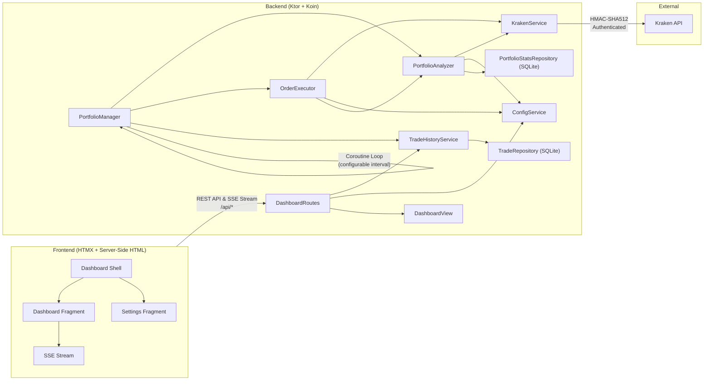
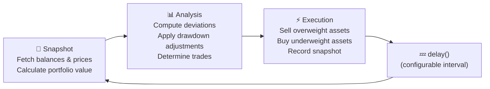

# Kraken Rebalancer

A production-grade, autonomous portfolio rebalancing engine for
the [Kraken](https://www.kraken.com/) cryptocurrency exchange. The system
continuously monitors your portfolio and automatically executes trades to
maintain target asset allocations — with intelligent strategies for handling
deposits, withdrawals, and market drawdowns.

**This application has been running in production managing a live portfolio for
several months.**


---

## Tech Stack

| Layer           | Technology                                                                                           |
|-----------------|------------------------------------------------------------------------------------------------------|
| **Language**    | Kotlin 2.4.0 (JVM)                                                                                   |
| **Backend**     | Ktor 3.5.0 (Netty engine), Koin 4.2.1 (DI), Jackson 2.21                                             |
| **Database**    | SQLite (via JetBrains Exposed ORM 0.61.0)                                                            |
| **HTTP Client** | Ktor CIO Client (async, coroutine-native)                                                            |
| **Concurrency** | Kotlin Coroutines (`kotlinx.coroutines` 1.11.0)                                                      |
| **Frontend**    | Server-side HTML (kotlinx.html DSL + HTMX), Ktor SSE                                                 |
| **API**         | Kraken REST API with HMAC-SHA512 authentication                                                      |
| **Testing**     | Kotest 6.1 (StringSpec), MockK 1.14, Ktor MockEngine, JaCoCo (100% coverage enforced and achieved)   |
| **Build**       | Gradle (Kotlin DSL)                                                                                  |

---

## Technology Journey

This project has served as both a real production tool and a personal learning
lab. The full history of each migration is preserved in the
[CHANGELOG](CHANGELOG.md), the git history, and in dedicated branches — every
rewrite is a checkpoint you can browse on GitHub.

### Phase 1 — Java / Spring Boot / Maven *(Jan – May 2026)*

The application was originally written in **Java 25** with **Spring Boot 4**,
**Maven**, **Lombok**, **OkHttp**, and **JUnit 5 / Mockito** — the stack I am
most experienced with and the one I use professionally. The frontend started as
a **React/Vite** SPA with vanilla JavaScript and Chart.js, and was later
migrated to **TypeScript** with **Tailwind CSS v4** and a full **Vitest** suite.
This phase produced the core rebalancing algorithm, Kraken API integration with
HMAC-SHA512 authentication, and a full CI pipeline on GitHub Actions. By the
time the project was made public (May 2026), the Java backend had 89+ unit tests
enforcing 95%+ coverage, the TypeScript frontend had 97 Vitest tests, and the
application included production-hardened features like atomic file writes,
structured order results, and graceful shutdown.

Development during this phase used feature branches merged via pull requests:

- `fix/security-and-ci-hardening` (PR #9) — security hardening and CI
  enforcement
- `refactor/backend-code-quality` (PR #10) — service/repository layering and
  import cleanup
- `feature/engine-hardening` (PR #12) — rebalancer engine reliability
  improvements
- `large_refactor` (PR #13) — TypeScript migration, Tailwind CSS v4 integration,
  Lombok adoption, and 95%+ coverage enforcement across both frontend and backend

> **If you are evaluating my backend skills**, the early commit history
> showcases idiomatic Java, Spring Boot dependency injection,
> service/repository layering, JUnit 5 testing patterns, and Maven build
> configuration — the technologies I work with daily.

### Phase 2 — Kotlin / Ktor / Koin / Gradle *(May 2026)*

I migrated the entire codebase from Java to **Kotlin 2.x**, **Ktor** (Netty
engine), **Koin** (DI), **Gradle** (Kotlin DSL), and **Kotest / MockK** for
testing. This migration was developed on the `kotlin-migration` branch and
merged via PR #15. Kotlin's coroutines replaced Java's
`ScheduledExecutorService` and `Thread.sleep`, making the rebalancing loop and
all API calls fully non-blocking.

The Kotlin phase continued with several focused branches:

- `cursor/rebalancer-reliability-and-safety-fixes` (PR #16) — `BigDecimal`
  order precision, `AtomicJsonFile` utility, `OrderResult` model, and 122
  backend + 110 frontend unit tests
- `htmx-html-dsl` (PR #17) — replaced the React/Vite frontend with
  **server-side HTML** using the **kotlinx.html** DSL and **HTMX**. Before
  landing on HTMX, I also explored **Angular** as a potential frontend
  framework, but the overhead of a full Angular project with its own build
  pipeline and module system felt disproportionate for a single-page dashboard
  — that exploration was done locally and never committed. HTMX turned out to
  be the ideal fit: it eliminated the separate frontend build pipeline entirely,
  added **Ktor SSE** for real-time dashboard updates, and achieved 100% test
  coverage across every metric
- `code_quality` (PR #18) — centralized CSS classes, HTML IDs, inline styles
  extraction, service layer SRP decomposition (`PortfolioAnalyzer` +
  `OrderExecutor`), and test symbol constants
- `refactor/kotlin-modernization` (PR #19) — Kotlin 2.4.0 named context
  parameters, `Asset` inline value class, pipeline typealiases, and Gradle
  configuration caching

### Phase 3 — Go *(Jun 2026, experimental)*

To explore a completely different paradigm, I rewrote the application in
**Go 1.26** — goroutines, `net/http`, `html/template`, `encoding/json`,
`log/slog`, and `shopspring/decimal`. This taught me Go's explicit error
handling, interface-based polymorphism, and `context.Context` propagation. The
Go version achieved 98.2% test coverage with strict per-package gates. The
complete Go codebase is preserved on the
[`go-rewrite`](../../tree/go-rewrite) branch (9 commits).

### Phase 4 — TypeScript / Node.js / NestJS *(Jun 2026, experimental)*

I then rewrote the application in **TypeScript** with **Node.js**, starting with
a plain Express backend and React/Vite frontend, then migrating to **NestJS**
with **Tailwind CSS v4**. This gave me hands-on experience with Zod schema
validation, the NestJS module/controller/service pattern, and native `fetch` in
Node.js. The complete TypeScript/NestJS codebase is preserved on the
[`feature/typescript-rewrite`](../../tree/feature/typescript-rewrite) branch
(8 commits).

### Phase 5 — Back to Kotlin *(Jun 2026 – present)*

After building the same application three different ways, I returned to
**Kotlin / Ktor** as the permanent stack. The Kotlin version offered the best
balance of:

- **Conciseness** — data classes, extension functions, and coroutines
  dramatically reduce boilerplate compared to Java
- **Type safety** — kotlinx.html gives compile-time-checked HTML rendering that
  Go's `html/template` and JSX cannot match
- **JVM ecosystem** — access to battle-tested libraries (Jackson, Netty, JaCoCo)
  without the weight of Spring Boot's classpath scanning
- **Single-process simplicity** — HTMX eliminated the React build pipeline,
  making the entire application a single `./gradlew run` command

The experimental branches remain in the repository as complete, working
reference implementations for anyone interested in comparing the same domain
logic across three languages and ecosystems.

### Technologies Explored

Building the same application across multiple stacks gave me hands-on experience
with a wide range of tools and paradigms:

| Category                | Technologies Used                                                                                                             |
|-------------------------|------------------------------------------------------------------------------------------------------------------------------ |
| **Languages**           | Java 25, Kotlin 2.4, Go 1.26, TypeScript, JavaScript (ES6+)                                                                   |
| **Backend Frameworks**  | Spring Boot 4, Ktor 2.3 → 3.5, NestJS, Express, Go `net/http`                                                                 |
| **DI / IoC**            | Spring IoC (`@Autowired`), Koin 3.5 → 4.2, NestJS modules                                                                     |
| **Build Systems**       | Maven, Gradle (Kotlin DSL), npm / yarn, Go modules                                                                            |
| **Frontend**            | React (JS → TypeScript), Angular (explored), HTMX + kotlinx.html DSL, Tailwind CSS v4, Chart.js                               |
| **HTTP Clients**        | OkHttp (blocking), Ktor CIO Client (async/coroutine), Node.js native `fetch`, Go `net/http`                                   |
| **Concurrency**         | Java `ScheduledExecutorService`, Kotlin Coroutines, Go goroutines, Node.js event loop                                         |
| **Testing**             | JUnit 5 + Mockito, Kotest 6 + MockK, Vitest + React Testing Library, Go `testing` + `go-test-coverage`                        |
| **Coverage**            | JaCoCo (100% enforced and achieved), Vitest coverage (>99%), Go per-package gates (98.2%)                                     |
| **Serialization**       | Jackson 2.21, Go `encoding/json`, Zod schema validation                                                                       |
| **Real-Time**           | Ktor Server-Sent Events (SSE), Kotlin `SharedFlow`, HTMX SSE extension                                                        |
| **CI / Security**       | GitHub Actions, CodeQL, Dependabot, SHA-pinned actions, CVE patching (Tomcat, Netty, Logback, Jackson)                        |
| **Code Quality**        | Lombok, ESLint, `go fmt`, Kotlin named context parameters, strict `BigDecimal` precision, atomic file I/O                     |

---

## Features

### Autonomous Rebalancing

- Continuously monitors portfolio allocations against configurable targets
- Automatically generates and executes market orders when deviation thresholds
  are exceeded
- Sells overweight assets first to generate liquidity, then buys underweight
  assets

### Dynamic Fiat Deployment

- Tracks portfolio All-Time High (ATH) and calculates real-time drawdown
- Progressively deploys idle cash into the market as drawdowns deepen
- Configurable deployment curve via an exponent parameter (linear, aggressive,
  or conservative)

### Intelligent Fiat Correction

- Recognizes when only USD triggers a deviation threshold (e.g., after a deposit
  or withdrawal)
- Distributes surplus cash proportionally among the most underweight assets
- Handles withdrawals by selling from the most overweight assets

### Live Dashboard

- Real-time portfolio overview with push updates (via Ktor Server-Sent Events)
- Horizontal bar chart showing asset allocation by value
- Sortable asset performance table with deviation indicators
- Trade history log with BUY/SELL badges
- Live/Delayed status indicator with data age tracking
- **Hypermedia-powered** — uses HTMX for dynamic content swapping and form
  submissions without writing JavaScript

### Hot-Reload Configuration

- Modify all settings (allocations, thresholds, assets) via the web UI
- Add or remove assets without restarting the application
- Allocation validation ensures targets always sum to 100%

### Historical Trades Synchronization

- Automatically synchronizes executed trade history from Kraken API (`/0/private/TradesHistory`) on startup
- Persists historical trades to the SQLite database
- Deduplicates boundary trades using cryptographic state signatures (timestamp, pair, side, volume, amount)
- Tracks synchronization state in `history_sync_metadata` to prevent redundant API queries

### Safety & Reliability

- **Dry Run Mode** — test your strategy without executing real trades
- **Structured Order Results** — each order returns success/failure status;
  failed orders don't corrupt cash projections
- **Atomic File Writes** — config, stats, and trade history use
  write-then-rename to prevent corruption
- **Graceful Shutdown** — JVM shutdown hook cleanly stops the loop, closes
  connections, and tears down DI
- Dust threshold filtering to avoid minimum order size errors
- Automatic error recovery — API failures don't crash the rebalancing loop
- Price validation — aborts cycle if any asset price is unavailable
- **BigDecimal Precision** — order volumes use `BigDecimal` (8 decimal places)
  to eliminate floating-point rounding

---

## Screenshots

### Dashboard

The main dashboard shows portfolio value, cash position with effective target (
adjusted for drawdown deployment), crypto asset values, an allocation chart, and
a sortable asset performance table.


### Asset Table & Trade History

The lower section shows detailed per-asset metrics (price, value, target %,
current %, deviation) and a chronological trade activity log.


### Settings

All configuration is managed through the web UI — loop interval, deviation
trigger, dust threshold, fiat deployment parameters, and per-asset allocation
targets.


---

## Architecture



### Rebalance Cycle

Each cycle executes three phases:



See **[ALGORITHM.md](ALGORITHM.md)** for a detailed breakdown of the rebalancing
logic, fiat correction strategy, and dynamic deployment math.

### Real-Time Event Streaming

To eliminate unnecessary network polling, the system uses a reactive, push-based
architecture to synchronize the dashboard with the backend rebalancing loop:

1. **Kotlin SharedFlow**: `TradeHistoryServiceImpl` maintains a
   `MutableSharedFlow` as a hot event broadcaster. Whenever a rebalance cycle
   records a new `PortfolioSnapshot`, the snapshot is emitted to the flow using
   `tryEmit()`.
2. **Ktor Server-Sent Events (SSE)**: The `/api/status/stream` route installs
   Ktor 3's native `SSE` plugin. When a client connects, Ktor pushes the latest
   cached snapshot and then suspends, collecting subsequent snapshots from the
   `SharedFlow` and streaming them over a single, persistent HTTP connection.
3. **HTMX SSE Extension**: The dashboard shell uses `hx-ext="sse"` and
   `sse-connect="/api/status/stream"`. A div with `sse-swap="message"` and
   `hx-trigger="sse:message"` automatically fetches updated dashboard fragments
   from `/fragments/dashboard` whenever a new snapshot arrives over the SSE
   stream.

---

## Project Structure

```text
├── src/main/kotlin/com/gemini/krakenbot/
│   ├── KrakenRebalancerApplication.kt    # Entry point, Ktor server & Koin DI bootstrap
│   ├── config/                            # Data classes: AppConfig, Settings, Allocation, KrakenCredentials
│   │   └── AppModule.kt                  # Koin dependency injection module
│   ├── controller/                        # Ktor routes: DashboardRoutes
│   ├── model/                             # Domain: PortfolioSnapshot, PortfolioStats, OrderResult
│   ├── repository/                        # Persistence interfaces: TradeRepository, PortfolioStatsRepository
│   │   └── impl/                          # SQLite-backed implementations (via Exposed ORM)
│   ├── service/                           # Core logic interfaces: PortfolioManager, KrakenService, ConfigService, TradeHistoryService
│   │   └── impl/                          # Service implementations (coroutine-aware)
│   ├── view/                              # HTML templates & components (kotlinx.html DSL)
│   │   ├── DashboardView.kt              # Facade class delegating to components
│   │   ├── component/                    # Modular components (Shell, Grid, Form, etc.)
│   │   └── util/                         # View utilities (Formatter, Icons, ViewText, Layouts)
│   └── table/                             # Exposed table definitions
├── src/test/kotlin/                       # Unit tests (100% overall coverage achieved across all packages and metrics)
│   └── com/gemini/krakenbot/
│       └── service/
│           └── FakeKrakenService.kt       # In-process test double for KrakenService
├── src/main/resources/                    # Static resources
│   └── static/
│       ├── style.css                      # Dashboard stylesheet
│       ├── dashboard.js                   # Dashboard client-side scripts
│       └── settings.js                    # Settings form client-side scripts
├── ALGORITHM.md                           # Detailed algorithm documentation
├── rebalancer-config-template.json        # Configuration template
└── build.gradle.kts                       # Gradle build with JaCoCo coverage enforcement
```

---

## Getting Started

### Prerequisites

- JDK 25 or higher
- Gradle (or use the included `./gradlew` wrapper — no installation required)
- A Kraken account with API Keys (Permissions: **Query Funds**, **Create &
  Modify Orders**)

### 1. Clone & Configure

```bash
git clone https://github.com/HyperVon/new-kraken-rebalancer.git
cd new-kraken-rebalancer
cp rebalancer-config-template.json rebalancer-config.json
```

Edit `rebalancer-config.json`:

- Add your Kraken API Key and Private Key
- Define your desired `allocations` (must sum to 100%, must include USD)
- Set `dryRun` to `true` for initial testing
- Optionally configure `fiatMaxDrawdown` and `fiatDeploymentExponent` for
  dynamic cash deployment

### 2. Start the Application

```bash
./gradlew run
```

The backend starts on port **8080** and begins the rebalancing loop immediately.

### 3. Open Dashboard

Open your browser to **<http://localhost:8080>**. The dashboard is served directly
from the backend — no separate frontend build step required.

---

## Configuration Reference

| Field                     | Type      | Default | Description                                                                           |
|---------------------------|-----------|---------|---------------------------------------------------------------------------------------|
| `loopDelaySeconds`        | `Long`    | `60`    | Seconds between rebalance cycles                                                      |
| `deviationTriggerPercent` | `Double`  | `5.0`   | Minimum deviation % to trigger a trade                                                |
| `dustThresholdUSD`        | `Double`  | `5.0`   | Minimum trade value in USD (below this is skipped)                                    |
| `dryRun`                  | `Boolean` | `true`  | If true, logs intended trades without executing them                                  |
| `fiatMaxDrawdown`         | `Double`  | `0.0`   | Portfolio drawdown % at which 100% of USD is deployed (0 = disabled)                  |
| `fiatDeploymentExponent`  | `Double`  | `1.0`   | Controls deployment curve: `1.0` = linear, `<1.0` = aggressive, `>1.0` = conservative |

---

## API Endpoints

| Method | Path                   | Description                                                              |
|--------|------------------------|--------------------------------------------------------------------------|
| `GET`  | `/`                    | Main dashboard shell (HTML)                                              |
| `GET`  | `/settings`            | Settings page (HTML)                                                     |
| `POST` | `/settings`            | Submit settings form (HTMX)                                              |
| `GET`  | `/fragments/dashboard` | Dashboard fragment (HTMX)                                                |
| `GET`  | `/api/status/stream`   | Server-Sent Events (SSE) stream for real-time portfolio snapshot updates |
| `GET`  | `/static/*`            | Static assets (CSS)                                                      |

---

## Testing

The project enforces **100% line, branch, method, class, and instruction coverage** via
JaCoCo, with the test suite achieving exactly **100% line, branch, method,
class, and instruction coverage** across the entire codebase (including view
rendering and routing). All tests are behavioural — they verify actual
rebalancing decisions, not just method invocations. Order volumes are asserted
with `BigDecimal.compareTo()` to avoid floating-point comparison issues.

```bash
./gradlew test
```

**214 tests** across:

- **Scenario Evaluation Suite** (`EvaluationScenariosTest`) — **30 highly realistic scenarios** testing the full end-to-end execution of rebalances, mathematical edge cases, API credentials invalidation, concurrency locks, and SSE client streams. See **[EVALUATION.md](EVALUATION.md)** for descriptions and test results of all 30 scenarios.
- `KrakenE2ETest` / `ResilienceChaosTest` / `PrecisionRoundingFuzzTest` /
  `SerializationParityTest` — advanced E2E black-box and fuzz testing
- `PortfolioManagerComprehensiveTest` — full rebalance cycles with order result
  verification
- `PortfolioManagerFiatCorrectionTest` — deposit/withdrawal distribution logic
- `PortfolioManagerDrawdownTest` — ATH tracking and dynamic deployment
- `PortfolioManagerOrderExecutionTest` — sell-first/buy-second sequencing
- `PortfolioManagerLoopTest` — loop lifecycle, error recovery, interruption
- `PortfolioManagerZeroAllocationTest` — edge case: 0% target allocation
- `PortfolioManagerEdgeCasesTest` — dust thresholds, price gaps, zero balances
- `PortfolioManagerDogeTest` — Kraken symbol mapping quirks (BTC→XBT, DOGE→XDG)
- `KrakenServiceTest` — API signing, error handling, dry run, order failure (
  using Ktor `MockEngine`)
- `ModelTest` — unit tests for models including `Asset` mapping
- `ConfigServiceTest` — validation, hot-reload, persistence, duplicate/blank
  symbol rejection
- `DashboardControllerTest` — REST API endpoints, invalid config error responses
- `TradeHistoryServiceTest` — snapshot storage, size limits, and historical synchronization states
- `SqliteTradeRepositoryImplTest` / `SqlitePortfolioStatsRepositoryImplTest` — SQLite persistence, Exposed ORM schema initialization, query logic, and transactional error propagation

### Test Design Principles

- **Class Initializers**: All test suites are structured using standard class body `init { ... }` blocks (e.g., `class ExampleTest : StringSpec() { init { ... } }`) instead of constructor lambdas, making them fully compatible with build runners and IDE test discovery tools. `@Suppress("unused")` is applied where IDE static analysis triggers warnings because Kotest loads specs dynamically via reflection.
- **`FakeKrakenService`** — an in-process test double for `KrakenService` used
  by all `PortfolioManager` tests. Avoids fragile `coEvery` stubbing of
  `suspend` functions in concurrent coroutine contexts.
- **`runTest`** — all tests that call `suspend` functions use
  `kotlinx.coroutines.test.runTest` for correct coroutine scheduling.
- **`MockEngine`** — `KrakenServiceTest` uses Ktor's `MockEngine` to simulate
  HTTP responses without a real network.

---

## License

This project is licensed under the MIT License — see the [LICENSE](LICENSE) file
for details.
