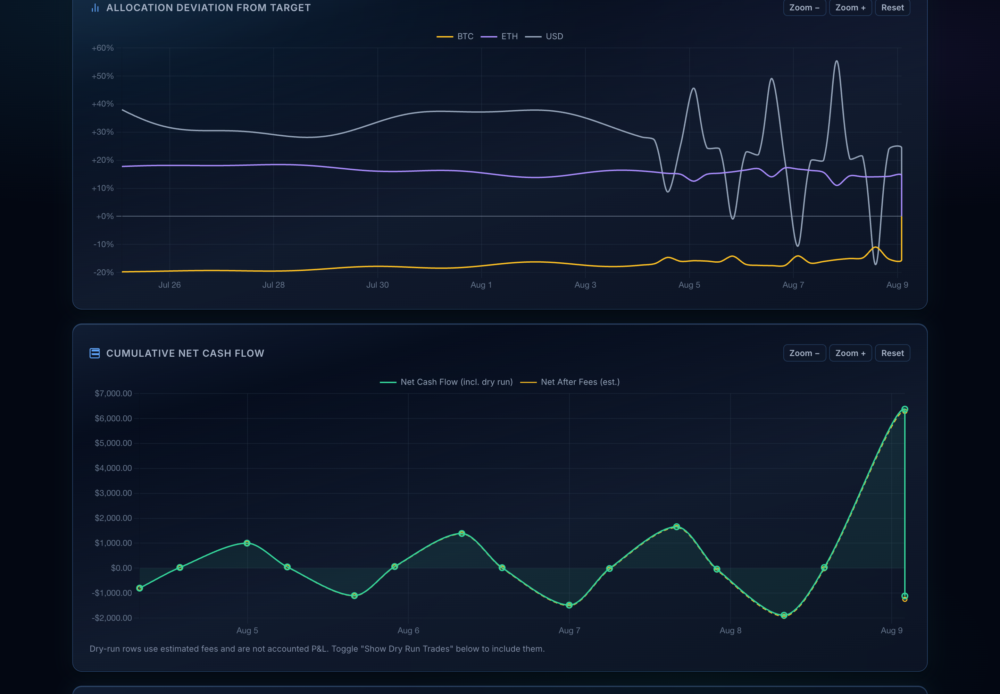
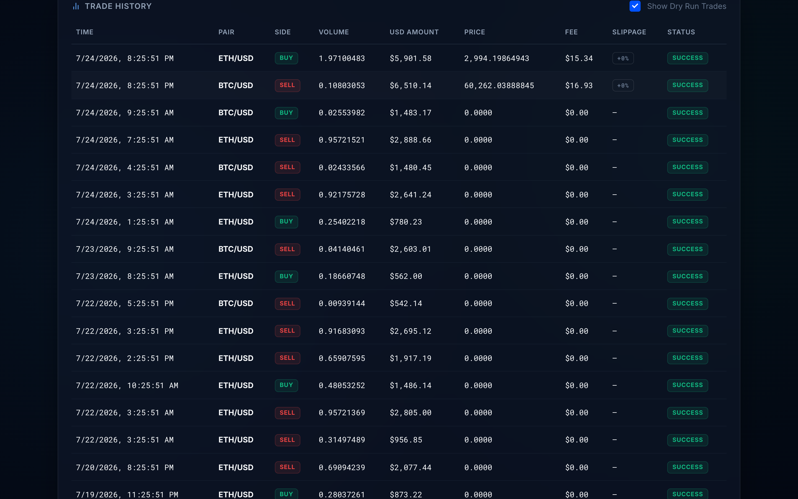
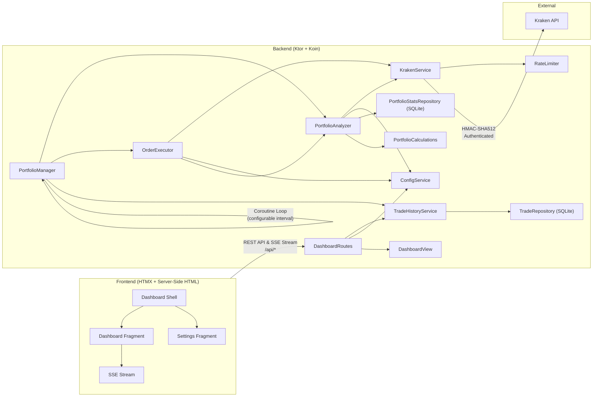
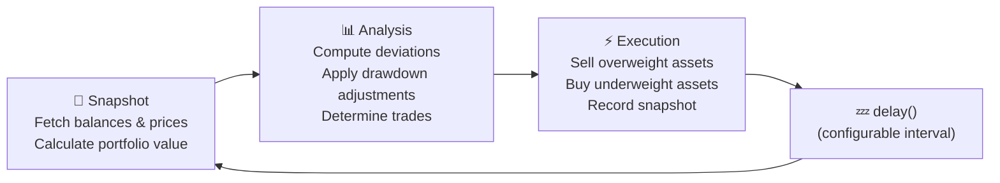

# Kraken Rebalancer

A production-grade, autonomous portfolio rebalancing engine for
the [Kraken](https://www.kraken.com/) cryptocurrency exchange. The system
continuously monitors your portfolio and automatically executes trades to
maintain target asset allocations — with intelligent strategies for handling
deposits, withdrawals, and market drawdowns.

**This application has been running in production managing a live portfolio for
several months.**


**New here?** Start with the [User Guide](docs/USER_GUIDE.md) — a visual
walkthrough of Dashboard, Settings, History, and safety modes
(simulation / dry run).

---

## Tech Stack

| Layer           | Technology                                                                                             |
| --------------- | ------------------------------------------------------------------------------------------------------ |
| **Language**    | Kotlin 2.4.10 (Kotlin Multiplatform: JVM + JS)                                                         |
| **Backend**     | Ktor 3.5.1 (Netty engine), Koin 4.2.2 (DI), Jackson 2.22.1                                             |
| **Database**    | SQLite (via JetBrains Exposed ORM 1.3.1)                                                               |
| **HTTP Client** | Ktor CIO Client (async, coroutine-native)                                                              |
| **Concurrency** | Kotlin Coroutines (`kotlinx.coroutines` 1.11.0)                                                        |
| **Frontend**    | Server-side HTML (kotlinx.html DSL + HTMX), kotlinx-css DSL, Ktor SSE + Client-side Kotlin/JS          |
| **API**         | Kraken REST API with HMAC-SHA512 authentication                                                        |
| **Testing**     | Kotest 6.2.3, MockK 1.14, JaCoCo (95%+ JVM coverage), Karma/Istanbul (90%+ JS statement/func coverage) |
| **Build**       | Gradle 9.6.1 (Kotlin DSL), Spotless + ktlint 1.7.1                                                     |

---

## Technology Journey

This project has served as both a real production tool and a personal learning
lab. The full history of each migration is preserved in the
[CHANGELOG](CHANGELOG.md), the git history, and in dedicated branches — every
rewrite is a checkpoint you can browse on GitHub.

### Phase 1 — Java / Spring Boot / Maven *(Jan – May 2026)*

The application was originally written in **Java 25** with **Spring Boot 4**,
**Maven**, **Lombok**, **OkHttp**, and **JUnit 5 / Mockito** — the stack I am
most experienced with and the one I use professionally. The frontend started as
a **React/Vite** SPA with vanilla JavaScript and Chart.js, and was later
migrated to **TypeScript** with **Tailwind CSS v4** and a full **Vitest** suite.
This phase produced the core rebalancing algorithm, Kraken API integration with
HMAC-SHA512 authentication, and a full CI pipeline on GitHub Actions. By the
time the project was made public (May 2026), the Java backend had 89+ unit tests
enforcing 95%+ coverage, the TypeScript frontend had 97 Vitest tests, and the
application included production-hardened features like atomic file writes,
structured order results, and graceful shutdown.

Development during this phase used feature branches merged via pull requests:

- `fix/security-and-ci-hardening` (PR #9) — security hardening and CI
  enforcement
- `refactor/backend-code-quality` (PR #10) — service/repository layering and
  import cleanup
- `feature/engine-hardening` (PR #12) — rebalancer engine reliability
  improvements
- `large_refactor` (PR #13) — TypeScript migration, Tailwind CSS v4 integration,
  Lombok adoption, and 95%+ coverage enforcement across both frontend and backend

> **If you are evaluating my backend skills**, the early commit history
> showcases idiomatic Java, Spring Boot dependency injection,
> service/repository layering, JUnit 5 testing patterns, and Maven build
> configuration — the technologies I work with daily.

### Phase 2 — Kotlin / Ktor / Koin / Gradle *(May 2026)*

I migrated the entire codebase from Java to **Kotlin 2.x**, **Ktor** (Netty
engine), **Koin** (DI), **Gradle** (Kotlin DSL), and **Kotest / MockK** for
testing. This migration was developed on the `kotlin-migration` branch and
merged via PR #15. Kotlin's coroutines replaced Java's
`ScheduledExecutorService` and `Thread.sleep`, making the rebalancing loop and
all API calls fully non-blocking.

The Kotlin phase continued with several focused branches:

- `cursor/rebalancer-reliability-and-safety-fixes` (PR #16) — `BigDecimal`
  order precision, `AtomicJsonFile` utility, `OrderResult` model, and 122
  backend + 110 frontend unit tests
- `htmx-html-dsl` (PR #17) — replaced the React/Vite frontend with
  **server-side HTML** using the **kotlinx.html** DSL and **HTMX**. Before
  landing on HTMX, I also explored **Angular** as a potential frontend
  framework, but the overhead of a full Angular project with its own build
  pipeline and module system felt disproportionate for a single-page dashboard
  — that exploration was done locally and never committed. HTMX turned out to
  be the ideal fit: it eliminated the separate frontend build pipeline entirely,
  added **Ktor SSE** for real-time dashboard updates, and achieved 100% test
  coverage across every metric
- `code_quality` (PR #18) — centralized CSS classes, HTML IDs, inline styles
  extraction, service layer SRP decomposition (`PortfolioAnalyzer` +
  `OrderExecutor`), and test symbol constants
- `refactor/kotlin-modernization` (PR #19) — Kotlin 2.4.0 named context
  parameters, `Asset` inline value class, pipeline typealiases, and Gradle
  configuration caching

### Phase 3 — Go *(Jun 2026, experimental)*

To explore a completely different paradigm, I rewrote the application in
**Go 1.26** — goroutines, `net/http`, `html/template`, `encoding/json`,
`log/slog`, and `shopspring/decimal`. This taught me Go's explicit error
handling, interface-based polymorphism, and `context.Context` propagation. The
Go version achieved 98.2% test coverage with strict per-package gates. The
complete Go codebase is preserved on the
[`go-rewrite`](../../tree/go-rewrite) branch (9 commits).

### Phase 4 — TypeScript / Node.js / NestJS *(Jun 2026, experimental)*

I then rewrote the application in **TypeScript** with **Node.js**, starting with
a plain Express backend and React/Vite frontend, then migrating to **NestJS**
with **Tailwind CSS v4**. This gave me hands-on experience with Zod schema
validation, the NestJS module/controller/service pattern, and native `fetch` in
Node.js. The complete TypeScript/NestJS codebase is preserved on the
[`feature/typescript-rewrite`](../../tree/feature/typescript-rewrite) branch
(8 commits).

### Phase 5 — 100% Kotlin & Kotlin Multiplatform *(Jun 2026 – present)*

After building the same application three different ways, I returned to
**Kotlin / Ktor** as the permanent stack. To eliminate client-side JavaScript entirely, I migrated all remaining frontend scripts to **Kotlin/JS** using **Kotlin Multiplatform (KMP)**. The codebase is now **100% Kotlin**, offering the best balance of:

- **Kotlin Multiplatform** — compiling a `:frontend-js` subproject directly to JavaScript via the Kotlin JS IR backend, replacing legacy browser scripts with type-safe Kotlin code.
- **Conciseness** — data classes, extension functions, and coroutines dramatically reduce boilerplate compared to Java.
- **Type safety** — `kotlinx.html` gives compile-time-checked HTML rendering that Go's `html/template` and JSX cannot match, while Kotlin/JS handles all client-side actions and table sorting with strong compile-time types.
- **JVM ecosystem** — access to battle-tested libraries (Jackson, Netty, JaCoCo) without the weight of Spring Boot's classpath scanning.
- **Single-process simplicity** — HTMX and Kotlin/JS compile to a single bundled asset served dynamically, keeping the entire application within a single `./gradlew run` command.

The experimental branches (`go-rewrite` and `feature/typescript-rewrite`) remain in the repository as complete, working
reference implementations for anyone interested in comparing the same domain
logic across three languages and ecosystems.

Subsequent updates in Phase 5 integrated a reactive configuration loop (`watchConfigChanges().collectLatest`), a Kraken call-counter rate limiter, flow-based API retry policies, and flow-based trade history pagination directly into the `main` branch. Additionally, the remaining client-side Javascript logic was rewritten to Kotlin/JS under the `:frontend-js` subproject, achieving a 100% Kotlin codebase.

### Technologies Explored

Building the same application across multiple stacks gave me hands-on experience
with a wide range of tools and paradigms:

| Category               | Technologies Used                                                                                                                                           |
| ---------------------- | ----------------------------------------------------------------------------------------------------------------------------------------------------------- |
| **Languages**          | Java 25, Kotlin 2.4, Go 1.26, TypeScript, JavaScript (ES6+)                                                                                                 |
| **Backend Frameworks** | Spring Boot 4, Ktor 2.3 → 3.5, NestJS, Express, Go `net/http`                                                                                               |
| **DI / IoC**           | Spring IoC (`@Autowired`), Koin 3.5 → 4.2, NestJS modules                                                                                                   |
| **Build Systems**      | Maven, Gradle (Kotlin DSL), npm / yarn, Go modules                                                                                                          |
| **Frontend**           | React (JS → TypeScript), Angular (explored), HTMX + kotlinx.html DSL, Tailwind CSS v4, Chart.js                                                             |
| **HTTP Clients**       | OkHttp (blocking), Ktor CIO Client (async/coroutine), Node.js native `fetch`, Go `net/http`                                                                 |
| **Concurrency**        | Java `ScheduledExecutorService`, Kotlin Coroutines, Go goroutines, Node.js event loop                                                                       |
| **Testing**            | JUnit 5 + Mockito, Kotest 6 + MockK, Vitest + React Testing Library, Go `testing` + `go-test-coverage`                                                      |
| **Coverage**           | JaCoCo (95%+ enforced on Kotlin stack), Vitest coverage (>99%), Go per-package gates (98.2%)                                                                |
| **Serialization**      | Jackson 2.22.1, Go `encoding/json`, Zod schema validation                                                                                                   |
| **Real-Time**          | Ktor Server-Sent Events (SSE), Kotlin `SharedFlow` (snapshots + rebalance events), HTMX SSE extension                                                       |
| **CI / Security**      | GitHub Actions, Dependabot, SHA-pinned actions, CVE patching (Netty, Logback, Jackson); CodeQL workflow present but **disabled** (Kotlin 2.4.x unsupported) |
| **Code Quality**       | Lombok, ESLint, `go fmt`, Kotlin named context parameters, strict `BigDecimal` precision, atomic file I/O                                                   |

---

## Features

### Autonomous Rebalancing

- Continuously monitors portfolio allocations against configurable targets
- Automatically generates and executes market orders when deviation thresholds
  are exceeded
- Sells overweight assets first to generate liquidity, then buys underweight
  assets

### Dynamic Fiat Deployment

- Tracks portfolio All-Time High (ATH) and calculates real-time drawdown
- Progressively deploys idle cash into the market as drawdowns deepen
- Configurable deployment curve via an exponent parameter (linear, aggressive,
  or conservative)

### Intelligent Fiat Correction

- Recognizes when only USD triggers a deviation threshold (e.g., after a deposit
  or withdrawal)
- Distributes surplus cash proportionally among the most underweight assets
- Handles withdrawals by selling from the most overweight assets

### Live Dashboard

- Real-time portfolio overview with push updates (via Ktor Server-Sent Events)
- Horizontal bar chart showing asset allocation by value
- Sortable asset performance table with deviation indicators
- Trade history log with BUY/SELL badges
- Live/Delayed status indicator with data age tracking
- **Range-Filtered History Metrics** — Time frame selector controls all six top metric summary cards (All-Time High / Period High, Total Trades, Total Volume Traded, Total Fees Paid, Avg Fee Rate, Avg Slippage) dynamically alongside interactive Chart.js timelines and trade history logs with price, fee, and slippage columns.
- **Hypermedia-powered** — uses HTMX for dynamic content swapping and form
  submissions without writing JavaScript

### Hot-Reload Configuration

- Modify all settings (allocations, thresholds, assets) via the web UI
- Add or remove assets without restarting the application
- Allocation validation ensures targets always sum to 100%
- `ConfigService.watchConfigChanges()` exposes a `Flow<Settings>`, which `PortfolioManagerImpl` uses to reactively abort and restart its rebalancing loop with the new settings without polling.

### Offline Exchange Simulator & Pre-Seeding

- **Offline Simulation Mode** — Run the bot completely offline without a real Kraken API key. Enable `"simulation": true` (dynamic toggling supported via the Settings UI) to execute orders and check balances against a realistic random walk price generator.
- **Automated Database Seeding** — If started in simulation mode with an empty database, the system generates 15 days (60 cycles) of historical snapshots and trade logs, providing immediately interactive graphs.

### Historical Trades Synchronization

- Automatically synchronizes executed trade history from Kraken API (`/0/private/TradesHistory`) on startup
- Persists historical trades to the SQLite database
- Deduplicates overlapping records within a ~5 minute window via pair-alias normalization (e.g. `XBTUSD` vs `XXBTZUSD`), local-estimate vs API fill reconciliation, and fee-difference tolerance
- Tracks synchronization state in `history_sync_metadata` to prevent redundant API queries

### Safety & Reliability

- **Dry Run Mode** — test your strategy without executing real trades
- **Structured Order Results** — each order returns success/failure status;
  failed orders don't corrupt cash projections
- **Atomic File Writes** — config updates use write-then-atomic-rename (NIO Files.move with StandardCopyOption.ATOMIC_MOVE) to prevent file system corruption
- **Graceful Shutdown** — JVM shutdown hook cleanly cancels the coroutine loop scope, closes Ktor HttpClient, and stops Koin DI
- **Redacted Secret Logging** — value class `toString()` implementations for API credentials return redacts to protect application logs
- **Rate-Limiting & Retries** — `RateLimiter` implements Kraken's linearly
  decaying call counter (elapsed seconds × 0.33; safe limit 12.0; per-endpoint
  costs); `retryWithFlow` automatically retries transient
  socket/HTTP/rate-limit/lockout errors with exponential backoff (lockouts
  start at 10s and scale up to a 15-minute ceiling)
- **CORS Restrictions** — locks down server allowed origins to local machine addresses (`localhost`, `127.0.0.1`, `::1`), Bonjour multicast DNS domains (`*.local`), and private local subnets (`192.168.x.x`, `10.x.x.x`, etc.) to permit local Wi-Fi access from other devices while blocking public web threats
- **Database Indexing & Auto Migrations** — database schemas utilize index optimizations for timestamps, and run dynamic `SchemaUtils.createMissingTablesAndColumns` auto-migrations on startup
- Dust threshold filtering to avoid minimum order size errors
- Automatic error recovery — API failures don't crash the rebalancing loop
- Price validation — aborts cycle if any asset price is unavailable
- **BigDecimal Precision** — all balances, prices, and volumes are tracked via `BigDecimal` to completely eliminate floating-point precision loss

---

## Screenshots

### Dashboard

The main dashboard shows portfolio value, cash position with effective target (
adjusted for drawdown deployment), crypto asset values, an allocation chart, and
a sortable asset performance table.


### Asset Table & Trade History

The lower section shows detailed per-asset metrics (price, value, target %,
current %, deviation) and a chronological trade activity log.


### Settings

All configuration is managed through the web UI — loop interval, deviation
trigger, dust threshold, fiat deployment parameters, and per-asset allocation
targets.


### History

The dedicated History view provides detailed analysis and charts tracking portfolio metrics over time. Users can select different time ranges (24h, 7d, 30d, 90d, All) to update the charts and trade log. It features:

- Six summary stat cards including avg fee rate and avg slippage
- Trade log columns for price, fee, slippage, and status
- Cumulative net cash flow chart with gross and fee-adjusted (dashed) series

- **View presets** — **Overview**, **Day · Total only**, **Week · Allocation**, and **Month · Net Cash Flow**, plus **Save view…** / **Set as default** / **Delete** for browser-local custom views
- **Chart zoom** — **Zoom −** / **Zoom +** / **Reset**, plus wheel, pinch, and drag-to-zoom on the x-axis
- **Pan scrubber** — after zooming in, a horizontal scrubber below each chart pans the visible window across the full time range (chart drag zooms; it does not pan)
- **Portfolio Value Over Time** (overall portfolio value in USD + individual asset values)
- **Asset Holdings Over Time** (% change in asset balance)
- **Allocation Deviation from Target** (signed relative drift around a 0% on-target baseline)
- **Cumulative Net Cash Flow** (gross signed cash flow plus dashed **Net After Fees** series)
- **Comprehensive Trade Log Table** (showing all executions, with a toggle to filter/show dry-run trades)






For a full walkthrough of what each control and chart means, see the
[User Guide](docs/USER_GUIDE.md).

---

## Architecture



### Rebalance Cycle

Each cycle executes three phases:



See **[ALGORITHM.md](docs/ALGORITHM.md)** for a detailed breakdown of the rebalancing
logic, fiat correction strategy, and dynamic deployment math.

See **[FLOWS.md](docs/FLOWS.md)** for sequence diagrams and a comprehensive breakdown
of how Kotlin's hot `SharedFlow` and cold `Flow` streams orchestrate configuration updates,
real-time dashboard streaming, paginated transaction sync, and exponential backoff polling.

### Real-Time Event Streaming

The dashboard and monitoring hooks use a reactive, push-based architecture with
two complementary `SharedFlow` channels:

#### Portfolio Snapshot Stream (Dashboard SSE)

1. **Kotlin SharedFlow**: `TradeHistoryServiceImpl` maintains a
   `MutableSharedFlow<PortfolioSnapshot>` as a hot event broadcaster. Whenever a
   rebalance cycle records a new snapshot, it is emitted via `tryEmit()`.
2. **Ktor Server-Sent Events (SSE)**: The `/api/status/stream` route installs
   Ktor 3's native `SSE` plugin. When a client connects, Ktor pushes the latest
   cached snapshot and then collects subsequent snapshots from the
   `SharedFlow`, streaming them over a single persistent HTTP connection.
3. **HTMX SSE Extension**: The dashboard shell uses `hx-ext="sse"` and
   `sse-connect="/api/status/stream"`. A div with `sse-swap="message"` and
   `hx-trigger="sse:message"` automatically fetches updated dashboard fragments
   from `/fragments/dashboard` whenever a new snapshot arrives.

#### Rebalance Cycle Event Stream (Monitoring)

1. **Reactive config loop**: `ConfigService.watchConfigChanges()` provides a
   `Flow<Settings>`. `PortfolioManagerImpl` wraps its run loop with `collectLatest`
   to immediately restart the loop on config changes.

---

## Project Structure

```text
├── .agents/                                # AI Agent rules, guidelines & domain skills
│   ├── AGENTS.md                          # Repository rules & technical guidelines
│   ├── OPERATING.md                       # Always-on norms (all agent frameworks)
│   └── skills/                            # Domain skills (see .agents/AGENTS.md skill index)
├── .cursor/rules/                          # Cursor projections of OPERATING.md (committed)
├── CLAUDE.md                               # Claude Code entrypoint → .agents/
├── .github/copilot-instructions.md         # GitHub Copilot entrypoint → .agents/
├── common/                                 # Kotlin Multiplatform shared module (JVM + JS)
│   └── src/commonMain/kotlin/.../         # AppConfig, Settings, Routes, HtmlIds, CssClass, ViewText, …
├── frontend-js/                            # Kotlin/JS client-side subproject compiling to rebalancer.js
│   ├── src/jsMain/kotlin/                 # Kotlin/JS frontend source files
│   │   ├── main.kt                        # Client-side routing entry point
│   │   ├── Dashboard.kt                   # Stats card age calculation & table sorting
│   │   ├── Settings.kt                    # Targets validation & dynamic row actions
│   │   ├── History.kt                     # Chart.js timelines, zoom, and pan scrubbers
│   │   ├── HistoryViewPrefs.kt            # Browser-local History view presets
│   │   ├── DomExtensions.kt               # Shared DOM helpers for Kotlin/JS
│   │   └── JsModels.kt                    # JS-facing model/helpers shared by pages
│   └── build.gradle.kts                   # Kotlin Multiplatform JS compilation configuration
├── src/main/kotlin/com/gemini/krakenbot/
│   ├── KrakenRebalancerApplication.kt    # Entry point, Ktor server & Koin DI bootstrap
│   ├── config/                            # JVM: AppModule, DatabaseConfig, KtorConfig, ErrorHandlingConfig
│   │   └── AppModule.kt                  # Koin dependency injection module
│   ├── controller/                        # Ktor routes: DashboardRoutes / DashboardController
│   ├── model/                             # Domain: PortfolioSnapshot, OrderResult, TradeRecord, TradeSource, HistoryStats, PortfolioStats
│   ├── repository/                        # Persistence interfaces: TradeRepository, PortfolioStatsRepository
│   │   ├── impl/                          # SQLite-backed implementations (via Exposed ORM)
│   │   │   └── RepositoryUtils.kt         # safeTransaction + Dispatchers.IO helpers
│   │   └── table/                         # Exposed table definitions (Trade, Snapshot, Stats, Sync metadata)
│   ├── service/                           # Core logic interfaces and shared utilities
│   │   ├── ServiceUtils.kt               # BigDecimal parsing and relative-tolerance helpers
│   │   └── impl/                          # Service implementations (coroutine-aware)
│   │       ├── PortfolioManagerImpl.kt   # Loop orchestrator
│   │       ├── PortfolioAnalyzerImpl.kt  # Snapshot/analysis logic
│   │       ├── PortfolioCalculations.kt  # Shared target/deviation math
│   │       ├── OrderExecutorImpl.kt      # Sell-first/buy-second execution
│   │       ├── DynamicKrakenService.kt   # Routes live vs SimulatedKrakenService by settings.simulation
│   │       ├── KrakenServiceImpl.kt      # Kraken API client + RateLimiter + retryWithFlow
│   │       ├── KrakenApiConstants.kt     # Kraken REST path/cost constants
│   │       ├── SimulatedKrakenService.kt # Offline exchange emulator
│   │       ├── RateLimiter.kt            # Kraken call-counter rate limiter
│   │       ├── ConfigServiceImpl.kt      # Config persistence + watchConfigChanges flow
│   │       ├── SimulationDefaults.kt     # Shared simulation default prices
│   │       ├── SnapshotHistoryCalculator.kt # History reconstruction helpers
│   │       └── TradeHistoryServiceImpl.kt # Snapshot storage, trade sync, history flow
│   ├── view/                              # HTML templates & components (kotlinx.html DSL)
│   │   ├── DashboardView.kt              # Facade class delegating to components
│   │   ├── component/                    # Modular components (Shell, Grid, Form, History, etc.)
│   │   ├── css/                          # Modular domain CSS modules (CssTheme, LayoutStyles, TableStyles, FormStyles, NavigationStyles)
│   │   └── util/                         # Formatter, Extensions, Icons, Layouts (shared IDs/Routes live in :common)
├── src/test/kotlin/                       # Unit tests (95%+ coverage enforced via JaCoCo)
│   └── com/gemini/krakenbot/
│       └── service/
│           ├── FakeKrakenService.kt       # In-process test double for KrakenService
│           ├── DynamicKrakenServiceTest.kt # Unit tests verifying dynamic real/simulation routing
│           └── SimulatedKrakenServiceTest.kt # Unit tests verifying mock exchange emulator
├── src/main/resources/                    # Static resources
│   └── static/
│       ├── (style.css served dynamically) # Stylesheet compiled from view/css/ via kotlinx-css DSL
│       └── (rebalancer.js copy-bundled)   # Dynamic JS bundle compiled from frontend-js subproject
├── docs/                                  # Project documentation and architecture guides
│   ├── USER_GUIDE.md                      # End-user walkthrough (Dashboard, Settings, History)
│   ├── images/                            # README / User Guide screenshot PNGs
│   ├── FLOWS.md                           # Kotlin Flow architecture guide
│   ├── ALGORITHM.md                       # Detailed algorithm documentation
│   └── EVALUATION.md                      # Scenario evaluation suite documentation
├── rebalancer-config-template.json        # Configuration template
└── build.gradle.kts                       # Gradle build with JaCoCo coverage enforcement
```

---

## Getting Started

### Prerequisites

- JDK 25 or higher
- Gradle (or use the included `./gradlew` wrapper — no installation required)
- A Kraken account with API Keys (Permissions: **Query Funds**, **Query Closed
  Orders & Trades**, **Create & Modify Orders**)

### 1. Clone & Configure

```bash
git clone https://github.com/HyperVon/new-kraken-rebalancer.git
cd new-kraken-rebalancer
cp rebalancer-config-template.json rebalancer-config.json
```

Edit `rebalancer-config.json`:

- Add your Kraken API Key and Private Key
- Define your desired `allocations` (must sum to 100%, must include USD)
- Set `dryRun` to `true` for initial testing
- Optionally configure `fiatMaxDrawdown` and `fiatDeploymentExponent` for
  dynamic cash deployment

### 2. Start the Application

You can start the application using the convenient pre-configured startup scripts (which automatically compile the Fat JAR if it has not yet been built):

- **macOS / Linux**:

  ```bash
  ./start.sh
  ```

- **Windows**:

  ```cmd
  start.bat
  ```

#### Alternative Startup Methods

If you prefer to run using Gradle directly:

```bash
./gradlew run
```

Or if you wish to build and execute the Fat JAR manually:

```bash
# Build the Fat JAR containing all dependencies
./gradlew fatJar

# Run using the JVM (includes optimal JVM parameters for native SQLite memory access)
java -Xshare:off --sun-misc-unsafe-memory-access=allow --enable-native-access=ALL-UNNAMED -jar build/libs/kraken-bot-0.0.1-SNAPSHOT-all.jar
```

For a local quality-gated release build, use `./gradlew build fatJar` without
`clean` so Gradle can reuse compilation, Kotlin/JS, Webpack, and test outputs.
Reserve `clean` for troubleshooting stale outputs. Gradle runs independent
projects in parallel and uses up to two JVM test forks by default; override on
smaller machines with `-PtestForks=1` or `-PtestMaxHeap=1g`.

The backend starts on port **8080** and begins the rebalancing loop immediately.

### 3. Open Dashboard

Open your browser to **<http://localhost:8080>**. The dashboard is served directly
from the backend.

> [!NOTE]
> **Zero-Setup Kotlin/JS Build:** The client-side code is written in Kotlin and compiled to JavaScript (`rebalancer.js`) via the Gradle build pipeline. The build process automatically downloads and executes an isolated local copy of Node.js and Yarn inside the `.gradle/` directory. **You do not need to install Node, npm, or Yarn on your host machine.**

#### Frontend Development Tasks (Optional)

If you are modifying the client-side code in `frontend-js/` and want to compile or verify only the JS bundle:

```bash
# Compile and bundle the Kotlin/JS subproject via production Webpack
./gradlew :frontend-js:jsBrowserProductionWebpack

# Compile and copy the bundle directly into the Ktor JVM static resources folder
./gradlew copyJsBundle
```

---

## Configuration Reference

| Field                     | Type      | Default | Description                                                                           |
|---------------------------|-----------|---------|---------------------------------------------------------------------------------------|
| `loopDelaySeconds`        | `Long`    | `60`    | Seconds between rebalance cycles                                                      |
| `deviationTriggerPercent` | `Double`  | `5.0`   | Minimum deviation % to trigger a trade                                                |
| `dustThresholdUSD`        | `Double`  | `5.0`   | Min significant USD deviation (order generation) and min order notional (execution)   |
| `dryRun`                  | `Boolean` | `true`  | If true, logs intended trades without executing them                                  |
| `simulation`              | `Boolean` | `false` | If true, runs offline in exchange simulation mode (seeds history if DB is empty)      |
| `fiatMaxDrawdown`         | `Double`  | `0.0`   | Portfolio drawdown % at which 100% of USD is deployed (0 = disabled)                  |
| `fiatDeploymentExponent`  | `Double`  | `1.0`   | Controls deployment curve: `1.0` = linear, `<1.0` = aggressive, `>1.0` = conservative |

---

## API Endpoints

| Method | Path                         | Description                                                              |
|--------|------------------------------|--------------------------------------------------------------------------|
| `GET`  | `/`                          | Main dashboard shell (HTML)                                              |
| `GET`  | `/settings`                  | Settings page (HTML)                                                     |
| `POST` | `/settings`                  | Submit settings form (HTMX)                                              |
| `GET`  | `/history`                   | History page (HTML charts + trade log)                                   |
| `GET`  | `/fragments/dashboard`       | Dashboard fragment (HTMX)                                                |
| `GET`  | `/api/status/stream`         | Server-Sent Events (SSE) stream for real-time portfolio snapshot updates |
| `GET`  | `/api/health`                | Public health check endpoint returning app status and metrics (JSON)     |
| `GET`  | `/api/history/snapshots`     | Portfolio snapshots for History charts (JSON, `?range=`)                 |
| `GET`  | `/api/history/trades`        | Trade log for History page (JSON, `?range=`)                             |
| `GET`  | `/api/history/stats`         | History summary-card aggregates (JSON, `?range=`)                        |
| `GET`  | `/api/history/sync-progress` | Polling endpoint for Kraken trade history sync status (JSON)             |
| `GET`  | `/static/*`                  | Static assets (JS, dynamically compiled CSS via kotlinx-css)             |

---

## Testing

The project features a comprehensive test suite for both the backend JVM application and the frontend Kotlin/JS subproject. To run all checks, tests, and coverage verification gates:

```bash
./gradlew check
```

### Backend JVM Tests

The backend enforces **strict line, branch, method, and instruction coverage**
via JaCoCo: **95% instruction, 90% branch, 95% line, and 95% method**.
Exclusions are narrow: framework bootstrap (`DatabaseConfig`,
`ErrorHandlingConfig`, `KtorConfig`), Exposed table declarations, Kraken API
client interfaces/impl, generated HTML-extension lambdas, CSS DSL, and
`KrakenRebalancerApplication`.

To run JVM tests only:

```bash
./gradlew test
```

### Frontend Kotlin/JS Tests

The client-side browser logic is tested via Chrome Headless using Karma and verified with Istanbul code coverage check thresholds (**90% statements, 90% lines, 90% functions, 75% branches**).

To run JS browser tests only:

```bash
./gradlew :frontend-js:jsBrowserTest
```

Tests cover:

- **Scenario Evaluation Suite** (`EvaluationScenariosTest`) — **32 highly realistic scenarios** testing the full end-to-end execution of rebalances, mathematical edge cases, API credentials invalidation, concurrency locks, and SSE client streams. See **[EVALUATION.md](docs/EVALUATION.md)** for descriptions and test results of all 32 scenarios.
- `KrakenE2ETest` / `ResilienceChaosTest` / `PrecisionRoundingFuzzTest` /
  `SerializationParityTest` — advanced E2E black-box and fuzz testing
- `PortfolioManagerComprehensiveTest` — full rebalance cycles with order result
  verification
- `PortfolioManagerFiatCorrectionTest` — deposit/withdrawal distribution logic
- `PortfolioManagerDrawdownTest` — ATH tracking and dynamic deployment
- `PortfolioManagerOrderExecutionTest` — sell-first/buy-second sequencing and
  `OrderExecuted` event flow verification
- `PortfolioManagerLoopTest` — loop lifecycle, error recovery, interruption
- `PortfolioManagerZeroAllocationTest` — edge case: 0% target allocation
- `PortfolioManagerEdgeCasesTest` — dust thresholds, price gaps, zero balances,
  rebalance event flow
- `PortfolioManagerDogeTest` — Kraken symbol mapping quirks (BTC→XBT, DOGE→XDG)
- `KrakenServiceTest` — API signing, error handling, dry run, order failure,
  retry/lockout behaviour (using Ktor `MockEngine`)
- `ModelTest` / `ResultTest` — unit tests for domain models and the `Result` type
- `ConfigServiceTest` — validation, hot-reload, persistence, duplicate/blank
  symbol rejection, and `watchConfigChanges()` flow
- `ServiceUtilsTest` / `FormatterTest` — utility function coverage
- `RateLimiterTest` — call-counter decay, endpoint costs, waiting, and reset behavior
- `DashboardControllerTest` — REST API endpoints, invalid config error responses, and trade history sync status
- `TradeHistoryServiceTest` — snapshot storage, size limits, and historical synchronization states
- `DynamicKrakenServiceTest` / `SimulatedKrakenServiceTest` — dynamic real/simulation routing and offline exchange simulation logic
- `SqliteTradeRepositoryImplTest` / `SqlitePortfolioStatsRepositoryImplTest` — SQLite persistence, Exposed ORM schema initialization, query logic, and transactional error propagation

### Test Design Principles

- **Class Initializers**: All test suites are structured using standard class body `init { ... }` blocks (e.g., `class ExampleTest : StringSpec() { init { ... } }`) instead of constructor lambdas, making them fully compatible with build runners and IDE test discovery tools. `@Suppress("unused")` is applied where IDE static analysis triggers warnings because Kotest loads specs dynamically via reflection.
- **Database Test Isolation**: All tests run against a clean in-memory SQLite database (`:memory:`) configured via a JVM system property (`kraken.db.path`). This ensures total test isolation and prevents modification of the local physical database file.
- **`FakeKrakenService`** — an in-process test double for `KrakenService` used
  by all `PortfolioManager` tests. Avoids fragile `coEvery` stubbing of
  `suspend` functions in concurrent coroutine contexts.
- **`runTest`** — all tests that call `suspend` functions use
  `kotlinx.coroutines.test.runTest` for correct coroutine scheduling.
- **`MockEngine`** — `KrakenServiceTest` uses Ktor's `MockEngine` to simulate
  HTTP responses without a real network.

---

## License

This project is licensed under the MIT License — see the [LICENSE](LICENSE) file
for details.
