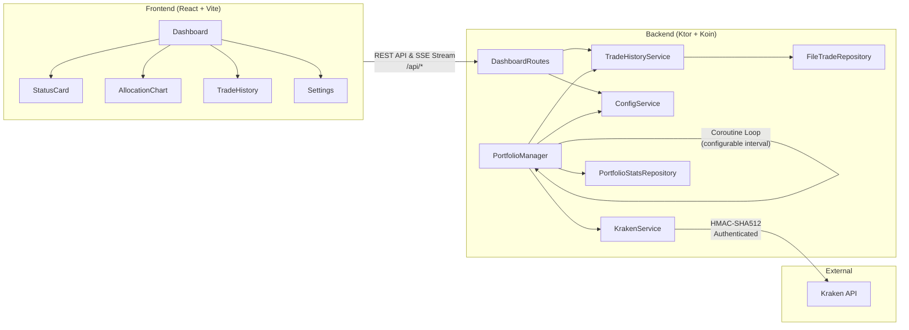
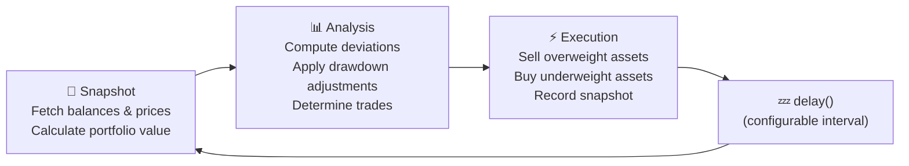

# Kraken Rebalancer

A production-grade, autonomous portfolio rebalancing engine for the [Kraken](https://www.kraken.com/) cryptocurrency exchange. The system continuously monitors your portfolio and automatically executes trades to maintain target asset allocations — with intelligent strategies for handling deposits, withdrawals, and market drawdowns.

**This application has been running in production managing a live portfolio for several months.**


---

## Tech Stack

| Layer | Technology |
|---|---|
| **Language** | Kotlin 2.x (JVM) |
| **Backend** | Ktor 3.5.0 (Netty engine), Koin 4.2.1 (DI), Jackson 2.21 |
| **HTTP Client** | Ktor CIO Client (async, coroutine-native) |
| **Concurrency** | Kotlin Coroutines (`kotlinx.coroutines` 1.11.0) |
| **Frontend** | React 19 (TypeScript), Vite 8, Tailwind CSS v4, Chart.js |
| **API** | Kraken REST API with HMAC-SHA512 authentication |
| **Testing** | Kotest 6.1 (StringSpec), MockK 1.14, Ktor MockEngine, JaCoCo (95%+ coverage enforced) |
| **Build** | Gradle (Kotlin DSL), npm |

---

## Features

### Autonomous Rebalancing
- Continuously monitors portfolio allocations against configurable targets
- Automatically generates and executes market orders when deviation thresholds are exceeded
- Sells overweight assets first to generate liquidity, then buys underweight assets

### Dynamic Fiat Deployment
- Tracks portfolio All-Time High (ATH) and calculates real-time drawdown
- Progressively deploys idle cash into the market as drawdowns deepen
- Configurable deployment curve via an exponent parameter (linear, aggressive, or conservative)

### Intelligent Fiat Correction
- Recognizes when only USD triggers a deviation threshold (e.g., after a deposit or withdrawal)
- Distributes surplus cash proportionally among the most underweight assets
- Handles withdrawals by selling from the most overweight assets

### Live Dashboard
- Real-time portfolio overview with push updates (via Ktor Server-Sent Events)
- Horizontal bar chart showing asset allocation by value
- Sortable asset performance table with deviation indicators
- Trade history log with BUY/SELL badges
- Live/Delayed status indicator with data age tracking

### Hot-Reload Configuration
- Modify all settings (allocations, thresholds, assets) via the web UI
- Add or remove assets without restarting the application
- Allocation validation ensures targets always sum to 100%

### Safety & Reliability
- **Dry Run Mode** — test your strategy without executing real trades
- **Structured Order Results** — each order returns success/failure status; failed orders don't corrupt cash projections
- **Atomic File Writes** — config, stats, and trade history use write-then-rename to prevent corruption
- **Graceful Shutdown** — JVM shutdown hook cleanly stops the loop, closes connections, and tears down DI
- Dust threshold filtering to avoid minimum order size errors
- Automatic error recovery — API failures don't crash the rebalancing loop
- Price validation — aborts cycle if any asset price is unavailable
- **BigDecimal Precision** — order volumes use `BigDecimal` (8 decimal places) to eliminate floating-point rounding

---

## Screenshots

### Dashboard
The main dashboard shows portfolio value, cash position with effective target (adjusted for drawdown deployment), crypto asset values, an allocation chart, and a sortable asset performance table.


### Asset Table & Trade History
The lower section shows detailed per-asset metrics (price, value, target %, current %, deviation) and a chronological trade activity log.


### Settings
All configuration is managed through the web UI — loop interval, deviation trigger, dust threshold, fiat deployment parameters, and per-asset allocation targets.


---

## Architecture



### Rebalance Cycle

Each cycle executes three phases:



See **[ALGORITHM.md](ALGORITHM.md)** for a detailed breakdown of the rebalancing logic, fiat correction strategy, and dynamic deployment math.

### Real-Time Event Streaming

To eliminate unnecessary network polling, the system uses a reactive, push-based architecture to synchronize the frontend dashboard with the backend rebalancing loop:

1. **Kotlin SharedFlow**: `TradeHistoryServiceImpl` maintains a `MutableSharedFlow` as a hot event broadcaster. Whenever a rebalance cycle records a new `PortfolioSnapshot`, the snapshot is emitted to the flow using `tryEmit()`.
2. **Ktor Server-Sent Events (SSE)**: The `/api/status/stream` route installs Ktor 3's native `SSE` plugin. When a client connects, Ktor pushes the latest cached snapshot and then suspends, collecting subsequent snapshots from the `SharedFlow` and streaming them over a single, persistent HTTP connection.
3. **React EventSource Integration**: The React `Dashboard` utilizes the browser's native `EventSource` API to listen to the SSE stream. On message reception, it directly updates React Query's `status` cache and invalidates the `history` query, triggering an instantaneous update across all components without periodic background HTTP polls.

---

## Project Structure

```
├── src/main/kotlin/com/gemini/krakenbot/
│   ├── KrakenRebalancerApplication.kt    # Entry point, Ktor server & Koin DI bootstrap
│   ├── config/                            # Data classes: AppConfig, Settings, Allocation, KrakenCredentials
│   │   └── AppModule.kt                  # Koin dependency injection module
│   ├── controller/                        # Ktor routes: DashboardRoutes, FrontendConfig
│   ├── model/                             # Domain: PortfolioSnapshot, PortfolioStats, OrderResult
│   ├── repository/                        # Persistence interfaces: TradeRepository, PortfolioStatsRepository
│   │   └── impl/                          # File-backed implementations
│   ├── service/                           # Core logic interfaces: PortfolioManager, KrakenService, ConfigService, TradeHistoryService
│   │   └── impl/                          # Service implementations (coroutine-aware)
│   └── util/                              # Utilities: AtomicJsonFile, KrakenSymbols
├── src/test/kotlin/                       # 122 unit tests (100% line and branch coverage enforced by JaCoCo)
│   └── com/gemini/krakenbot/service/
│       └── FakeKrakenService.kt           # In-process test double for KrakenService
├── frontend/
│   └── src/
│       ├── assets/                        # Static assets (e.g., images, icons)
│       ├── components/                    # Dashboard, Settings, AllocationChart, TradeHistory, StatusCard
│       ├── services/                      # API client configurations
│       ├── test/                          # Frontend unit and component tests
│       ├── types/                         # TypeScript definitions
│       ├── index.css                      # Dark theme design system
│       └── App.tsx                        # Root component
├── ALGORITHM.md                           # Detailed algorithm documentation
├── rebalancer-config-template.json        # Configuration template
└── build.gradle.kts                       # Gradle build with JaCoCo coverage enforcement
```

---

## Getting Started

### Prerequisites

- JDK 25 or higher
- Gradle (or use the included `./gradlew` wrapper — no installation required)
- Node.js (LTS version) and npm
- A Kraken account with API Keys (Permissions: **Query Funds**, **Create & Modify Orders**)

### 1. Clone & Configure

```bash
git clone https://github.com/HyperVon/new-kraken-rebalancer.git
cd new-kraken-rebalancer
cp rebalancer-config-template.json rebalancer-config.json
```

Edit `rebalancer-config.json`:
- Add your Kraken API Key and Private Key
- Define your desired `allocations` (must sum to 100%, must include USD)
- Set `dryRun` to `true` for initial testing
- Optionally configure `fiatMaxDrawdown` and `fiatDeploymentExponent` for dynamic cash deployment

### 2. Start the Backend

```bash
./gradlew run
```

The backend starts on port **8080** and begins the rebalancing loop immediately.

### 3. Start the Frontend

#### Dev Mode (Hot-Reloading)
```bash
cd frontend
npm install
npm run dev
```
Open your browser to **http://localhost:5173**. The frontend proxies API requests to the backend automatically.

#### Production Mode (Local Preview)
```bash
cd frontend
npm install
npm run build      # Compiles and optimizes assets into /dist
npm run preview    # Serves the production build locally
```
Open your browser to **http://localhost:4173**. This serves the static build and proxies API requests to the backend automatically.

---

## Configuration Reference

| Field | Type | Default | Description |
|---|---|---|---|
| `loopDelaySeconds` | `Long` | `60` | Seconds between rebalance cycles |
| `deviationTriggerPercent` | `Double` | `5.0` | Minimum deviation % to trigger a trade |
| `dustThresholdUSD` | `Double` | `5.0` | Minimum trade value in USD (below this is skipped) |
| `dryRun` | `Boolean` | `true` | If true, logs intended trades without executing them |
| `fiatMaxDrawdown` | `Double` | `0.0` | Portfolio drawdown % at which 100% of USD is deployed (0 = disabled) |
| `fiatDeploymentExponent` | `Double` | `1.0` | Controls deployment curve: `1.0` = linear, `<1.0` = aggressive, `>1.0` = conservative |

---

## API Endpoints

| Method | Path | Description |
|---|---|---|
| `GET` | `/api/status` | Returns the latest portfolio snapshot |
| `GET` | `/api/status/stream` | Server-Sent Events (SSE) stream for real-time portfolio snapshot updates |
| `GET` | `/api/history` | Returns the last 50 portfolio snapshots |
| `GET` | `/api/config` | Returns the current configuration |
| `POST` | `/api/config` | Updates and persists configuration (validated server-side) |

---

## Testing

### Backend Testing

The backend enforces **95% line and branch coverage** via JaCoCo (with the current suite achieving **100% line and branch coverage**). All tests are behavioural — they verify actual rebalancing decisions, not just method invocations. Order volumes are asserted with `BigDecimal.compareTo()` to avoid floating-point comparison issues.

```bash
./gradlew test
```

**122 tests** across:
- `KrakenE2ETest` / `ResilienceChaosTest` / `PrecisionRoundingFuzzTest` / `SerializationParityTest` — advanced E2E black-box and fuzz testing
- `PortfolioManagerComprehensiveTest` — full rebalance cycles with order result verification
- `PortfolioManagerFiatCorrectionTest` — deposit/withdrawal distribution logic
- `PortfolioManagerDrawdownTest` — ATH tracking and dynamic deployment
- `PortfolioManagerOrderExecutionTest` — sell-first/buy-second sequencing
- `PortfolioManagerLoopTest` — loop lifecycle, error recovery, interruption
- `PortfolioManagerZeroAllocationTest` — edge case: 0% target allocation
- `PortfolioManagerEdgeCasesTest` — dust thresholds, price gaps, zero balances
- `PortfolioManagerDogeTest` — Kraken symbol mapping quirks (BTC→XBT, DOGE→XDG)
- `KrakenServiceTest` — API signing, error handling, dry run, order failure (using Ktor `MockEngine`)
- `KrakenSymbolsTest` — ticker mapping and trading pair construction
- `AtomicJsonFileTest` — file-system atomic write verification under normal and error/unsupported paths
- `ConfigServiceTest` — validation, hot-reload, persistence, duplicate/blank symbol rejection
- `DashboardControllerTest` — REST API endpoints, invalid config error responses
- `TradeHistoryServiceTest` — snapshot storage, size limits
- `FileTradeRepositoryTest` / `PortfolioStatsRepositoryTest` — file I/O, atomic writes, error propagation

### Frontend Testing

The frontend enforces **95% statement, branch, function, and line coverage** via Vitest (with the current suite achieving **100% statements, 100% lines, 100% functions, and >99% branch coverage**).

```bash
cd frontend
npm run test:coverage
```

**110 tests** across:
- `api.test.ts` — API client requests, response status mapping, and JSON parse/network error resilience.
- `Settings.test.tsx` — Settings validation UI, allocation targets validation, number input parser fallbacks, and backdoor debug/simulation tools.
- `Dashboard.test.tsx` — Dashboard state render cycles, status updates, chart integration, offline badges, and cleanup/unmount behavior.
- `StatusCard.test.tsx` — Metrics display, value-aging alerts, status banners, and system flags.
- `AllocationChart.test.tsx` — Chart.js canvas binding, percentage distribution, and target allocation indicators.
- `TradeHistory.test.tsx` — Actions history grid, dry-run flags rendering, timestamp formatting, and table state.
- `App.test.tsx` — App shell structure and routing.

### Test Design Principles

- **`FakeKrakenService`** — an in-process test double for `KrakenService` used by all `PortfolioManager` tests. Avoids fragile `coEvery` stubbing of `suspend` functions in concurrent coroutine contexts.
- **`runTest`** — all tests that call `suspend` functions use `kotlinx.coroutines.test.runTest` for correct coroutine scheduling.
- **`MockEngine`** — `KrakenServiceTest` uses Ktor's `MockEngine` to simulate HTTP responses without a real network.

---

## License

This project is licensed under the MIT License — see the [LICENSE](LICENSE) file for details.
