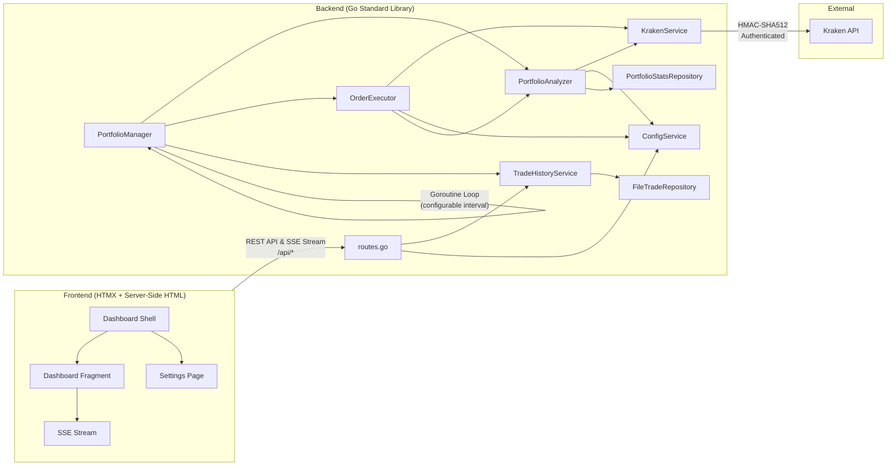
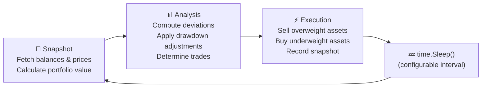

# Kraken Rebalancer

A production-grade, autonomous portfolio rebalancing engine for
the [Kraken](https://www.kraken.com/) cryptocurrency exchange. The system
continuously monitors your portfolio and automatically executes trades to
maintain target asset allocations — with intelligent strategies for handling
deposits, withdrawals, and market drawdowns.

---

## Tech Stack

| Layer           | Technology                                                                                           |
|-----------------|------------------------------------------------------------------------------------------------------|
| **Language**    | Go 1.26                                                                                             |
| **Backend**     | Go Standard Library (`net/http` router, pattern matching)                                             |
| **HTTP Client** | Go Standard `http.Client` (non-blocking)                                                             |
| **Concurrency** | Goroutines & Channels                                                                                |
| **Frontend**    | Server-side HTML (`html/template` + HTMX), Native Server-Sent Events (SSE)                           |
| **API**         | Kraken REST API with HMAC-SHA512 authentication                                                      |
| **Testing**     | Go native `testing` library, `net/http/httptest` request testing                                      |
| **Build**       | Native Go compiler (`go build`)                                                                       |

---

## Features

### Autonomous Rebalancing

- Continuously monitors portfolio allocations against configurable targets.
- Automatically generates and executes market orders when deviation thresholds are exceeded.
- Sells overweight assets first to generate liquidity, then buys underweight assets.

### Dynamic Fiat Deployment

- Tracks portfolio All-Time High (ATH) in `portfolio-stats.json` and calculates real-time drawdown.
- Progressively deploys idle cash into the market as drawdowns deepen.
- Configurable deployment curve via an exponent parameter (linear, aggressive, or conservative).

### Intelligent Fiat Correction

- Recognizes when only USD triggers a deviation threshold (e.g., after a deposit or withdrawal).
- Distributes surplus cash proportionally among the most underweight assets.
- Handles withdrawals by selling from the most overweight assets.

### Live Dashboard

- Real-time portfolio overview with push updates (via standard Server-Sent Events).
- Horizontal bar chart showing asset allocation by value.
- Sortable asset performance table with deviation indicators.
- Trade history log with BUY/SELL badges.
- Live/Delayed status indicator with data age tracking.
- **Hypermedia-powered** — uses HTMX for dynamic content swapping and form submissions without writing JavaScript.

### Hot-Reload Configuration

- Modify all settings (allocations, thresholds, assets) via the web UI.
- Add or remove assets without restarting the application.
- Allocation validation ensures targets always sum to 100%.

### Safety & Reliability

- **Dry Run Mode** — test your strategy without executing real trades.
- **Structured Order Results** — each order returns success/failure status; failed orders don't corrupt cash projections.
- **Atomic File Writes** — config, stats, and trade history use write-then-rename to prevent corruption.
- **Graceful Shutdown** — OS signal hooks cleanly stop the loop, cancel background routines, and close the HTTP server.
- Dust threshold filtering to avoid minimum order size errors.
- Automatic error recovery — API failures don't crash the rebalancing loop.
- Price validation — aborts cycle if any asset price is unavailable.
- **Decimal Precision** — order volumes use `github.com/shopspring/decimal` (8 decimal places) to eliminate floating-point rounding.

---

## Architecture



### Rebalance Cycle

Each cycle executes three phases:



See **[ALGORITHM.md](ALGORITHM.md)** for a detailed breakdown of the rebalancing logic, fiat correction strategy, and drawdown mathematics.

### Real-Time Event Streaming

To eliminate unnecessary network polling, the system uses a reactive, push-based architecture:

1. **Go Channels**: `TradeHistoryServiceImpl` maintains a map of subscribed channels. Whenever a rebalance cycle records a new `PortfolioSnapshot`, the snapshot is broadcasted to all registered subscriber channels.
2. **Standard HTTP SSE**: The `/api/status/stream` route initializes SSE connection headers and loops to read new snapshots from the channel subscription, writing them instantly to the client.
3. **HTMX SSE Extension**: The dashboard uses `hx-ext="sse"` and `sse-connect="/api/status/stream"`. A div with `sse-swap="message"` and `hx-trigger="sse:message"` fetches updated dashboard fragments from `/fragments/dashboard` whenever a new snapshot arrives over the SSE stream.

---

## Project Structure

```
├── main.go                            # Entry point, HTTP server & DI setup
├── go.mod                             # Go module definition
├── go.sum                             # Go module lock
├── internal/
│   ├── config/                        # AppConfig, Settings, Allocation DTOs & Service
│   ├── model/                         # Domain models (Snapshot, Stats, OrderResult)
│   ├── repository/                    # Atomic write persistence implementations
│   ├── service/                       # Rebalancer loop, analyzer, and API service implementations
│   └── web/                           # Router and HTML layout template functions
│       ├── templates/                 # Embedded HTML files (shell, fragment, settings)
│       ├── static/                    # Static CSS and JS assets
│       └── icons/                     # Embedded SVG icons
├── ALGORITHM.md                       # Detailed algorithm documentation
├── CHANGELOG.md                       # Semantic versioning updates log
└── rebalancer-config-template.json   # Configuration template
```

---

## Getting Started

### Prerequisites

- Go 1.26 or higher
- A Kraken account with API Keys (Permissions: **Query Funds**, **Create & Modify Orders**)

### 1. Clone & Configure

```bash
git clone https://github.com/HyperVon/new-kraken-rebalancer.git
cd new-kraken-rebalancer
cp rebalancer-config-template.json rebalancer-config.json
```

Edit `rebalancer-config.json`:

- Add your Kraken API Key and Private Key.
- Define your desired `allocations` (must sum to 100%, must include USD).
- Set `dryRun` to `true` for initial testing.
- Optionally configure `fiatMaxDrawdown` and `fiatDeploymentExponent` for dynamic cash deployment.

### 2. Start the Application

You can run the application directly from source code:

```bash
go run main.go
```

The backend starts on port **8080** and begins the rebalancing loop immediately.

### 3. Build a Self-Contained Executable

Since the frontend HTML templates, CSS/JS resources, and SVG icons are embedded directly inside the binary using `go:embed`, you can build a single, fully self-contained binary:

```bash
go build -o rebalancer main.go
```

For production deployment, you can strip debugging symbols and optimize the binary size:

```bash
go build -ldflags="-s -w" -o rebalancer main.go
```

The resulting `rebalancer` executable can be run independently on any system of the target architecture.

### 4. Open Dashboard

Open your browser to **http://localhost:8080**. The dashboard is served directly from the backend — no separate frontend build step required.

---

## Configuration Reference

| Field                     | Type      | Default | Description                                                                           |
|---------------------------|-----------|---------|---------------------------------------------------------------------------------------|
| `loopDelaySeconds`        | `int64`   | `60`    | Seconds between rebalance cycles                                                      |
| `deviationTriggerPercent` | `float64` | `5.0`   | Minimum deviation % to trigger a trade                                                |
| `dustThresholdUSD`        | `float64` | `5.0`   | Minimum trade value in USD (below this is skipped)                                    |
| `dryRun`                  | `bool`    | `true`  | If true, logs intended trades without executing them                                  |
| `fiatMaxDrawdown`         | `float64` | `0.0`   | Portfolio drawdown % at which 100% of USD is deployed (0 = disabled)                  |
| `fiatDeploymentExponent`  | `float64` | `1.0`   | Controls deployment curve: `1.0` = linear, `<1.0` = aggressive, `>1.0` = conservative |

---

## Command-Line Flags

By default, the rebalancer binary looks for its config and state files in the current working directory. You can customize these paths using command-line flags when launching the executable:

| Flag | Description | Default |
|------|-------------|---------|
| `-config` | Path to the configuration JSON file | `rebalancer-config.json` |
| `-history` | Path to the trade history JSON file | `trade-history.json` |
| `-stats` | Path to the portfolio stats ATH JSON file | `portfolio-stats.json` |

For example, to run the rebalancer with external configs in `/etc` and state files in `/var/lib`:

```bash
./rebalancer -config /etc/rebalancer/config.json -history /var/lib/rebalancer/history.json -stats /var/lib/rebalancer/stats.json
```

---

## API Endpoints

| Method | Path                   | Description                                                              |
|--------|------------------------|--------------------------------------------------------------------------|
| `GET`  | `/`                    | Main dashboard shell (HTML)                                              |
| `GET`  | `/settings`            | Settings page (HTML)                                                     |
| `POST` | `/settings`            | Submit settings form (HTMX)                                              |
| `GET`  | `/fragments/dashboard` | Dashboard fragment (HTMX)                                                |
| `GET`  | `/api/status/stream`   | Server-Sent Events (SSE) stream for real-time portfolio snapshot updates |
| `GET`  | `/static/*`            | Static assets (CSS/JS)                                                   |

---

## Testing

To run the unit test suite covering configuration validations, routing, and calculations:

```bash
go test -v ./...
```

---

## License

This project is licensed under the MIT License — see the [LICENSE](LICENSE) file for details.