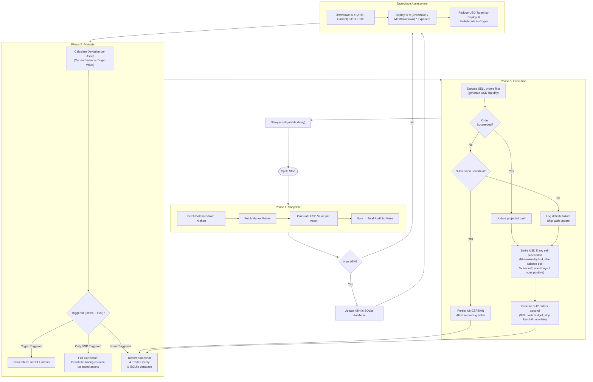

# Rebalancing Algorithm

This document details the operational logic of the Kraken Rebalancer. The system
is designed to autonomously maintain a specific portfolio allocation across a
set of assets (cryptocurrencies & fiat).

## Overview

## Core Concepts

### 1. Portfolio Definition

The portfolio is defined by a set of target allocations summing to 100%.
**Example:**

- **BTC**: 50%
- **ETH**: 45%
- **USD**: 5%

### 2. Operational Loop

The application runs a continuous "Rebalance Cycle" with a configurable delay (
e.g., every 60 seconds). Each cycle consists of three phases: **Snapshot**, **Analysis**,
and **Execution**.

### 3. Architectural Separation of Concerns

To maintain the Single Responsibility Principle (SRP) and keep domain logic highly testable, the pure domain rebalancing math and typed planning models are encapsulated in the standalone `:engine` module, while the service and execution orchestrators live in the backend:

- **`PortfolioManagerImpl` (The Orchestrator)**: Manages the continuous coroutine loop. It acts as a lightweight facade that delegates domain logic to the analyzer and executor, and coordinates snapshot persistence. It reactively restarts the loop upon configuration changes via `watchConfigChanges()`.
- **`PortfolioAnalyzer` (The Brain)**: Responsible for Phase 1 and 2. It resolves prices, tracks the All-Time High (ATH), assembles end-of-cycle `PortfolioSnapshot`s, and delegates valuation / drawdown / deviation / fiat-correction math to **`RebalancerEngine`** in `:engine`. Portfolio value calculation returns a `Result<PortfolioValues>` for graceful error handling.
- **`RebalancerEngine` (Domain calculator — `:engine`)**: Side-effect-light math (no network/DB) for portfolio values, drawdown, fiat deployment, targets, deviation analysis, and fiat correction. It emits a typed `RebalancePlan` with `RebalanceEvent` values; a presentation adapter keeps the existing snapshot action-log strings stable. Logging is retained for diagnostics.
- **`PortfolioCalculations` (Shared Math — `:engine`)**: Consolidated percentage, target, and deviation calculations shared by the analyzer (including end-of-cycle snapshot assembly) — eliminates duplicate math across the codebase.
- **`OrderExecutor` (The Brawn)**: Responsible for Phase 3. It takes the calculated orders and safely executes them against the Kraken API. It manages the strict sell-before-buy sequence, projected vs. actual cash tracking, dust-threshold filtering, action-log formatting, and persisting each order via `TradeHistoryService.saveTrade`. Before a real live placement, it persists a `PENDING` intent with a deterministic Kraken **`cl_ord_id`** (from `cycleId|symbol|side`). AddOrder is attempted only once; an ambiguous transport/response failure becomes `UNCERTAIN`, aborts the remaining batch, and blocks later live orders until operator reconciliation (`userref` is not a uniqueness key among open orders).
- **`KrakenServiceImpl` + transport limiters (The Gateway)**: Handles
  HMAC-SHA512 authenticated API calls with Kraken's separate public and private
  controls. The private account counter defaults to the standard account
  `safeLimit = 20` and `0.5` points/second decay; `Ledgers`, `TradesHistory`,
  and `ClosedOrders` cost 4, other private calls cost 1, and `AddOrder` and
  `CancelOrder` do not charge that counter because trading has separate limits.
  Public ticker/OHLC calls use a separate conservative limiter of at most about
  one call per second. Private nonce acquisition, signing, POST, and response
  handling are serialized. `retryWithFlow` retries only network I/O, 429,
  temporary lockout, and relevant 5xx responses with capped backoff; AddOrder
  remains one-shot because an ambiguous response may follow an accepted order.
  See [Kraken's current rate-limit guidance](https://support.kraken.com/articles/206548367-what-are-the-api-rate-limits-?mobile_site=false).
- **Persistence Impls (`SqliteTradeRepositoryImpl`, `SqliteOrderIntentRepositoryImpl`, `SqlitePortfolioStatsRepositoryImpl`, `ConfigServiceImpl`)**: Config uses atomic write-then-rename file operations and exposes `watchConfigChanges()` as a reactive `Flow<Settings>`. Trade logs, live-order intents, and portfolio statistics are persisted to SQLite (using JetBrains Exposed ORM); schema versions are recorded and file-backed migrations receive a pre-migration backup.
- **`TradeHistoryServiceImpl`**: Thin façade over Sync / SnapshotStore / Query /
  Reconstruction. The hot `MutableSharedFlow<PortfolioSnapshot>` lives on
  `TradeHistorySnapshotStore` and is exposed via `getHistoryFlow()` for the Ktor
  SSE stream. Trade history sync uses a flow-based paginated fetch from the
  Kraken API (`TradeHistorySyncService`). Ledger synchronization is a separate
  paginated flow (`LedgersSyncService`) so ledger persistence does not alter
  trade reconciliation semantics.

---

## Phase 1: Snapshot

In this phase, the system builds a complete view of the current portfolio state.

1. **Fetch Balances**: Retrieves the current balance of all configured assets
   from the Kraken API.
2. **Fetch Prices**: Retrieves the current market price (in USD) for all non-USD
   assets.
3. **Calculate Valuation**:
    - Calculates the USD value of every asset (`Balance * Price`).
    - Rounds each per-asset USD value used by analysis and order sizing to USD
      scale, but sums the raw values and rounds the **Total Portfolio Value** only
      once.
4. **Price safety**: If any non-USD configured asset is missing a ticker price or
   the resolved price is zero, the cycle **aborts** before orders are generated
   (`Result.Failure`) to avoid erroneous trades.

The reconstruction path follows the same consistency boundary: it captures one
execution-session configuration and pins one exchange backend for balances,
ticker prices, OHLC history, and snapshot calculations. A settings change or
simulation flip cannot make one reconstruction pass mix configurations or
backends.

---

## Phase 2: Analysis

The system determines what trades are necessary to restore the portfolio to its
target state.

### 1. Target Calculation & Dynamic Adjustment

Normally, the target value is `Total Portfolio Value * Target %`. However, the system implements a **Dynamic Fiat Deployment Strategy**:

1. **ATH Tracking**: The bot tracks the portfolio's All-Time High (ATH) value in
   the SQLite database. ATH is set on first run or updated whenever a new high
   is reached. Missing or explicitly null stats represent an empty initial
   state. A database read or legacy-file migration failure aborts the analysis
   before ATH persistence or order planning, rather than treating the ATH as
   zero. Any non-cancellation ATH persistence failure logs an error and aborts
   the cycle (fail-closed) so the bot never plans orders against an unpersisted
   All-Time High. Cancellation still propagates so a cancelled cycle cannot
   continue.
2. **Drawdown Calculation**:
   `Drawdown % = (ATH - Current Value) / ATH * 100`
   The numerator is multiplied by 100 before division so the result retains all
   four internal percentage decimal places.
3. **Fiat Deployment Percentage**:
   Based on the configured `fiatMaxDrawdown` (e.g., 30%) and `fiatDeploymentExponent` (e.g., 1.0):
   `Deployment % = (Drawdown % / Max Drawdown %) ^ Exponent` (Capped at 100%)

   Fractional exponents use `Double.pow`, then the result is re-entered as
   `BigDecimal` at percent scale (`SCALE_PERCENT = 4`). When `fiatMaxDrawdown ≤ 0`
   or `fiatDeploymentExponent ≤ 0`, deployment is **disabled** (`Deploy% = 0`).

   **Examples (Max Drawdown = 30%)**:

   | Drawdown | Linear (1.0) | Aggressive (0.5) | Conservative (2.0) |
   | :--- | :--- | :--- | :--- |
   | **1.5%** (5% of Max) | 5% | 22% | 0.25% |
   | **7.5%** (25% of Max) | 25% | 50% | 6.25% |
   | **15%** (50% of Max) | 50% | 71% | 25% |
   | **22.5%** (75% of Max) | 75% | 87% | 56% |
   | **30%** (100% of Max) | 100% | 100% | 100% |

4. **Target Adjustment**:
   The target percentage for USD is reduced by the Deployment %:
   `Effective USD Target = Base USD Target * (1 - Deployment %)`
   The removed allocation is redistributed proportionally to crypto assets,
   ensuring the total remains 100%. If there is no positive non-USD target to
   receive that allocation, fiat deployment is a no-op and the configured USD
   target remains unchanged.

Using these effective targets, the **Ideal Value** for each asset is calculated.

### 2. Deviation Calculation

The difference between current and target value is calculated:
`Deviation (USD) = Current Value - Target Value`
`Deviation (%) = Deviation (USD) / Target Value * 100` (signed relative
deviation). The deviation numerator is multiplied by 100 before division so
trigger math retains `SCALE_PERCENT` precision. When the target value is `$0`
but the holding still has a
positive value, `Deviation (%)` is treated as **100%** so a zero-target
position can still clear the percent trigger (paired with the dust gate).

### 3. Trigger Logic

An asset generates an order only when **both** gates pass:

1. Absolute relative deviation
   `|Deviation (%)| ≥ deviationTriggerPercent` (e.g., 5%).
2. Absolute USD deviation is significant:
   `|Deviation (USD)| ≥ minimumOrderSizeUSD` (`AssetMetrics.isSignificant`).

Dust therefore filters **order generation**, not only execution.

- **Scenario A: Standard Rebalance**
  If a crypto asset (e.g., BTC) passes both gates:
  - **Overweight (> 0)**: A **SELL** order is generated for the excess USD
      amount.
  - **Underweight (< 0)**: A **BUY** order is generated for the deficit
      USD amount.

- **Scenario B: Fiat Correction (Deposit/Withdrawal)**
  If *only* the USD asset passes both gates (e.g., due to a fresh
  deposit of cash), the system recognizes this as a "Fiat Correction" event.
  - The surplus (or deficit) of USD is distributed intelligently among
      assets that counter-balance the deviation.
  - **Surplus (Deposit)**: Buys are distributed among **Underweight**
      assets only, proportional to their current USD deficit.
  - **Shortage (Withdrawal)**: Sells are distributed among **Overweight**
      assets only, proportional to their current USD surplus.
  - Each share is rounded to USD scale (2 decimals) and drawn from a budget
      truncated to the same scale, so the shares can never sum above the fiat
      deviation being corrected. A share that rounds to `$0.00` is dropped
      instead of becoming a zero-value order.
  - *Note: This concentrates the rebalancing power into the assets that
      are furthest from their targets, effectively clearing dust
      thresholds.*

---

## Phase 3: Execution

The system executes the calculated orders in a specific sequence to ensure
liquidity. Each order returns a structured `OrderResult` indicating success or
failure.

1. **Sell Orders First**: All SELL orders are executed immediately to generate
   USD.
    - Only successful sells update the projected cash balance. Failed sells are
      logged but do not inflate the available cash. If every sell fails (or none
      run), buys continue against the **pre-sell** projected cash and the 99%
      cycle budget — no invented sell liquidity.
    - Sell volume is capped to the cycle-entry asset balance rounded down to
      eight decimals. Cent-rounded full-liquidation intent therefore cannot
      request more units than were held at analysis time.
2. **USD Settle (fill-confirmed, balance fallback)**: After **≥1 successful
   sell** and when **not** in dry-run mode, the system prefers **fill-confirmed**
   sell proceeds: poll trade history (same 3× backoff from **250ms**, paginating
   up to 5×50 rows) for API fills whose `ordertxid` matches the sell AddOrder
   txids, sum **net** proceeds (`cost − fee`), and set cash = opening USD +
   confirmed proceeds. When spendable USD is already visible on a balance peek,
   cash is capped to `min(fill-confirmed, balance)`. When the peek is empty or
   fails, cash is capped to **projected cash** so history cannot invent liquidity
   beyond this cycle's sell intents. Early-accept at **≥95%** of
   projected. If txids exist but no positive fills appear, or the capped
   fill-confirmed amount is below the 95% threshold, **fall back** to the legacy
   USD **balance poll** (same attempt/backoff/≥95% rules); a short result can mean
   Kraken's history index or pagination is lagging. **Abort buys** if neither
   path confirms positive USD (fail-closed). When no sell txids are available
   (e.g. some test doubles), go straight to the balance poll. Skipped
   entirely when no sell succeeded or `dryRun` is true (buys use projected cash).
   Successful sells record `cycleId` and `orderTxid` on persisted trade rows.
   Repeated nonblank Kraken trade IDs caused by shifting offset pages count
   once; id-less rows remain distinct because identical partial-fill economics
   can be legitimate.
3. **Buy Orders Second**:
    - The whole sell→buy sequence runs inside `KrakenService.withStableBackend`
      so a mid-cycle `simulation` flip cannot split sells and buys across backends.
    - A **cycle-level budget** of **99%** of post-sell settled USD caps aggregate
      multi-buy spend (`PrecisionConstants.CASH_RESERVE_FACTOR`).
    - Each buy is further capped by the remaining cycle budget; dust buys below
      `minimumOrderSizeUSD` are skipped.
    - Only successful buys deduct from available cash and the remaining budget.
4. **Order Placement**:
    - Orders are placed as **Market Orders** for immediate execution.
    - Before a real live AddOrder call, a durable `PENDING` row is written to
      `order_intents` with `clientOrderId`. A definite exchange response
      resolves that row. A transport failure, response failure, or response
      without a txid is ambiguous and marks it `UNCERTAIN`; the executor stops
      the batch.
      Cancellation persists that uncertain state in a `NonCancellable`
      durability block before propagating. Dry-run and simulation exceptions
      update the local estimate with the actual known failure instead. If that
      journal update also fails, the placement exception remains primary and
      the persistence failure is attached as suppressed diagnostic context.
    - AddOrder is **not retried** after an ambiguous response. Any unresolved
      live intent blocks subsequent live order batches and is excluded from
      sync reconciliation, duplicate cleanup, and retention pruning. An
      operator must verify Kraken open orders, closed orders, and fills before
      clearing the SQLite state; missing trade history alone is not proof that
      Kraken rejected the order.
    - Operators review unresolved rows with `GET /api/order-intents` and clear
      only `UNCERTAIN` rows through `POST /api/order-intents/{id}/resolve` using
      an explicit `CONFIRMED` or `REJECTED` outcome, evidence, and the optional
      Kraken `orderTxid` when known. `PENDING`
      rows cannot be terminalized while AddOrder may still be in flight;
      restart recovery converts abandoned PENDING rows to UNCERTAIN. `GET
      /api/readiness` remains `503` while any unresolved row exists.
    - "Dust" orders (below the configured `minimumOrderSizeUSD`) are skipped to
      avoid API errors.
    - USD intents are converted to crypto volumes at 8 decimal places with
      `RoundingMode.DOWN`, so submitted notional never exceeds the intent.
      Sell volumes are also floored and capped to the cycle-entry holdings.
    - `dryRun` suppresses placement on the **active** backend. Server logs use
      `[DRY RUN]` (live) or `[EMULATOR DRY RUN]` (simulation); the dashboard
      activity log always uses `[DRY RUN]`. Orthogonal to `simulation` (which
      only selects live Kraken vs the offline emulator).
    - With `simulation = true` and `dryRun = false`, the offline emulator charges
      a `0.26%` fee on each order and updates balances net of that fee. Emulator
      dry-run returns before changing balances.
5. **Persistence**: The cycle snapshot (including all trade actions and their outcomes) is saved directly to the SQLite database (under the trade and snapshot tables).

### Ledger history and staking rewards

`LedgersSyncService` pulls Kraken's private `/0/private/Ledgers` endpoint at most
once every **300 seconds**, requesting the eight strategy-neutral response types
(`staking`, `dividend`, `deposit`, `withdrawal`, `transfer`, `adjustment`,
`spend`, and `receive`) in pages of **50**. Kraken's API query filter uses
`sale` for the consumer `spend`/`receive` rows; the live adapter filters those
response types locally. The first and recovered initial syncs use a bounded
**96-day** seed window and store durable progress metadata; later syncs use the
latest stored ledger time (or watermark) with a **300-second overlap**. SQLite
enforces the `(ledger id, timestamp, asset, type)` identity so overlapping pages
and retries are safe. See Kraken's [Ledgers API reference](https://docs.kraken.com/api-reference/account-data/get-ledgers-info)
and [ledger field guidance](https://support.kraken.com/articles/360001169383-how-to-interpret-ledger-history-fields).

The History `/api/history/rewards` endpoint charts `staking` and `dividend`
entries for tracked allocation assets. It aligns cumulative per-asset amounts to
stored portfolio snapshot timestamps, values each asset using that snapshot's
price, and returns total and per-asset USD series for the selected range.
Dividend entries for untracked assets remain persisted but excluded as external
inflows.

For benchmark and reconstruction accounting, all eight external ledger types are
applied as `amount - fee`, preserving both legs of a consumer transaction. Kraken
states that Buy Crypto Widget and Kraken app transactions appear in Ledger history
and not Trades history, so the comparison does not try to deduplicate these ledger
rows against `TradesHistory`. The reconstruction marker is paired with the ledger
coverage version it replayed, so a coverage migration cannot suppress the required
rebuild.

Before rendering benchmark points, each interval replays every successful
authoritative trade, supported external ledger event, and fee into the previous
tracked balances. If any tracked asset still differs from the next snapshot after
rounding USD to scale 2 and crypto to scale 8, the comparison is unavailable with
`UNEXPLAINED_BALANCE_CHANGE` at that next snapshot's timestamp. It never emits
estimated numeric alpha for an unexplained tracked mutation; untracked assets remain
outside this validation boundary.

Snapshots track an explicit `balancesObservedAt` timestamp representing the exact
time account balances were queried, distinct from the snapshot creation/display
timestamp. The comparison engine reasons about exchange events (trades and external
ledgers) relative to balance observation boundaries. A bounded clock skew window
(up to 1,000ms) admits exchange fills or ledgers whose execution was already reflected
in observed balances, matching unique candidate subsets across both trades and ledger
events. For user-selected subranges, an optional pre-baseline anchor snapshot ($S_0$)
attributes boundary events without modifying the displayed baseline or points.
For `TradeSource.API_FILL`, replay uses the precise `price × volume` notional
when a positive fill price is available, with the stored USD amount retained as a
legacy fallback.

### Trade economics & slippage lifecycle

Each executed order creates a **local estimate** row at rebalance time:

- **`TradeSource.LOCAL_ESTIMATE`** — `expectedPrice` from the ticker snapshot used for planning; fee from the fixed local planning estimate (`PrecisionConstants.FEE_RATE_ESTIMATE` = **0.006**); slippage computed vs that expected price.
- **`TradeSource.API_FILL`** — Kraken `/0/private/TradesHistory` fills (or reconciled rows after sync).
- **`TradeSource.LEGACY_UNKNOWN`** — a successful historical row written before
  explicit provenance, where the stored shape cannot safely distinguish a
  local estimate from an exchange fill.

During **Kraken sync**, a matching local row is updated in place: API fill price/volume/fee replace the estimate, **`expectedPrice` is preserved**, slippage is **recomputed** against the API execution price, and `source` becomes `API_FILL`. A legacy row with stored slippage remains an inferred local estimate; the null-slippage shape is not assumed to be an API fill.

Each Kraken fill also retains its exchange trade ID. Sync uses that ID as the
authoritative per-fill identity, so distinct legs of one order cannot collapse
when their rounded economics match. For older source-less rows with no
slippage, provenance is genuinely ambiguous: startup migration marks them
`LEGACY_UNKNOWN`; sync preserves them and treats only an exact conservative
fingerprint match as already imported rather than rewriting them as a fill.

Dedupe prefers settled API fills over local estimates when pair alias or estimate-vs-fill rules match (see trade-history sync skill).

## Configuration

The behavior is controlled by `rebalancer-config.json`:

| Parameter | Description |
| :--- | :--- |
| `loopDelaySeconds` | Time to wait between cycles. |
| `deviationTriggerPercent` | Sensitivity of the rebalancer. Lower values track targets closer but trade more frequently (higher fees). |
| `minimumOrderSizeUSD` | Minimum significant USD deviation **and** minimum order notional. Assets below this USD deviation do not trigger; smaller orders are also skipped at execution. **Minimum `2` (enforced in `ConfigService` + UI `min="2"`).** |
| `dryRun` | Suppresses order placement on the **active** backend. Server logs: `[DRY RUN]` live / `[EMULATOR DRY RUN]` simulation; activity log always `[DRY RUN]`. Orthogonal to `simulation`. |
| `simulation` | If set to `true`, `DynamicKrakenService` routes to `SimulatedKrakenService` (offline emulator). Empty DB pre-seeds ~**15 days** of snapshots at 6-hour steps. Snapshots/trades older than **90 days** are pruned on each `addSnapshot`. |
| `fiatMaxDrawdown` | The portfolio drawdown percentage at which 100% of the USD allocation should be deployed into assets. Set to `0` to disable. |
| `fiatDeploymentExponent` | Controls the aggressiveness of deployment. `1.0` is linear. Values `< 1.0` deploy more cash earlier (aggressive). Values `> 1.0` save cash for deeper dips (conservative). |

## Precision

Monetary and ratio math uses `BigDecimal` with these scales (`PrecisionConstants`):

| Constant | Scale | Use |
| :--- | ---: | :--- |
| `SCALE_CRYPTO` | **8** | Balances, prices, order volumes |
| `SCALE_USD` | **2** | USD notionals and **persisted snapshot** percent/USD display fields |
| `SCALE_PERCENT` | **4** | Internal analysis percents (drawdown, deploy, deviation triggers) |
| `SCALE_FEE` | **4** | Fee amounts |

Snapshot/UI asset percents are rounded to `SCALE_USD` (2 dp) when persisted;
trigger math keeps `SCALE_PERCENT` (4 dp).
