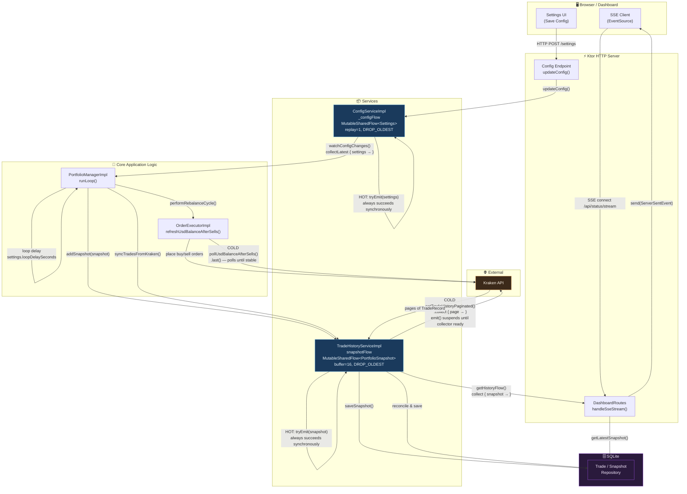
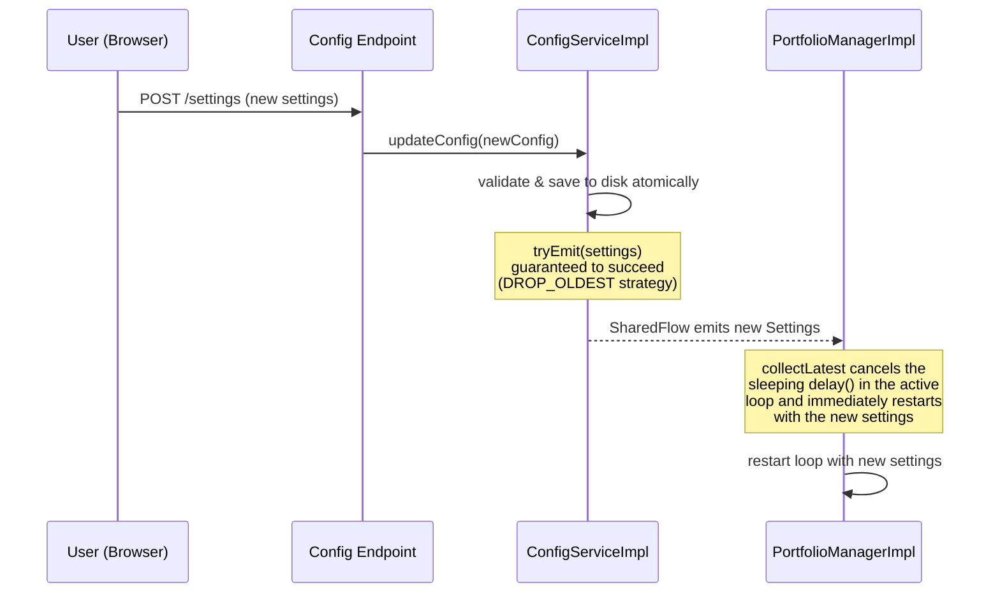
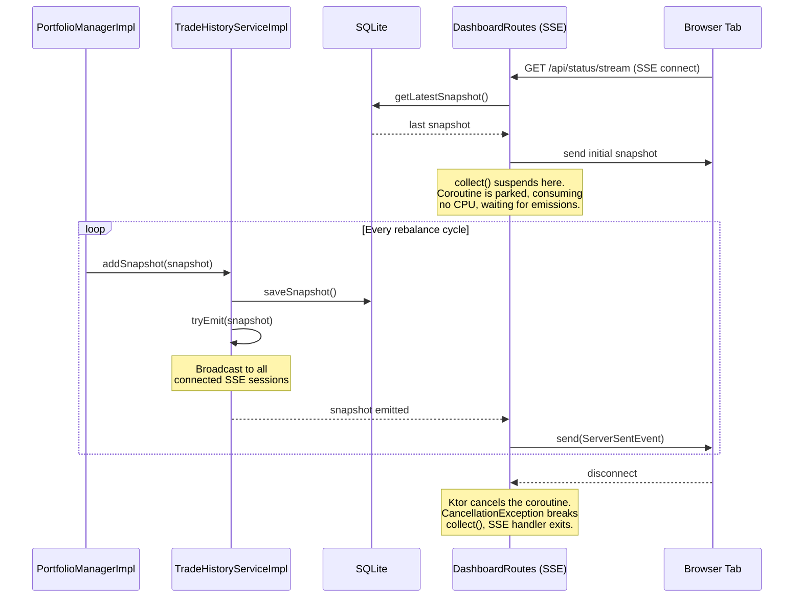
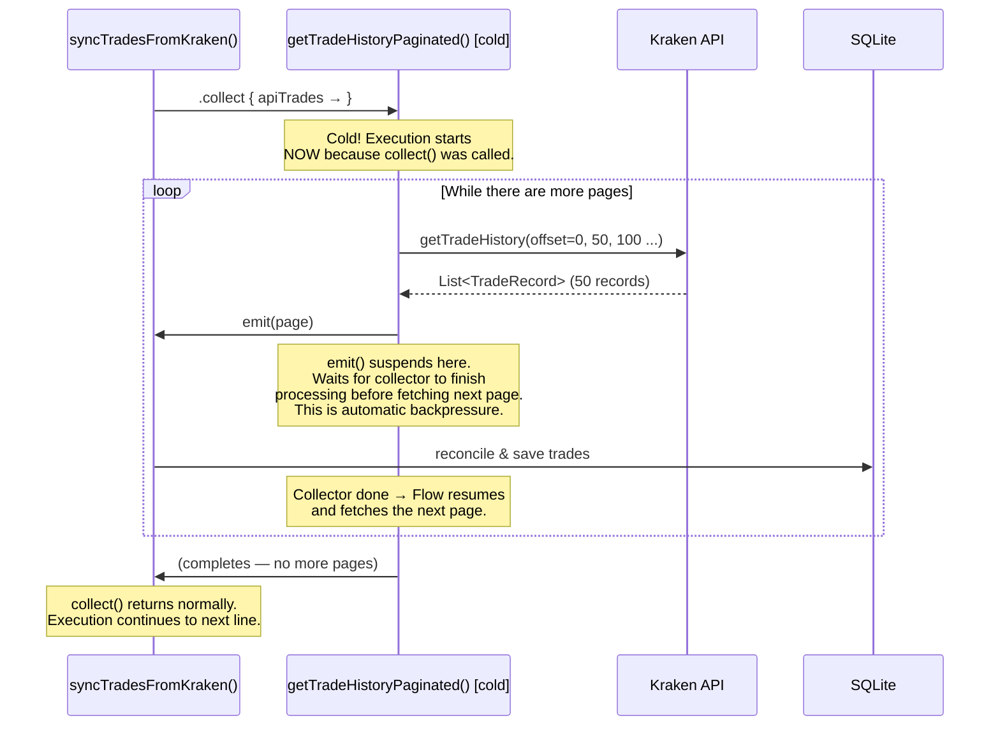
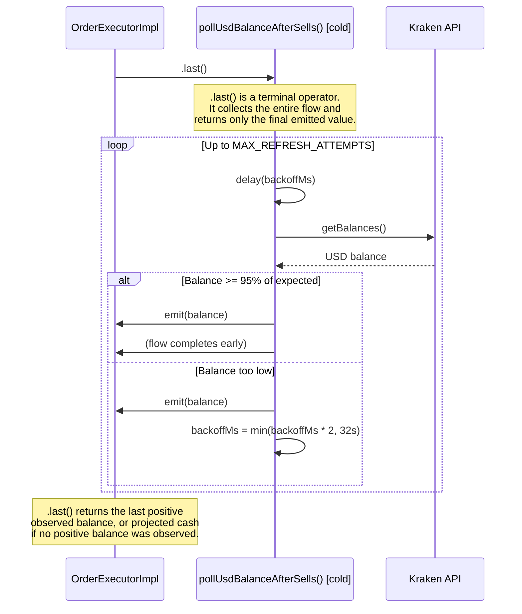

# Kotlin Flow Architecture

This document explains how **Kotlin Coroutines Flows** are used throughout the application to handle asynchronous events without blocking threads. There are two kinds of flow in play: **hot** `SharedFlow` (a live broadcast) and **cold** `Flow` (an on-demand pipeline).

---

## The Two Types at a Glance

| | Cold `Flow` | Hot `SharedFlow` |
| --- | --- | --- |
| **Analogy** | On-demand video (starts when you press play) | Live radio (broadcasting regardless of listeners) |
| **Execution** | Starts only when collected | Runs independently of collectors |
| **Per-collector** | Each collector gets its own independent run | All collectors share the same broadcast |
| **Lifecycle** | Finite — completes when the producer finishes | Infinite — never completes on its own |
| **Backpressure** | Automatic: `emit()` suspends if collector is slow | Configurable: buffer + overflow strategy |
| **Use in this app** | Paginated API fetching, balance polling | Config changes, live dashboard streaming |

---

## System-Wide Flow Map

This diagram shows every place flows are used and how data moves between components.

---

## Flow 1 — Config Changes (Hot SharedFlow)

**Path:** Settings UI → `ConfigService._configFlow` → `PortfolioManager`

**Key design choices:**

- `replay = 1` means `PortfolioManager` immediately gets the current config the moment it subscribes on startup — no race condition on boot.
- `collectLatest` (not `collect`) is used so that a settings change during a long loop `delay()` takes effect immediately, without waiting for the delay to expire.

---

## Flow 2 — Live Dashboard Updates (Hot SharedFlow)

**Path:** `PortfolioManager` → `TradeHistoryService.snapshotFlow` → Ktor SSE → Browser

**Key design choices:**

- `extraBufferCapacity = 16` + `DROP_OLDEST` means a slow browser connection **never** stalls the rebalancing loop. The portfolio manager can always `tryEmit()` and move on immediately.
- Multiple browser tabs can all connect simultaneously — each gets its own `collect()` call which independently consumes from the same shared broadcast.

---

## Flow 3 — Paginated Trade Sync (Cold Flow)

**Path:** `syncTradesFromKraken()` → `getTradeHistoryPaginated()` → Kraken API (page by page) → SQLite

**Key design choices:**

- Processing happens page-by-page, keeping memory constant regardless of how many total trades exist.
- `emit()` naturally suspends until the collector finishes, meaning Kraken's API is never hit faster than the database can process the last batch — automatic rate-limiting.
- Being cold means this is only ever triggered by `syncTradesFromKraken()` — nothing happens in the background.

---

## Flow 4 — USD Balance Polling (Cold Flow)

**Path:** After sell orders → `pollUsdBalanceAfterSells()` → Kraken API (with backoff) → caller

**Key design choices:**

- Using `.last()` instead of `.collect()` is intentional — the caller uses the
  **last positive observed balance**, not the maximum observation. If no
  positive balance is observed, the initial projected amount is emitted as the
  fallback. That fail-open fallback is tracked separately in
  [#54](https://github.com/HyperVon/new-kraken-rebalancer/issues/54).
- Exponential backoff is managed entirely inside the cold flow, keeping `OrderExecutorImpl`'s orchestration logic clean.
- Being cold means this only runs when explicitly triggered after sells — it never polls in the background.

---

## Hot vs. Cold: Why Does It Matter?

The choice between hot and cold flows in this application is deliberate and maps directly to the nature of each problem:

| Use Case | Type | Why? |
| --- | --- | --- |
| Config changes | **Hot** | Config exists before anyone listens. New subscribers must get the current value immediately (`replay=1`). Multiple components could theoretically watch it. |
| Dashboard streaming | **Hot** | Snapshots are produced by the rebalancer loop independently of how many browsers are connected. Each connected browser should see the same live broadcast. |
| Paginated API sync | **Cold** | Fetching is always triggered on-demand for a specific reason. The caller owns the full lifecycle. Backpressure is critical for memory safety with large histories. |
| Balance polling | **Cold** | A one-shot operation triggered after sells. The polling only makes sense in that specific context, and the caller only needs the final result. |
