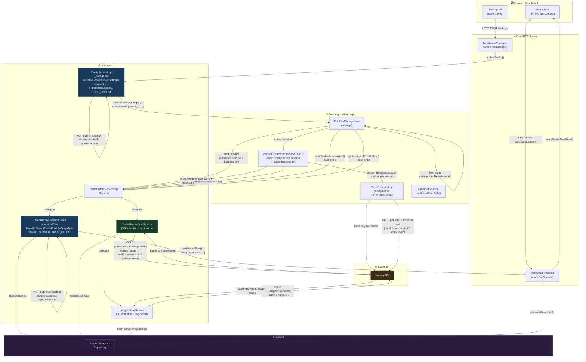
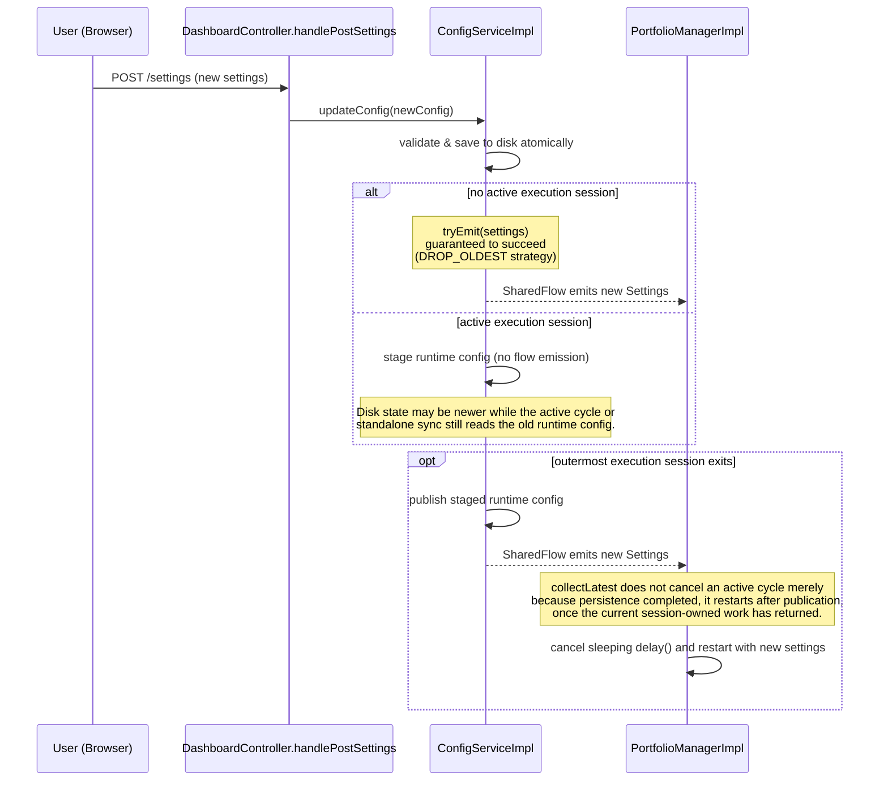
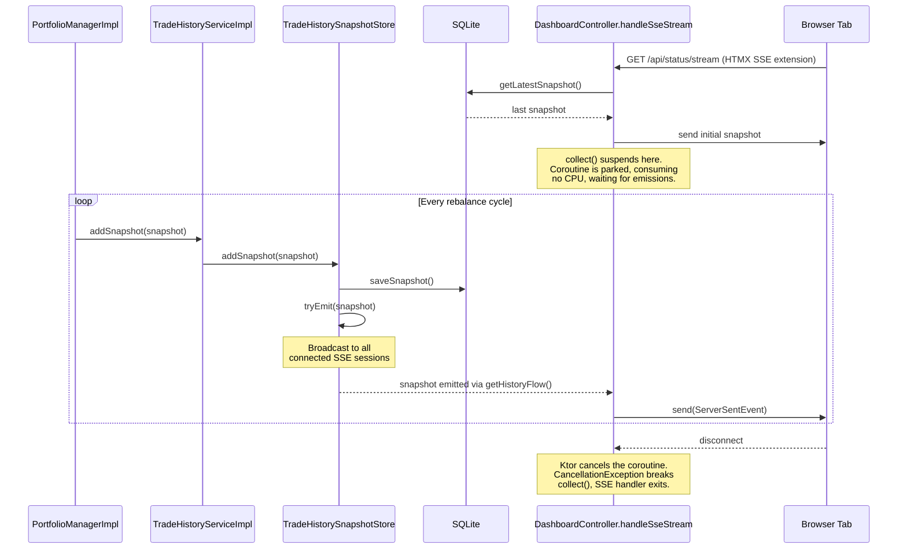
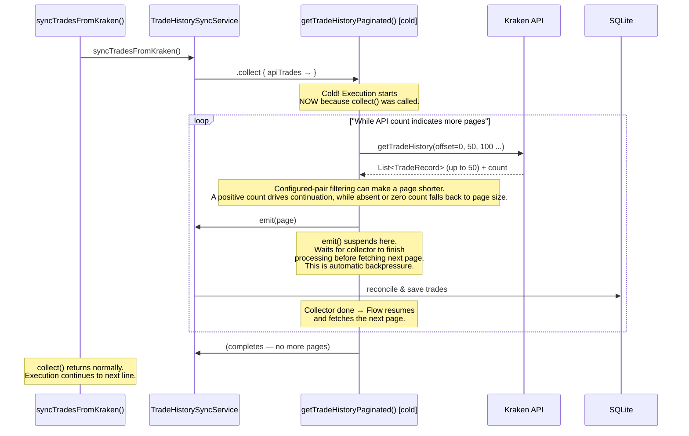
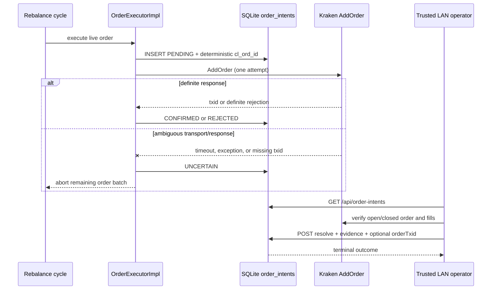
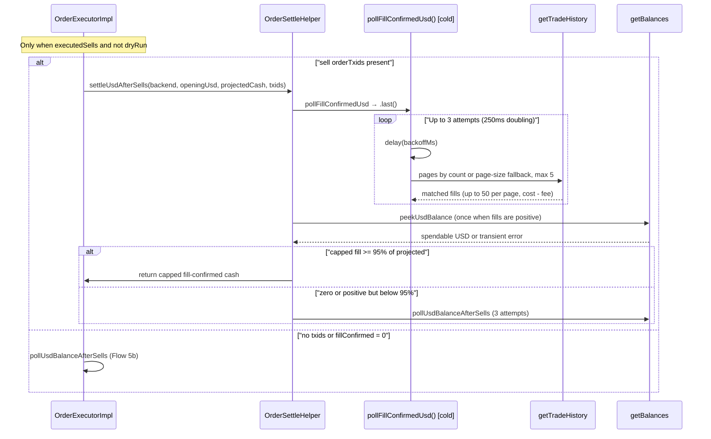
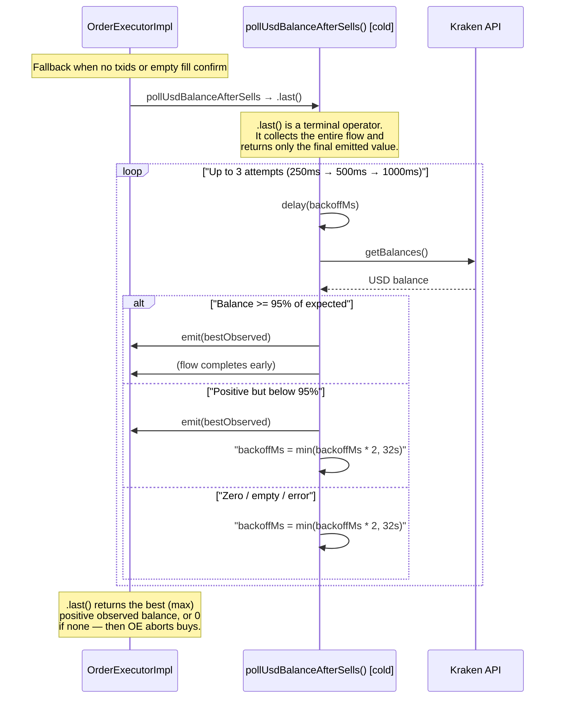

# Kotlin Flow Architecture

This document explains how **Kotlin Coroutines Flows** are used throughout the application to handle asynchronous events without blocking threads. There are two kinds of flow in play: **hot** `SharedFlow` (a live broadcast) and **cold** `Flow` (an on-demand pipeline).

---

## The Two Types at a Glance

| | Cold `Flow` | Hot `SharedFlow` |
| --- | --- | --- |
| **Analogy** | On-demand video (starts when you press play) | Live radio (broadcasting regardless of listeners) |
| **Execution** | Starts only when collected | Runs independently of collectors |
| **Per-collector** | Each collector gets its own independent run | All collectors share the same broadcast |
| **Lifecycle** | Finite — completes when the producer finishes | Infinite — never completes on its own |
| **Backpressure** | Automatic: `emit()` suspends if collector is slow | Configurable: buffer + overflow strategy |
| **Use in this app** | Paginated API fetching, balance polling | Config changes, live dashboard streaming |

---

## System-Wide Flow Map

This diagram shows every place flows are used and how data moves between components.

---

## Flow 1 — Config Changes (Hot SharedFlow)

**Path:** Settings UI → `ConfigService._configFlow` → `PortfolioManager`

**Key design choices:**

- `replay = 1` means `PortfolioManager` immediately gets the current config the moment it subscribes on startup — no race condition on boot.
- Config’s `MutableSharedFlow` uses **no** `extraBufferCapacity` (default 0) with `DROP_OLDEST`; snapshot flow uses `extraBufferCapacity = 16` so slow SSE clients do not stall emitters.
- `collectLatest` (not `collect`) is used so that a settings change during a long loop `delay()`
  takes effect immediately. During an active rebalance session, config saves/reloads persist to disk
  but defer runtime publication until the **outermost** session exits. Persistence can therefore
  complete during a cycle without cancelling it; after publication, `collectLatest` restarts the
  loop with the new settings. Unrelated coroutine cancellation still propagates normally.
- Normal iterations enter `performCycleWithStableSession()`, whose execution session and stable
  backend pin cover in-cycle ledger sync, trade sync, historical reconstruction, the rebalance body,
  and nested order/post-trade reads. Startup syncs and standalone/top-level syncs establish their own
  sessions and pins; nested guards reuse the outer cycle boundary.
- Real-live order placement writes `PENDING` plus the deterministic `cl_ord_id` before AddOrder.
  Definite exchange rejections resolve the row immediately; transport/response failures become
  `UNCERTAIN` and immediately abort the remaining batch. An unresolved row is excluded from
  heuristic fill reconciliation, duplicate cleanup, and retention pruning: an operator must verify
  Kraken open orders, closed orders, and fills before clearing its state in SQLite. Absence from
  trade history alone is never treated as proof of rejection.
- Historical reconstruction uses the same nested-safe execution-session boundary and pins one
  exchange backend for the entire pass, so balances, ticker/OHLC prices, and derived snapshots
  cannot mix settings or live/simulation backends.

---

## Flow 2 — Live Dashboard Updates (Hot SharedFlow)

**Path:** `PortfolioManager` → `TradeHistoryServiceImpl` façade →
`TradeHistorySnapshotStore.snapshotFlow` → Ktor SSE → Browser

**Key design choices:**

- Each SSE `data` payload is Jackson-serialized **`PortfolioSnapshot` JSON** (`timestamp`, `totalValueUSD`, `assets`, `actions`, drawdown/deploy fields).
- `replay = 1` + `extraBufferCapacity = 16` + `DROP_OLDEST` means late SSE subscribers still get the latest snapshot, and a slow browser connection **never** stalls the rebalancing loop. The portfolio manager can always `tryEmit()` and move on immediately.
- Multiple browser tabs can all connect simultaneously — each gets its own `collect()` call which independently consumes from the same shared broadcast.

---

## Flow 3 — Paginated Trade Sync (Cold Flow)

**Path:** `TradeHistoryServiceImpl.syncTradesFromKraken()` →
`TradeHistorySyncService` → `getTradeHistoryPaginated()` → Kraken API
(page by page) → SQLite

**Key design choices:**

- `PortfolioManagerImpl` calls `syncTradesFromKraken()` **every** rebalance cycle,
  but `TradeHistorySyncService` (via the façade) **no-ops** unless ≥ **300 seconds**
  have elapsed since `lastSyncTime` (5-minute throttle).
- Live sync is skipped when credentials are invalid and `simulation` is false;
  simulation mode never hits Kraken for history.
- A non-no-op standalone sync opens a nested-safe `ConfigService` execution
  session and backend pin before collecting pages and closes them in `finally`.
  When the sync is called from `performCycleWithStableSession()`, those guards
  reuse the outer session and pin. Config and credential updates therefore
  publish only after the outermost session covering the current work finishes.
- Incremental sync uses a **300-second overlap** window from the **effective**
  watermark (`latestTradeTime` is the latest successful non-dry-run trade time,
  including local estimates; it falls back to `sync_watermark_epoch_sec` when
  none exists) so fills near the cutoff are not missed and dry-run-only accounts
  do not re-pull from EPOCH.
- Within one sync pass, the captured `endSec` keeps newest-first offsets stable
  against fills arriving after the pass begins. API fills are fingerprinted so
  repeated pages cannot double-insert the same fill. The bound does not make
  separate operations immutable or protect against backfilled or exchange-
  reordered rows; the overlap window and identity deduplication recover those
  cases. Dry-run locals never match API fills (`isMatchingApiTrade` returns false
  when `local.dryRun`).
- The throttle check and pagination run under one coroutine mutex; concurrent
  callers wait and then recheck. A backward wall-clock jump allows the next
  sync to rebase the 300-second throttle instead of suppressing it indefinitely.
- Reconciliation first prefers an exact nonblank `orderTxid` match. The
  economics tolerance applies only to successful, non-dry-run
  `LOCAL_ESTIMATE` rows; `LEGACY_UNKNOWN` rows require an exact persisted
  identity or fingerprint. Conflicting nonblank IDs never reconcile.
- API fetching happens page-by-page (at most **50** rows), but local trades in
  the query range and seen API-fill identities are retained for the whole pass;
  total memory is therefore not constant in the size of the history.
- `emit()` naturally suspends until the collector finishes, meaning Kraken's API
  is never hit faster than the database can process the last batch — automatic
  backpressure.
- Being cold means pagination only runs when `syncTradesFromKraken()` collects —
  nothing polls Kraken for trades in the background.

---

## Flow 4 — Live-Order Intent Journal and Readiness

**Path:** `OrderExecutorImpl` → SQLite `order_intents` → operator API

The journal is the live-order safety boundary. Any `PENDING` or `UNCERTAIN`
intent blocks later live batches and makes `/api/readiness` return `503`.
`/api/health` remains a `200` liveness/diagnostic response. Resolution may
include the Kraken order transaction ID when known. It requires the normal
double-submit CSRF token, an explicit terminal state, and evidence;
only UNCERTAIN intents are eligible for manual resolution while PENDING denotes
an in-flight AddOrder. There is no automatic retry, reconciliation,
deduplication, or age-based prune
for unresolved intents.

---

## Flow 5 — USD Settle after sells (Cold Flow)

**Path:** After **≥1 successful sell** and when **not** dry-run →
`settleUsdAfterSells()`:

1. **Primary (when sell AddOrder txids exist):** `pollFillConfirmedUsd()` →
   `sumMatchedSellProceeds()` (trade history matched by `orderTxid`, net of fee,
   paginate up to 5 pages of at most 50 rows) → optional balance peek
   `min(fillConfirmed, balance)` when spendable USD is visible → else cap to
   `projectedCash`.
2. **Fallback:** when no txids, fill confirmation returns no positive USD, or
   its balance/projected-cash-capped result is below 95% of projected cash →
   `pollUsdBalanceAfterSells().last()` (below). A materially short fill result
   may reflect lagging or truncated Kraken trade-history pagination.

Skipped when dry-run or no sell succeeded (buys use projected cash). Fail-closed:
abort buys if neither path confirms positive USD.

### Flow 5b — USD Balance Polling fallback (Cold Flow)

**Path:** `pollUsdBalanceAfterSells().last()` →
Kraken balances API (with backoff). Used when sell txids are missing (e.g. some
test doubles) or fill confirmation found no matching positive proceeds.

**Key design choices:**

- Fill confirmation is preferred when AddOrder returns txids — buy budget is
  sized from **opening USD + net fill proceeds**, capped by a balance peek when
  spendable cash is already visible, otherwise by **projected cash** so history
  cannot invent liquidity beyond the cycle's sell intents.
- Balance polling remains the fail-safe path (and the only path for backends
  that omit txids).
- Using `.last()` instead of `.collect()` is intentional — both cold polls track
  the **best (maximum) positive** observation across attempts. If nothing
  positive is observed, `.last()` yields `0` and `OrderExecutorImpl` **aborts
  buys** (fail-closed).
- Backoff starts at **250ms** and doubles per attempt
  (**250ms → 500ms → 1000ms** with `MAX_REFRESH_ATTEMPTS = 3`). Code also
  `coerceAtMost(32000)` as a defensive ceiling; that cap is unreachable under
  current constants.
- Being cold means this only runs when explicitly triggered after a successful
  sell outside dry-run — it never polls in the background.

---

## Flow 6 - Paginated Ledger Sync (Cold Flow)

**Path:** `TradeHistoryServiceImpl.syncLedgersFromKraken()` ->
`LedgersSyncService` -> `getLedgersPaginated()` -> Kraken `/0/private/Ledgers`
-> SQLite

Ledger synchronization follows the same cold, page-by-page backpressure model as
trade synchronization, but it has separate metadata and insert-only semantics:

- `PortfolioManagerImpl` invokes it at startup and once per rebalance cycle;
  `LedgersSyncService` skips calls made within **300 seconds** of the previous
  completed sync.
- The startup call and a standalone top-level call establish their own
  execution session and stable backend pin. The normal-cycle call reuses the
  cycle-wide session/backend boundary owned by `performCycleWithStableSession()`.
- The first and recovered initial passes fetch at most the **96-day** seed
  window, record durable page progress, and mark the ledger store seeded. A
  resumed seed restarts from page zero because new rows can shift Kraken offsets.
- Incremental passes begin from the latest stored ledger time or watermark minus
  **300 seconds**, with a captured end time for stable newest-first pagination.
- Each page is inserted under the unique `(ledger id, timestamp, asset, type)` key,
  so overlap and repeated pages are harmless. Only `staking` and `dividend`
  entries are requested.
- Invalid live credentials skip the sync without opening an execution session;
  a real sync brackets all pages with the same `ConfigService` execution-session
  boundary used by trade synchronization. Simulation mode does not call Kraken.

The History rewards query filters the persisted ledger range to `staking` and
`dividend` rows for tracked assets, then aligns cumulative amounts to portfolio
snapshots and values them with each snapshot's prices. Dividends for untracked
assets remain excluded. It is a normal suspend query, not a background flow.

---

## Hot vs. Cold: Why Does It Matter?

The choice between hot and cold flows in this application is deliberate and maps directly to the nature of each problem:

| Use Case | Type | Why? |
| --- | --- | --- |
| Config changes | **Hot** | Config exists before anyone listens. New subscribers must get the current value immediately (`replay=1`). Multiple components could theoretically watch it. |
| Dashboard streaming | **Hot** | Snapshots are produced by the rebalancer loop independently of how many browsers are connected. Each connected browser should see the same live broadcast. |
| Paginated API sync | **Cold** | Fetching is always triggered on-demand for a specific reason. The caller owns the full lifecycle. Backpressure is critical for memory safety with large histories. |
| Paginated ledger sync | **Cold** | Ledger pages are fetched only during startup/cycle sync, with insert-only identity dedupe and durable seed progress. |
| USD settle (fill / balance) | **Cold** | One-shot after sells. Fill-confirm or balance poll only makes sense in that context; the caller only needs the final settled cash. |
| Live-order journal | **Durable state** | A database row survives process failure and blocks ambiguous live retries until an operator verifies the exchange outcome. |
