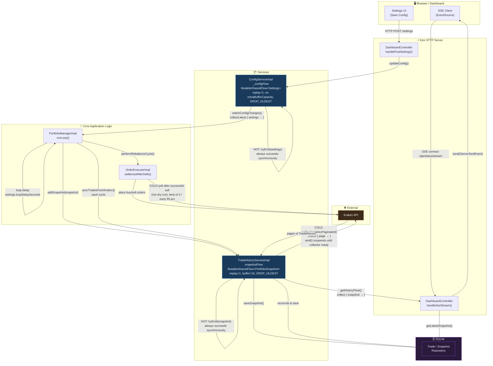
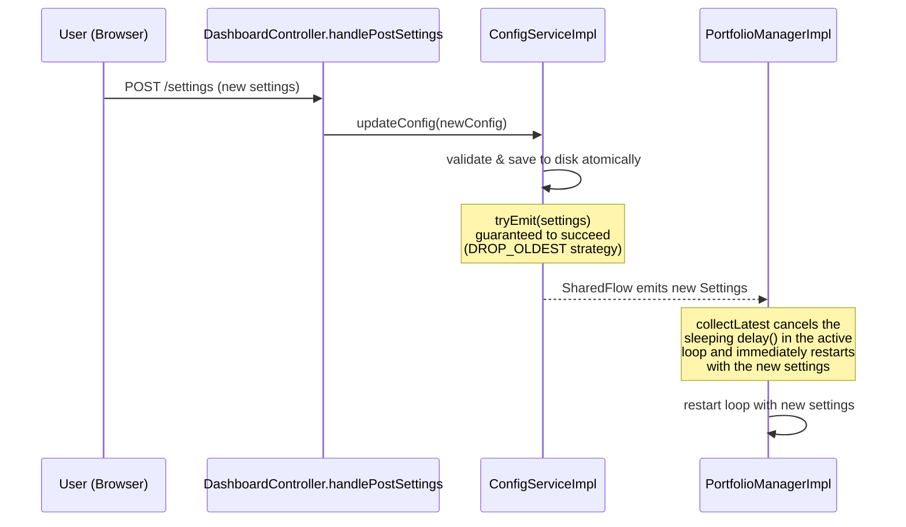
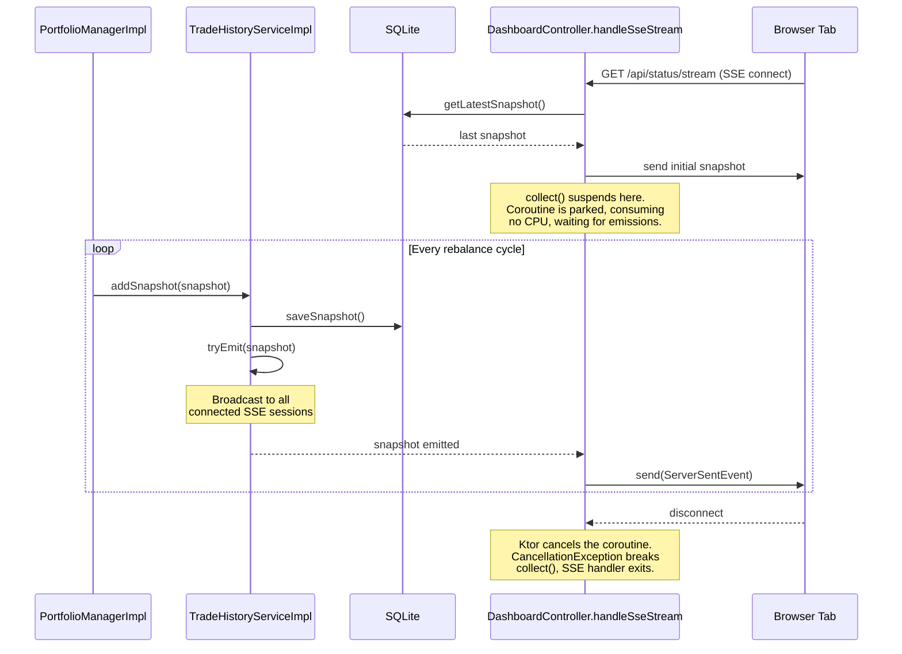
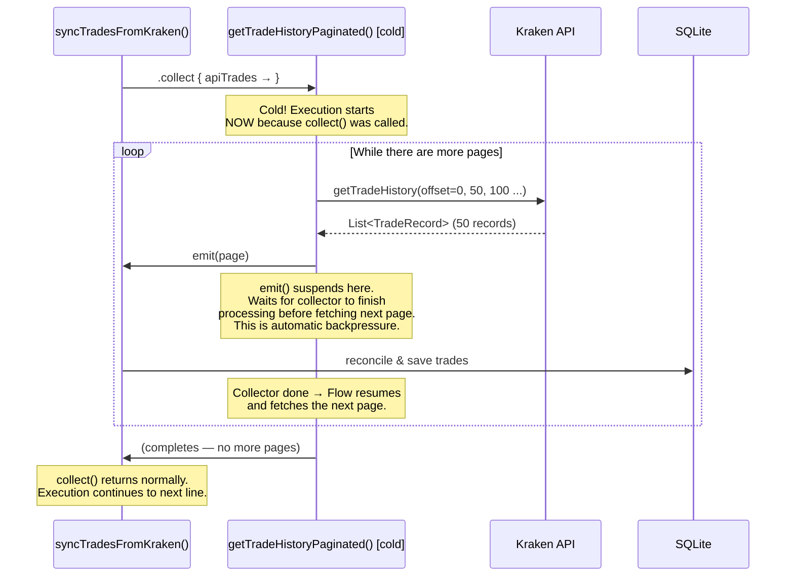
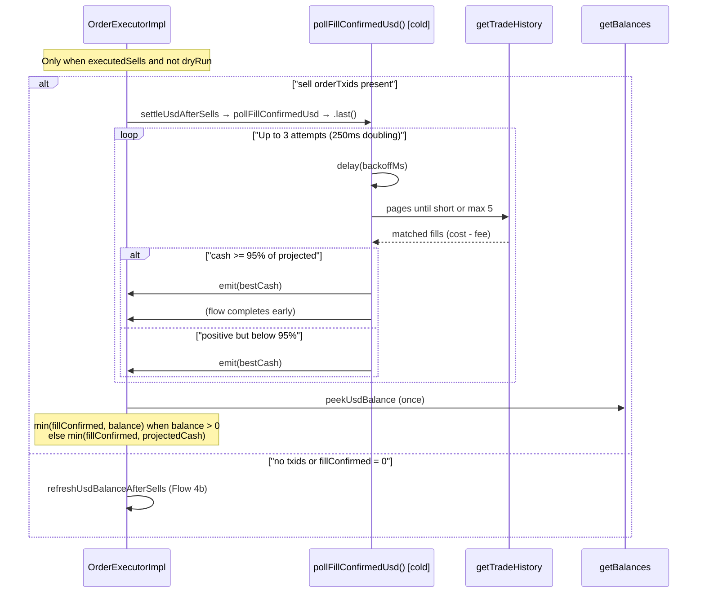
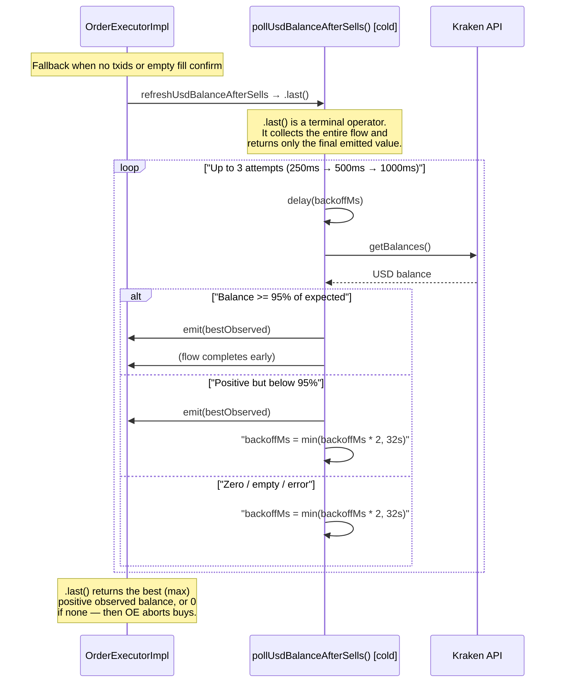

# Kotlin Flow Architecture

This document explains how **Kotlin Coroutines Flows** are used throughout the application to handle asynchronous events without blocking threads. There are two kinds of flow in play: **hot** `SharedFlow` (a live broadcast) and **cold** `Flow` (an on-demand pipeline).

---

## The Two Types at a Glance

| | Cold `Flow` | Hot `SharedFlow` |
| --- | --- | --- |
| **Analogy** | On-demand video (starts when you press play) | Live radio (broadcasting regardless of listeners) |
| **Execution** | Starts only when collected | Runs independently of collectors |
| **Per-collector** | Each collector gets its own independent run | All collectors share the same broadcast |
| **Lifecycle** | Finite — completes when the producer finishes | Infinite — never completes on its own |
| **Backpressure** | Automatic: `emit()` suspends if collector is slow | Configurable: buffer + overflow strategy |
| **Use in this app** | Paginated API fetching, balance polling | Config changes, live dashboard streaming |

---

## System-Wide Flow Map

This diagram shows every place flows are used and how data moves between components.

---

## Flow 1 — Config Changes (Hot SharedFlow)

**Path:** Settings UI → `ConfigService._configFlow` → `PortfolioManager`

**Key design choices:**

- `replay = 1` means `PortfolioManager` immediately gets the current config the moment it subscribes on startup — no race condition on boot.
- Config’s `MutableSharedFlow` uses **no** `extraBufferCapacity` (default 0) with `DROP_OLDEST`; snapshot flow uses `extraBufferCapacity = 16` so slow SSE clients do not stall emitters.
- `collectLatest` (not `collect`) is used so that a settings change during a long loop `delay()` takes effect immediately, without waiting for the delay to expire.

---

## Flow 2 — Live Dashboard Updates (Hot SharedFlow)

**Path:** `PortfolioManager` → `TradeHistoryService.snapshotFlow` → Ktor SSE → Browser

**Key design choices:**

- Each SSE `data` payload is Jackson-serialized **`PortfolioSnapshot` JSON** (`timestamp`, `totalValueUSD`, `assets`, `actions`, drawdown/deploy fields).
- `replay = 1` + `extraBufferCapacity = 16` + `DROP_OLDEST` means late SSE subscribers still get the latest snapshot, and a slow browser connection **never** stalls the rebalancing loop. The portfolio manager can always `tryEmit()` and move on immediately.
- Multiple browser tabs can all connect simultaneously — each gets its own `collect()` call which independently consumes from the same shared broadcast.

---

## Flow 3 — Paginated Trade Sync (Cold Flow)

**Path:** `syncTradesFromKraken()` → `getTradeHistoryPaginated()` → Kraken API (page by page) → SQLite

**Key design choices:**

- `PortfolioManagerImpl` calls `syncTradesFromKraken()` **every** rebalance cycle,
  but `TradeHistoryServiceImpl` **no-ops** unless ≥ **300 seconds** have elapsed
  since `lastSyncTime` (5-minute throttle).
- Live sync is skipped when credentials are invalid and `simulation` is false;
  simulation mode never hits Kraken for history.
- Incremental sync uses a **300-second overlap** window from the **effective**
  watermark (`latestTradeTime`, falling back to `sync_watermark_epoch_sec` when
  there are no non-dry-run fills) so fills near the cutoff are not missed and
  dry-run-only accounts do not re-pull from EPOCH.
- Within one sync pass, API fills are fingerprinted so a pagination window shift
  cannot double-insert the same fill; dry-run locals never match API fills
  (`isMatchingApiTrade` returns false when `local.dryRun`).
- Processing happens page-by-page (page size **50**), keeping memory constant
  regardless of how many total trades exist.
- `emit()` naturally suspends until the collector finishes, meaning Kraken's API
  is never hit faster than the database can process the last batch — automatic
  backpressure.
- Being cold means pagination only runs when `syncTradesFromKraken()` collects —
  nothing polls Kraken for trades in the background.

---

## Flow 4 — USD Settle after sells (Cold Flow)

**Path:** After **≥1 successful sell** and when **not** dry-run →
`settleUsdAfterSells()`:

1. **Primary (when sell AddOrder txids exist):** `pollFillConfirmedUsd()` →
   `sumMatchedSellProceeds()` (trade history matched by `ordertxid`, net of fee,
   paginate up to 5×50) → optional balance peek
   `min(fillConfirmed, balance)` when spendable USD is visible → else cap to
   `projectedCash`.
2. **Fallback:** when no txids, or fill confirmation returns no positive USD →
   `refreshUsdBalanceAfterSells()` → `pollUsdBalanceAfterSells().last()` (below).

Skipped when dry-run or no sell succeeded (buys use projected cash). Fail-closed:
abort buys if neither path confirms positive USD.

### Flow 4b — USD Balance Polling fallback (Cold Flow)

**Path:** `refreshUsdBalanceAfterSells()` → `pollUsdBalanceAfterSells().last()` →
Kraken balances API (with backoff). Used when sell txids are missing (e.g. some
test doubles) or fill confirmation found no matching positive proceeds.

**Key design choices:**

- Fill confirmation is preferred when AddOrder returns txids — buy budget is
  sized from **opening USD + net fill proceeds**, capped by a balance peek when
  spendable cash is already visible, otherwise by **projected cash** so history
  cannot invent liquidity beyond the cycle's sell intents.
- Balance polling remains the fail-safe path (and the only path for backends
  that omit txids).
- Using `.last()` instead of `.collect()` is intentional — both cold polls track
  the **best (maximum) positive** observation across attempts. If nothing
  positive is observed, `.last()` yields `0` and `OrderExecutorImpl` **aborts
  buys** (fail-closed).
- Backoff starts at **250ms** and doubles per attempt
  (**250ms → 500ms → 1000ms** with `MAX_REFRESH_ATTEMPTS = 3`). Code also
  `coerceAtMost(32000)` as a defensive ceiling; that cap is unreachable under
  current constants.
- Being cold means this only runs when explicitly triggered after a successful
  sell outside dry-run — it never polls in the background.

---

## Hot vs. Cold: Why Does It Matter?

The choice between hot and cold flows in this application is deliberate and maps directly to the nature of each problem:

| Use Case | Type | Why? |
| --- | --- | --- |
| Config changes | **Hot** | Config exists before anyone listens. New subscribers must get the current value immediately (`replay=1`). Multiple components could theoretically watch it. |
| Dashboard streaming | **Hot** | Snapshots are produced by the rebalancer loop independently of how many browsers are connected. Each connected browser should see the same live broadcast. |
| Paginated API sync | **Cold** | Fetching is always triggered on-demand for a specific reason. The caller owns the full lifecycle. Backpressure is critical for memory safety with large histories. |
| USD settle (fill / balance) | **Cold** | One-shot after sells. Fill-confirm or balance poll only makes sense in that context; the caller only needs the final settled cash. |
