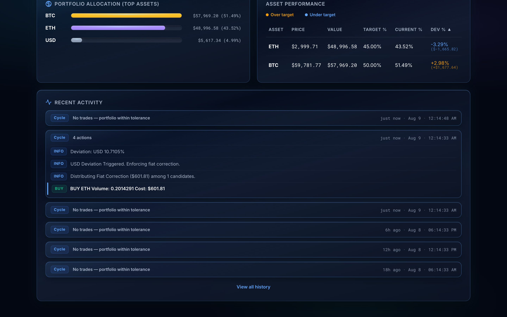
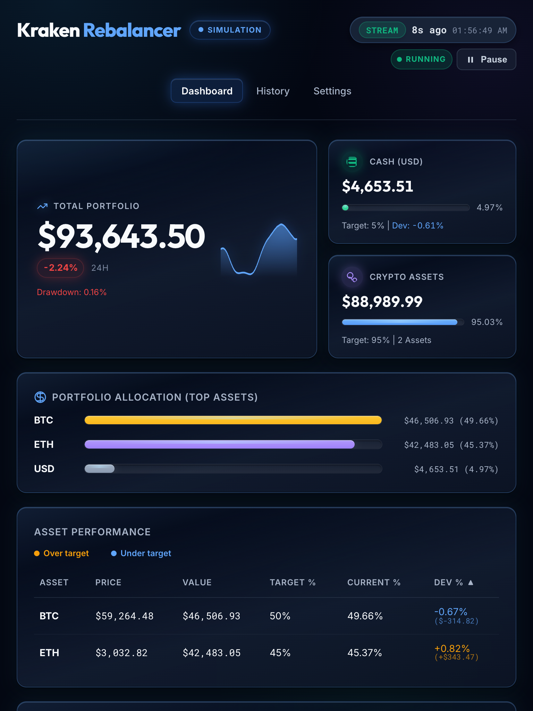
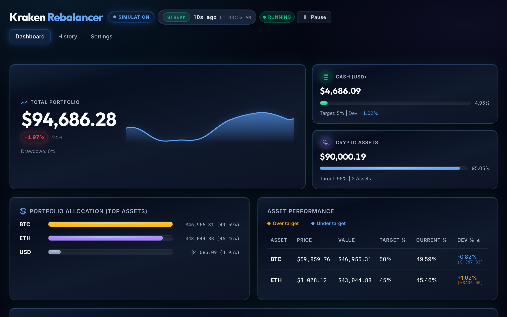
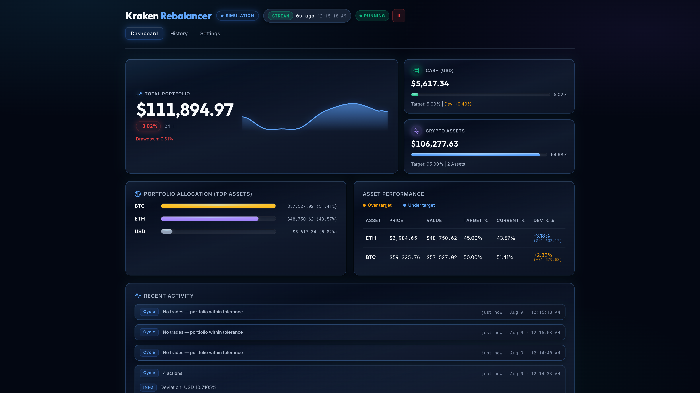
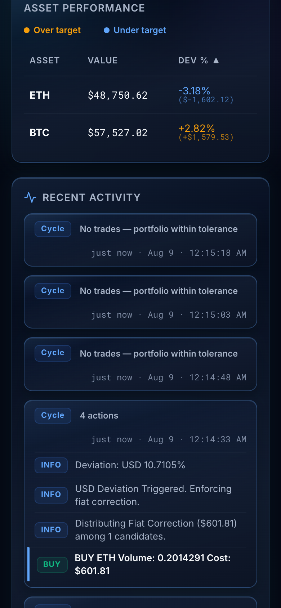
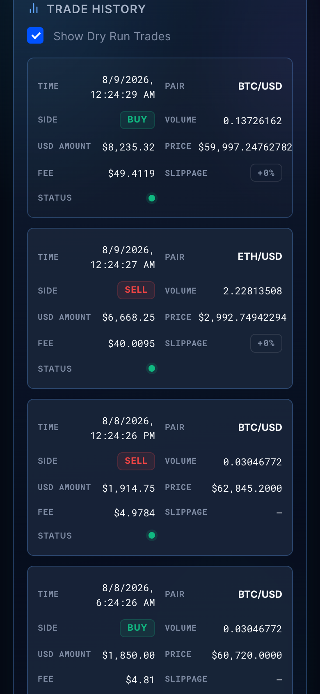

# User Guide — Kraken Rebalancer

This guide walks through the live dashboard: what each screen is for, how to
configure the bot, and how to interpret charts and trade logs. Screenshots below
were captured in **simulation mode** so values are illustrative, not live
exchange balances.

For install and first launch, see the [README Getting Started](../README.md#getting-started)
section. For rebalancing math internals, see [ALGORITHM.md](ALGORITHM.md).

---

## What problem does it solve?

Market moves, deposits, and withdrawals cause a portfolio to drift away from its
target allocation. Correcting that drift by hand requires repeated monitoring,
calculations, and order entry. Kraken Rebalancer automates those rules so a
Kraken user can follow a chosen allocation consistently, optionally configure a
cash reserve to deploy progressively during drawdowns, and review what the
strategy did from one local dashboard.

This is an execution and monitoring tool, not a source of trading signals. You
choose the assets, targets, and risk settings; the application does not predict
prices or guarantee returns. Rebalancing may create fees and tax consequences.
The simulator and dry-run mode let you decide whether the workflow fits your
strategy before any real order is placed.

For a fuller explanation of the use cases and intended audience, see
[Why Use Kraken Rebalancer?](../README.md#why-use-kraken-rebalancer).

---

## Safety modes (read this first)

Two independent settings control how “real” trading is. Change them from
**Settings** or in `rebalancer-config.json`.

| Mode | What it does | When to use |
| :--- | :--- | :--- |
| **Simulation Mode** | Routes all exchange calls to an offline Kraken emulator (random-walk prices, seeded history). No API keys required. | Learning the UI, demos, documentation screenshots |
| **Dry Run Mode** | Calculates intended orders on the active backend (live Kraken or the emulator) but never places them. Server logs may show `[DRY RUN]` or `[EMULATOR DRY RUN]`; Recent Activity always prefixes `[DRY RUN]`. | Rehearsing strategies against live or simulated markets |

**Live trading** is `simulation` off **and** `dryRun` off with real API keys —
that moves real funds. Prefer simulation (and/or dry run) until you understand
the screens below.

On **Settings**, these appear as two toggle cards — **Simulation Mode** first,
then **Dry Run Mode** — each with an **ON** / **OFF** state pill and a short line
of consequence prose (e.g. "No real funds are ever touched"). Keep at least one
safety on unless you intend to trade live.

---

## Navigation

Dashboard, History, and Settings share the same top nav tabs (active page is
highlighted and centered below the header identity on wider screens). The header
brand reads **Kraken** + **Rebalancer**, and the Stream/loop status cluster sits
to its right on wider screens. A **persistent mode plate** shows the current
trading mode on **every** page: **SIMULATION** (blue), **DRY RUN** (amber), or
**LIVE TRADING** (red).
Precedence is simulation first (even if dry run is also on), then dry run, then
live. The plate reflects your Settings, and hovering it reveals a tooltip
explaining the consequence (e.g. "Live trading — real orders execute with real
funds").

The header also includes a loop control on every page. Its state pill shows
**RUNNING** or **PAUSED**; choose the labeled **Pause** action to stop new rebalance
cycles or **Resume** to start them again. This is separate from the
trading-mode plate: pausing the loop does not change Simulation, Dry Run, or
Live Trading settings.

| Page | Route | Purpose |
| :--- | :--- | :--- |
| **Dashboard** | `/` | Live portfolio snapshot, allocation bars, performance table, recent activity |
| **History** | `/history` | Time-range charts, summary cards, full trade log |
| **Settings** | `/settings` | Loop timing, triggers, fiat deployment, safety modes, allocations |

The dashboard pushes live updates over Server-Sent Events (`/api/status/stream`).
**Only the Dashboard** shows a stream-health chip in the header next to the mode
plate: **STREAM** (green) when data is flowing, or **STALE** when the last
snapshot is older than **90 seconds** (governed by
`PrecisionConstants.STALE_THRESHOLD_SECONDS`). Automatic SSE reconnection
resumes feed status without requiring a page reload. Beside it are the relative
age of the last update (e.g. `12s`) and its clock time.

The stream chip describes **feed health, not trading mode** — a healthy
**STREAM** chip does not mean live trading is on. Always read the mode plate for
that.

---

## Dashboard

### Portfolio overview

The top of the Dashboard is a hero card plus two tiles:

| Element | Meaning |
| :--- | :--- |
| **Total Portfolio** (hero) | Mark-to-market value of all tracked assets, with a signed **24H** delta when a true ≥24h baseline exists (green up / red down / muted flat), current **drawdown**, and an inline **sparkline** of recent retained snapshots. |
| **Cash (USD)** (tile) | Fiat balance with a progress bar for its current share, plus **effective** target % after drawdown-based fiat deployment (and the configured **Base** target when they differ) and deviation. |
| **Crypto Assets** (tile) | Combined crypto value with a progress bar for its share, its target %, and how many crypto symbols you hold. |

### Loop control

The header's loop control is the quickest way to stop trading activity without
changing the saved configuration. When the state reads **RUNNING**, click
**Pause**; the active loop is cancelled safely and the state changes to
**PAUSED**. Click **Resume** when you want the configured cycle schedule to
start again. The control does not alter credentials, allocations, Simulation,
Dry Run, or Live Trading mode.

### Allocation & performance

- **Portfolio Allocation (Top Assets)** — Horizontal bars for the largest
  holdings by USD value (and cash), showing up to the **top 15**. Bar lengths are
  relative to the largest holding (the biggest fills the track), with each bar
  labelled by its USD value and current %. Each symbol uses its configured color
  from Settings (BTC/ETH/USD start with amber/violet/slate defaults; other
  assets get an auto-assigned color), shared with History charts.
- **Asset Performance** — Sortable table of price, value, target %, current %,
  and **Dev %** (how far each asset is from target, with dollar impact).
  Amber = over target, blue = under target (not profit/loss green/red); a small
  legend sits above the table.
- **Recent Activity** — A **cycle-grouped feed** of the most recent rebalance
  cycles (up to 6). Each cycle is a lightweight row with an action summary (e.g.
  `3 actions`, or **No trades — portfolio within tolerance**) and a compact
  relative/absolute timestamp. Cycles with trades show at most one concise note
  followed by the individual actions:
  - Red **SELL** / green **BUY** — orders with USD to 2 decimals
  - A **View all history** link at the bottom jumps to `/history`.

Use this page as your “is the bot healthy right now?” view.

### Operational status and readiness

The JSON endpoints are intentionally unauthenticated for this application's
single-operator/private-LAN deployment model. Treat every device that can reach
the server as trusted. `GET /api/health` is a liveness and diagnostic check; it
includes the active mode, loop state, last cycle timestamps/error, latest trade
sync watermark, and unresolved live-order counts. `GET /api/readiness` returns
`200` only when the loop is running, configuration is available, a snapshot
exists, the latest cycle is not failed, and no ambiguous live-order intent is
waiting for review. It returns `503` with a `readinessReason` otherwise.

If an ambiguous live order occurs, the application halts live trading and displays an
**Action Required: Unresolved Live Order Intent** banner at the top of the Dashboard.
You can inspect the intent details (ID, symbol, side, volume, USD amount, error message)
and resolve it directly from the UI by selecting **CONFIRMED** or **REJECTED**,
entering optional Kraken order transaction IDs, and providing resolution evidence.
Alternatively, inspect `GET /api/order-intents` via REST. Only an `UNCERTAIN` intent is
eligible for resolution (`PENDING` indicates an AddOrder in flight). Follow
the [operator recovery runbook](../SECURITY.md#operator-recovery-runbook) for
the exchange-verification checklist, complete resolution options, and post-request
checks before resuming.

### Responsive layouts

The dashboard is checked at the same common viewport profiles used by the visual
review workflow. On phones, Asset Performance keeps Asset, Value, and Dev % in
view, while History trade rows become labeled detail cards so price, fee, and
status remain readable.

<strong>Phone (390px CSS viewport)</strong> 

<strong>Tablet (768px CSS viewport)</strong> 

<strong>Laptop (1280px CSS viewport)</strong> 

<strong>Wide (1920px CSS viewport)</strong> 

<strong>Phone asset performance</strong> 

<strong>Phone trade log</strong> 

---

## Settings

Open **Settings** from the shared top nav, or go to `/settings`.

### Global parameters

| Field | Purpose |
| :--- | :--- |
| **Loop Interval (Seconds)** | How often the rebalancer wakes up to snapshot and potentially trade. Minimum **1**. |
| **Deviation Trigger (%)** | Minimum absolute deviation from target before an asset can trigger trades. Minimum **0**. |
| **Minimum Order Size ($)** | Dual role: absolute USD deviation must meet this for an asset to trigger, and orders below this notional are skipped at execution. **Minimum `2` (enforced).** |
| **Fiat Max Drawdown (%)** | Drawdown at which cash is fully eligible for deployment into crypto. Bounded **0–100**. |
| **Fiat Deployment Exponent** | Shape of the cash→crypto deployment curve as drawdown grows (1.0 ≈ linear). Must be positive (any value > 0). |
| **Fiat Deployment Threshold (%)** | Minimum drawdown before cash deployment begins (deadband). Drawdowns below this deploy 0% cash. Bounded **0–100**. |
| **Inception Date (Optional)** | Anchor date for strategy performance comparison (`YYYY-MM-DD` or ISO-8601). If empty, auto-detects from the earliest multi-asset rebalance burst in your trade history. |

### Safety modes

Simulation and Dry Run live in their own **Safety Modes** block (not mixed into
the numeric parameter grid), as two toggle cards each with an **ON** / **OFF**
state pill:

| Card | Purpose |
| :--- | :--- |
| **Simulation Mode** | Runs the whole strategy against an offline Kraken emulator — no real funds are ever touched. |
| **Dry Run Mode** | Calculates intended orders on the active backend (live Kraken or the emulator) but never places them. |

**Simulation Mode** is listed first. **Save Configuration** lives in the page
header next to the nav (not at the bottom of the form). Saving hot-reloads the
running loop — no process restart required. If a rebalance is actively
executing, the file is saved immediately but the new runtime settings take
effect only after that cycle finishes.

Saving fails closed when any numeric field is missing, malformed, or non-finite,
or when allocation rows are incomplete. The current configuration remains
active and the Settings form shows the validation error.

### Target allocations

- Every allocation row is a symbol + target percent + optional color swatch,
  bounded to **0–100%** by the percent input itself.
- Colors persist in `rebalancer-config.json`. The Settings form accepts a blank
  swatch for automatic assignment but rejects malformed nonblank colors.
  Config-file load/save normalization still assigns known defaults for
  BTC/ETH/USD and HSL-derived colors for other missing or invalid values.
- **Total** must read **100.00%** (green badge) before save succeeds.
- **USD is required** — cash is part of the strategy, not optional.
- **Add Asset** / **Remove** change the universe without restarting the app.

Deeper behavior (drawdown deployment, sell-then-buy, dust) is documented in
[ALGORITHM.md](ALGORITHM.md).

---

## History

The History page is for longer-term review: performance charts and the full
trade log. Use the **24h / 7d / 30d / 90d / All** pills to change the window —
all six summary cards and the charts update together.

### Sync progress banner

Immediately below the header, a banner appears while trade and ledger history is
being synchronized: a spinner with **Synchronizing Kraken Trade History…** and an
inline progress indicator (e.g. **0 / 0 (0%)**) plus a progress bar. It auto-
dismisses once the sync session completes.

### Views

The **Views** control (next to the time-range pills) applies a preset across
range, series visibility, and **Show Dry Run Trades**:

| Preset | Window | Intent |
| :--- | :--- | :--- |
| **Overview** (default) | 30d | All series visible |
| **Day · Total only** | 24h | Portfolio Value shows **Total Portfolio** only |
| **Week · Allocation** | 7d | Full series for allocation review |
| **Month · Net Cash Flow** | 30d | Cumulative net cash flow focus; dry-run trades off |

**Save view…** stores the current range, legend visibility, and dry-run toggle
under a name in browser `localStorage` (`kraken.history.views`). **Set as
default** marks the selected view for the next visit. **Delete** removes
user-saved views only (built-ins stay locked).

### Summary cards

| Card | Meaning |
| :--- | :--- |
| **All-Time High** / **Period High** | Label switches with the selected range (“All” → ATH; finite ranges → period high). |
| **Total Trades** | Successful, non-dry-run executions in the selected window. |
| **Total Volume Traded** | Sum of USD amounts for those trades. |
| **Total Fees Paid** | Fees attributed to those trades. |
| **Avg Fee Rate** | `(SUM(fee) / SUM(usdAmount)) × 100` (%) for successful, non-dry-run trades in the window. |
| **Avg Slippage** | Mean signed slippage % for successful, non-dry-run trades with slippage data. |

### Zoom

Each chart has **Zoom − / Zoom + / Reset**. You can also wheel, pinch, or
drag-to-zoom on the **x-axis** only. Changing the time range rebuilds charts and
clears zoom. Reset restores the full selected window.

After you zoom in (via **Zoom +**, wheel, pinch, or drag), a horizontal **pan
scrubber** below the chart becomes enabled. Use it to slide the visible window
across the full selected time range. Dragging on the chart zooms; it does not
pan. **Reset** returns to the full window and disables the scrubber again.

### Rebalancer vs Buy & Hold

The first chart below the summary cards compares what the rebalancer actually
achieved against a **synthetic buy-and-hold** strategy:

- **Buy & Hold** starts from the first snapshot in the selected window. Strategy-neutral
  economic flows (staking rewards, crypto dividends, USD cash dividends, external deposits,
  withdrawals, transfers, adjustments, consumer Buy Crypto `spend`/`receive` legs, and manual
  user trades) are replayed into Buy & Hold identically to the actual portfolio. Kraken app/Buy
  Crypto activity is read from Ledger history, including both asset legs, rather than inferred
  from the trade-history feed.
- The comparison accounts for the balance request's duration and up to one second of
  exchange/local clock skew, accepting events only when the complete tracked balance change
  reconciles. API fills use precise `price × volume` first; historical rounded costs are
  accepted per interval only when they represent the same fill and all tracked balances match.
- Historical Kraken ledger entries are reconciled using their recorded post-event balance when
  the stored fee precision is insufficient; mixed or ambiguous balance changes remain unavailable.
- **Rebalancer** is the actual portfolio value at each snapshot, incorporating rebalancing bot
  trade executions that create genuine divergence from Buy & Hold.
- The **delta badge** next to the chart title shows the cumulative
  outperformance or underperformance (e.g. `+$5,000.00 (+4.76%)`).

A caption below the chart reads: *Based on stored snapshots and recorded trades.
Starting quantities are frozen at the first snapshot in the selected range.*

The comparison cannot be computed when:

| Reason | Meaning |
| :--- | :--- |
| Insufficient snapshots | Fewer than 2 snapshots in range. |
| Non-positive baseline | First snapshot total value is $0 (no baseline to scale from). |
| Baseline mismatch | First snapshot's total value doesn't match the sum of its priced assets (stale data). |
| Missing price | An asset lacks a price in a snapshot. |
| Asset universe changed | An asset was added or removed during the window. |
| Unsupported trade | A trade with a side other than BUY or SELL or non-USD quotes. |
| Ambiguous trade ownership | A tracked trade, including a late fill, cannot be proven to belong to the bot or an external/manual source. |
| Unexplained balance change | A tracked balance changed without a matching authoritative trade or supported ledger event, or a known event does not reconcile to the next snapshot. |

When an unavailability reason applies, the chart hides and a message explains why.
There is no estimated numeric fallback for an unexplained tracked balance change:
the comparison is `UNAVAILABLE` with `UNEXPLAINED_BALANCE_CHANGE`, timestamped at
the first snapshot whose tracked balances still differ after checking compatible
historical cost rounding.
Late fills are accepted only when their ownership is authoritative and their
complete tracked balance change reconciles. Rendered comparisons are fully
reconciled.

### Staking Rewards

A dedicated chart below the comparison shows the cumulative USD value of
`staking` and `dividend` ledger entries for tracked assets in the selected
range, with one series per asset and a total shown beside the title. Values are
aligned to portfolio snapshots and use each snapshot's asset price; the chart is
empty until ledger data has been synchronized. Untracked asset cash dividends credited
in USD are accounted for in portfolio comparison but omitted from crypto staking asset series.
A caption below the chart reads:
*Cumulative staking and dividend reward value accrued during the selected range.
Assets without a snapshot price in the range are excluded.*

### Portfolio Value & Asset Holdings

- **Portfolio Value Over Time** — Total portfolio (blue) plus per-asset USD
  values using the same configured per-asset colors as Settings / Dashboard.
- **Asset Holdings Over Time** — Relative change in holdings (percent), same
  per-asset colors.

Point markers scale with density: full size at ≤24 points, half size through 48,
then line-only (markers hidden) while hover hit areas stay large enough for
tooltips.

### Allocation deviation & net cash flow

- **Allocation Deviation from Target** — Each series shows signed relative
  deviation from that asset’s target. **0%** means on target, positive values
  are overweight, and negative values are underweight. The Y-axis scales around
  the observed drift so small departures and post-rebalance corrections remain
  visible.
- **Cumulative Net Cash Flow** — Running net cash flow from trades over the
  window: sells add cash, buys subtract it (includes dry-run trades when that
  filter is enabled). A dashed **Net After Fees** series subtracts fees from the
  same signed cash-flow math (estimated fees when dry-run rows are included — not
  accounting P&L). Negative axis ticks use `-$…` formatting. An on-screen caption
  below the chart spells out the dry-run caveat, and the legend labels switch with
  the **Show Dry Run Trades** toggle — e.g. "Net Cash Flow (incl. dry run)" and
  "Net After Fees (est.)" when dry-run rows are shown, versus "Net Cash Flow
  (realized)" and "Net After Fees" when they're hidden.

### Trade log

| Column | Meaning |
| :--- | :--- |
| **Time** | When the trade was recorded. |
| **Pair** | Exchange pair (e.g. `BTC/USD`). |
| **Side** | **BUY** (green) or **SELL** (red). |
| **Volume** | Asset quantity. |
| **USD Amount** | Notional in USD. |
| **Price** | Executed price (USD per unit); shows an em dash (—) when zero/unknown. |
| **Fee** | Fee in USD; shows an em dash (—) when zero. Estimated for dry-run / local-estimate rows. |
| **Slippage** | Signed % vs expected quote at order time — favorable, adverse, or a neutral badge at exactly 0%; em dash when unknown. |
| **Status** | A quiet success **dot** for plain fills (hover shows a **SUCCESS** tooltip); **FAILED** (hover for the error message) and **DRY RUN** keep labelled badges. |

For dry-run and local-estimate rows, the Price, Fee, and Slippage cells carry an
"estimated at order time" tooltip so estimated economics aren't mistaken for
settled fills.

Toggle **Show Dry Run Trades** to include or hide rehearsal rows.

In **simulation** with dry run off, successful emulator fills show as the quiet
success **dot** (as in the screenshot above). With dry run on, expect **DRY RUN**
badges instead.

---

## Suggested workflows

### 1. Learn the UI offline

1. Enable **Simulation Mode** (dry run optional).
2. Start with an empty database so the emulator seeds ~15 days of history.
   Snapshots and trades older than 90 days are pruned automatically.
3. Explore Dashboard → History charts → Settings, then save a small allocation
   change and watch the next cycle appear in the **Recent Activity** feed.

### 2. Rehearse against live market data (no orders)

1. Provide Kraken API keys with appropriate permissions.
2. Leave **Simulation** off; enable **Dry Run**.
3. Confirm Dashboard prices and History sync look right before considering live
   mode.

### 3. Go live

1. Confirm allocations sum to 100% and dust / deviation settings match your
   risk tolerance.
2. Disable **Simulation** and **Dry Run** only when you intend to trade.
3. Watch **Recent Activity** on the first few cycles; keep History open to audit
   fills.
4. If logs report an uncertain live submission, stop changing modes or
   retrying manually. Verify Kraken open orders, closed orders, and fills before
   resolving the durable intent; the bot blocks further live orders to avoid a
   duplicate submission. Use the
   [operator recovery runbook](../SECURITY.md#operator-recovery-runbook), which
   includes the exact CSRF-protected request and verification steps.

---

## Where to go next

| Need | Doc |
| :--- | :--- |
| Install / build / config keys | [README.md](../README.md) |
| Rebalancing math & order sequence | [ALGORITHM.md](ALGORITHM.md) |
| Reactive Flows / SSE architecture | [FLOWS.md](FLOWS.md) |
| Security / CORS / reporting | [SECURITY.md](../SECURITY.md) |

Screenshots in this guide are refreshed with the project’s documentation
screenshot workflow whenever the UI changes — see the agent skill
`docs-screenshot-refresh` if you maintain this repository.
